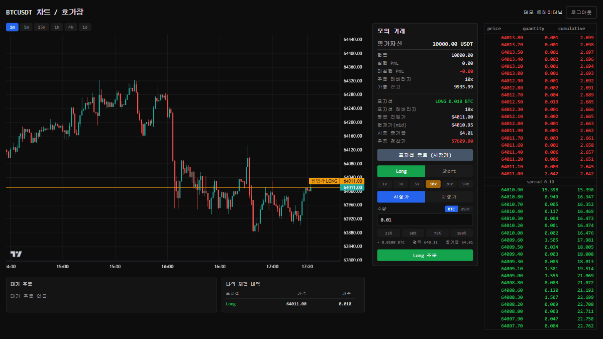
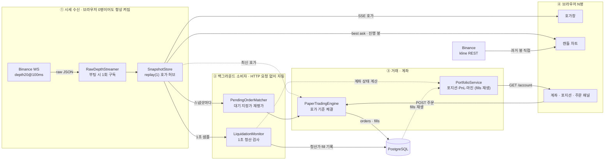

# Futures Paper Trading

> Binance USDⓈ-M 선물의 실시간 호가창을 기준으로 주문을 체결하고, 레버리지·마진·강제청산까지 다루는 학습용 모의 선물거래 웹 애플리케이션


마지막 체결가(last price) 한 줄로 체결하는 모의투자와 달리, **현재 호가창의 잔량을 레벨 단위로 소진하며** 평균 체결가를 만드는 paper trading 엔진입니다.
그 위에 선물 거래소의 핵심인 **레버리지·격리 마진·롱/숏 포지션·실현/미실현 PnL·강제청산**을 얹었습니다.
Binance 선물 호가 스트림은 서버가 부팅 시 **단 1개 연결로만** 구독하고, 접속한 모든 브라우저에는 SSE로 fan-out 합니다.

전 구간 **논블로킹 리액티브 스택**(WebFlux + Reactor + R2DBC)이며, 돈 계산은 전부 `BigDecimal` / `NUMERIC(38,8)`로 다룹니다.



<p align="center"><sub>실시간 호가창 · 캔들 차트 · 레버리지/포지션/PnL 거래 패널 (BTCUSDT)</sub></p>

---

## 주요 기능

- **실시간 호가창** — Binance `btcusdt@depth20@100ms` WebSocket을 서버가 수신해 SSE로 push, 100ms 간격 갱신
- **캔들 차트** — 과거 봉은 Binance kline REST, 진행 봉은 호가 스트림의 best ask로 실시간 갱신 (TradingView Lightweight Charts)
- **회원가입 / 로그인** — 자체 회원가입, BCrypt 해시, 세션 + HttpOnly 쿠키 인증
- **호가창 기준 모의 주문** — 시장가 / 지정가 BUY·SELL, 지정가 대기·취소, 호가 레벨 단위 부분 체결(주문 1 : 체결 N)
- **레버리지·마진** — 1·3·5·10·20·50x 프리셋 레버리지(기본 10x), 격리 마진 모델, 신규 주문 시 가용 증거금 검증
- **포지션·PnL** — 롱/숏 포지션, 포지션 뒤집기, 실현·미실현 PnL, equity, 가용잔고를 체결 내역에서 실시간 계산
- **자동 강제청산** — 현재 mark(mid)가 청산가에 닿은 포지션을 백그라운드에서 1초 샘플링으로 검사하고, 청산가 fill을 기록해 강제 청산
- **사용자별 격리** — 로그인한 사용자는 자신의 계좌·주문·체결·포지션만 조회·취소 가능

## 아키텍처



데이터 흐름의 핵심:

> 브라우저 실행용 [Sinks 흐름 애니메이션](https://htmlpreview.github.io/?https://github.com/lee-gimoon/futures-paper-trading/blob/main/src/main/resources/static/docs/sink-flow-animation.html)에서 이 구조를 움직이는 화면으로 확인할 수 있다. 원본은 [HTML 소스](src/main/resources/static/docs/sink-flow-animation.html)에 있다.
> 핵심 구현 설명은 [Binance 실시간 데이터 파이프라인 포트폴리오 PDF](docs/portfolio/binance-stream-portfolio.pdf)에서 확인할 수 있다. Binance WebSocket 수신부터 `Sinks.many().replay(1)` 기반 fan-out까지의 흐름만 따로 정리했다.

- Binance 수신은 `@PostConstruct`로 서버 부팅 시 1회 시작되고, 브라우저가 0명이어도 계속 돈다. 브라우저 SSE 구독은 `Sinks.asFlux()` 아래쪽에만 생기므로 **수신 생명주기와 구독 생명주기가 분리**되어 있다.
- `Sinks.many().replay(1)` 덕분에 늦게 접속한 브라우저도 최신 스냅샷 1건을 즉시 받는다.
- 대기 지정가 주문(`PendingOrderMatcher`)과 강제청산 검사(`LiquidationMonitor`)는 둘 다 같은 호가 스냅샷 스트림을 구독하는 **백그라운드 리액티브 소비자**다. 사용자의 HTTP 요청 없이 호가가 들어올 때마다(청산은 1초 샘플링) 자동으로 돈다.

## 거래 엔진

### 체결 규칙

| 주문 | 규칙 |
|---|---|
| 시장가 BUY | best ask부터 위로 호가 레벨 잔량을 소진하며 체결 |
| 시장가 SELL | best bid부터 아래로 소진하며 체결 |
| 지정가 BUY | `limit ≥ best ask`면 가능한 만큼 즉시 체결, 잔량이 남으면 OPEN 대기 |
| 지정가 SELL | `limit ≤ best bid`면 가능한 만큼 즉시 체결, 잔량이 남으면 OPEN 대기 |

한 주문이 여러 호가 레벨에 걸치면 레벨마다 체결(fill)이 한 건씩 생긴다 → `paper_orders` 1건 : `paper_fills` N건. 평균 체결가는 fill들의 수량가중평균이다.

### 계좌·포지션·마진 모델

| 항목 | 값 / 규칙 |
|---|---|
| 시드 자본 | 10,000 USDT (가입 후 첫 조회 시 1회 적립) |
| 레버리지 | UI/API 모두 1·3·5·10·20·50x 프리셋만 허용 (기본 10x) |
| 마진 방식 | 격리(isolated) 마진, 유지증거금률(MMR) 0, 수수료 0 가정 (MVP) |
| 명목금액 | 평균진입가 × \|수량\| |
| 사용 증거금 | 명목금액 / 레버리지 |
| 청산가 | 롱 = 진입가 × (1 − 1/L), 숏 = 진입가 × (1 + 1/L) |
| 미실현 PnL | (현재 mid − 평균진입가) × 부호수량 |
| 가용잔고 | (현금 + 실현 PnL) − 사용 증거금 (0 미만이면 0) |

- **신규 주문 검증** — 새로 여는(또는 뒤집어 늘어나는) 수량의 필요 증거금이 가용잔고를 넘으면 거부(`400`). 순수 축소·청산 주문은 증거금이 들지 않아 항상 통과한다.
- **강제청산** — 현재 mark(mid)가 청산가에 닿으면 `LiquidationMonitor`가 반대 방향 `FILLED` 주문과 청산가 fill을 기록해 포지션을 닫고, 묶였던 증거금만큼 실현 손실이 확정된다.

현재 MVP 가정: 모의 주문은 실제 호가창에 영향을 주지 않으며, depth20 안에 보이는 수량만 유동성으로 간주한다. 호가 레벨 소진으로 생기는 평균 체결가 차이는 반영하지만, depth20 밖 유동성 / queue priority / maker·taker 수수료 / 펀딩비 / 별도 시장충격 모델은 이후 단계에서 다룬다.

## 설계 결정

**왜 호가창 기준 체결인가** — last price 한 줄로 체결하는 모의투자와 달리, 실제 거래소처럼 주문 수량이 호가 잔량을 소진하며 평균 체결가가 결정된다. 호가창·차트·체결·PnL이 전부 같은 데이터 축(호가 스트림)을 공유한다.

**왜 포지션·PnL을 저장하지 않고 매번 계산하는가** — `paper_accounts`에는 시드 현금과 레버리지만 저장하고, 포지션·실현/미실현 PnL은 체결 내역(`paper_fills`)을 시간순으로 재생해 매번 다시 계산한다(`PositionCalculator`). 상태를 따로 쌓아두지 않으니 체결과 포지션이 어긋날 여지가 없고, 계산 로직은 부수효과 없는 순수 함수로 남는다.

**왜 레버리지를 두 종류로 나눴나** — `계좌 레버리지`(버튼으로 바꾸는 신규 주문용 값)와 `포지션 레버리지`(이미 연 포지션이 진입 시점에 고정한 값)를 구분했다. 격리 마진에서는 포지션을 연 뒤 레버리지 버튼을 눌러도 그 포지션의 증거금·청산가가 흔들리면 안 되기 때문이다. 포지션 레버리지는 `paper_orders.leverage`를 체결 순서대로 되짚어 복원한다.

**왜 가격·수량은 BigDecimal / NUMERIC(38,8)인가** — 돈 계산에 이진 부동소수점(double)을 쓰면 오차가 누적된다. 백엔드 전 구간 BigDecimal, DB는 NUMERIC으로 통일했다.

**왜 핵심 계산을 순수 함수(도메인 계산기)로 뽑았나** — `PaperTradingEngine`(체결)·`PositionCalculator`(포지션/실현 PnL)·`MarginCalculator`(증거금/청산가)는 DB·웹을 일절 모르고 입력만 보고 답을 낸다. 덕분에 주문·체결만 만들어 넣고 결과를 확인하는 단위 테스트가 쉽고, 금융 로직의 정확성을 테스트로 못 박을 수 있다.

**왜 차트의 과거 봉은 프론트가 Binance에 직접 요청하는가** — kline은 API 키가 필요 없는 공개 시세다. 백엔드가 중계하면 사용자 수에 비례해 서버 부담이 늘지만, 브라우저가 직접 받으면 서버 부담은 0이다. 체결·PnL에 쓰는 가격은 이미 백엔드 호가 스트림이 갖고 있어 차트용 kline은 순수 표시용이다.

**왜 진행 봉은 kline WebSocket이 아닌 호가 스트림으로 갱신하는가** — 개발 환경에서 Binance 선물의 체결 계열 push 스트림(`@kline`·`@aggTrade`·`@markPrice`)이 연결은 되지만 메시지 0건으로 차단되는 것을 직접 측정으로 확인했다(호가 계열 `@depth`·`@bookTicker`와 REST는 정상). 이미 받고 있는 호가 SSE의 best ask로 진행 봉을 묶어, 추가 연결 없이 호가창과 가격이 일치하는 차트를 만들었다.

**왜 세션 + HttpOnly 쿠키인가** — 단일 백엔드 + 브라우저 클라이언트 구성에서는 세션이 가장 단순하고, HttpOnly 쿠키는 XSS로 토큰이 탈취되는 면을 줄인다. JWT는 모바일 앱·외부 API 공개 같은 필요가 생길 때 도입한다.

자세한 학습 노트와 다이어그램은 [docs/](docs/)에 있다.

## 기술 스택

| 구분 | 스택 |
|---|---|
| Backend | Java 21, Spring Boot 4.0.6, Spring WebFlux (Reactor), Spring Security (reactive), R2DBC |
| Database | PostgreSQL |
| Frontend | React 18, TypeScript, Vite, TradingView Lightweight Charts v5 |
| Test | JUnit 5 — 체결 엔진·포지션/PnL·마진/청산가·호가 파생값 단위 테스트 + Spring context 테스트 |

## 시작하기

### Docker로 실행하기

Docker Desktop을 설치하고 실행한 상태에서 프로젝트 루트 폴더에서 아래 명령어를 실행한다.
별도의 Java, Node.js, PostgreSQL 설치는 필요 없다.

```bash
docker compose up --build
```

실행 후 브라우저에서 `http://localhost:8080`으로 접속한다.
React 빌드 파일은 Spring Boot가 함께 서빙하고, PostgreSQL도 Docker Compose가 같이 실행한다.

종료하려면 터미널에서 `Ctrl + C`를 누른 뒤 아래 명령어를 실행한다.

```bash
docker compose down
```

DB 데이터까지 초기화하고 다시 시작하려면:

```bash
docker compose down -v
docker compose up --build
```

### 로컬 개발용 실행

프론트/백엔드를 따로 띄우며 개발할 때 사용한다.

사전 준비:

- Java 21
- Node.js 18+
- PostgreSQL (localhost:5432)

#### 1. 데이터베이스

```sql
CREATE DATABASE futures_paper_trading;
```

테이블은 서버 부팅 시 `schema.sql`이 자동 생성한다. 접속 정보는 환경변수로 덮어쓸 수 있다 (`DB_NAME` / `DB_USERNAME` / `DB_PASSWORD`, 기본값 `futures_paper_trading` / `postgres` / `postgres`).

#### 2. 백엔드 (:8080)

```bash
./gradlew bootRun        # Windows: gradlew.bat bootRun
```

#### 3. 프론트엔드 (:5173)

```bash
cd frontend
npm install
npm run dev
```

`http://localhost:5173` 접속. `/api` 요청은 Vite 프록시가 8080으로 전달한다.

### 테스트

```bash
./gradlew test
```

`contextLoads`가 Spring Boot 전체 컨텍스트와 R2DBC 연결을 함께 띄우므로, 로컬 실행 시에는 `application.yaml` 기준의 PostgreSQL(`localhost:5432`, 기본 DB/계정)이 준비되어 있어야 한다.

## API

| Method | Path | 인증 | 설명 |
|---|---|---|---|
| GET | `/api/binance-futures/btcusdt/depth/latest` | – | 최신 호가 스냅샷 1건 |
| GET | `/api/binance-futures/btcusdt/depth/stream` | – | 호가 SSE 스트림 |
| POST | `/api/auth/signup` | – | 회원가입 |
| POST | `/api/auth/login` | – | 로그인 (세션 발급) |
| POST | `/api/auth/logout` | 세션 | 로그아웃 |
| GET | `/api/auth/me` | 세션 | 내 정보 조회 |
| POST | `/api/paper/orders` | 세션 | 주문 생성 (시장가/지정가) |
| GET | `/api/paper/orders` | 세션 | 내 주문 목록 |
| DELETE | `/api/paper/orders/{id}` | 세션 | 대기 지정가 주문 취소 |
| GET | `/api/paper/account` | 세션 | 내 계좌 (잔고·실현/미실현 PnL·equity·마진·포지션) |
| GET | `/api/paper/fills` | 세션 | 내 체결 내역 |
| PUT | `/api/paper/account/leverage` | 세션 | 레버리지 변경 (1·3·5·10·20·50x) |

주문 생성 예시:

```bash
curl -X POST http://localhost:8080/api/paper/orders \
  -H "Content-Type: application/json" \
  -b cookies.txt \
  -d '{"symbol":"BTCUSDT","side":"BUY","type":"MARKET","quantity":"0.01"}'
```

## 프로젝트 구조

```text
src/main/java/com/example/futurespapertrading/
├── market/    호가 수신 파이프라인 — Binance WebSocket 수신, 파싱, 보관, SSE 노출
├── auth/      회원가입·로그인 — Spring Security(reactive), 세션 + BCrypt
└── paper/     모의 거래 — 체결 엔진, 대기 지정가 매칭, 포지션/PnL·마진 계산, 강제청산
    ├── domain/    순수 도메인 계산기 (PaperTradingEngine · PositionCalculator · MarginCalculator) + 엔티티
    ├── service/   주문 처리 · 포트폴리오 · 강제청산 · 대기 주문 매칭
    ├── controller/ 주문 · 계좌 HTTP 입구
    └── dto/       요청/응답 경계 객체
frontend/      React 화면 — 호가창, 캔들 차트, 거래 패널(주문·계좌·포지션), 회원가입/로그인
docs/          학습 노트, 실행 흐름 다이어그램
roadmap.md     단계별 로드맵 (설계 배경과 결정 이유 포함)
```

### 백엔드 파일 역할 상세

면접관이 README만 보고도 "어떤 파일이 어떤 책임을 맡는지" 빠르게 따라올 수 있도록, 백엔드 Java 코드 파일을 모듈별로 정리했다.

<details>
<summary><strong>root · resources</strong> — 앱 부팅과 설정</summary>

| 파일 | 역할 |
|---|---|
| `FuturesPaperTradingApplication.java` | Spring Boot 애플리케이션 진입점. `main()`에서 전체 서버를 부팅한다. |
| `application.yaml` | 앱 이름, R2DBC PostgreSQL 접속 정보, `schema.sql` 실행 모드 같은 런타임 설정을 둔다. Docker에서는 환경변수로 DB 주소를 덮어쓴다. |
| `schema.sql` | R2DBC는 자동 DDL을 쓰지 않으므로, 서버 부팅 시 `users`, `paper_orders`, `paper_fills`, `paper_accounts` 테이블을 만든다. |

</details>

<details>
<summary><strong>auth</strong> — 회원가입·로그인·세션 인증</summary>

| 파일 | 역할 |
|---|---|
| `auth/config/SecurityConfig.java` | Spring Security WebFlux 설정. 공개 API와 세션이 필요한 API를 나누고, JSON 로그인에 맞게 form login/basic/csrf를 끈다. |
| `auth/config/PasswordEncoderConfig.java` | 비밀번호 해시와 검증에 사용할 BCrypt `PasswordEncoder` 빈을 등록한다. |
| `auth/controller/AuthController.java` | 회원가입, 로그인, 로그아웃, 내 정보 조회 API 입구. 로그인 성공 시 SecurityContext를 세션에 저장한다. |
| `auth/controller/AuthExceptionHandler.java` | 인증 모듈 예외를 HTTP 응답으로 번역한다. 예: 중복 이메일 `409 Conflict`. |
| `auth/domain/User.java` | `users` 테이블과 매핑되는 사용자 엔티티. 비밀번호는 원문이 아니라 BCrypt 해시로 저장한다. |
| `auth/dto/SignupRequest.java` | 회원가입 요청 본문 DTO. 이메일, 비밀번호, 표시 이름 입력값을 받는다. |
| `auth/dto/LoginRequest.java` | 로그인 요청 본문 DTO. 이메일과 비밀번호를 받는다. |
| `auth/dto/UserResponse.java` | 사용자 응답 DTO. `passwordHash`를 제외하고 클라이언트에 보여줄 값만 담는다. |
| `auth/repository/UserRepository.java` | `users` 테이블 접근 계층. 이메일 중복 검사와 로그인 사용자 조회에 사용한다. |
| `auth/service/AuthService.java` | 회원가입 비즈니스 로직. 이메일 중복 검사, 비밀번호 해싱, 사용자 저장을 담당한다. |
| `auth/service/SecurityUserDetailsService.java` | Spring Security 로그인 과정에서 이메일로 사용자를 조회하고 인증용 `UserDetails`로 변환한다. |

</details>

<details>
<summary><strong>market</strong> — Binance 호가 수신·파싱·SSE 노출</summary>

| 파일 | 역할 |
|---|---|
| `market/controller/BinanceFuturesDepthController.java` | 최신 호가 snapshot 조회 API와 SSE 스트림 API를 제공한다. 프론트 호가창/차트가 이 스트림을 구독한다. |
| `market/domain/OrderBookLevel.java` | 호가 한 레벨의 가격과 수량을 표현하는 값 객체. |
| `market/domain/OrderBookSnapshot.java` | 한 시점의 BTCUSDT 호가창 snapshot. bids/asks와 이벤트 시간을 담는다. |
| `market/domain/OrderBookQuotes.java` | snapshot에서 best bid, best ask, mid price를 뽑는 호가 파생 계산 유틸리티. |
| `market/stream/BinanceFuturesRawDepthStreamer.java` | Binance Futures WebSocket에 연결해 raw depth 메시지를 수신한다. 부팅 시 1개 upstream 연결을 시작해 사용자 수와 무관하게 공유한다. |
| `market/stream/OrderBookSnapshotParser.java` | Binance raw JSON 메시지를 `OrderBookSnapshot` 도메인 객체로 파싱한다. |
| `market/stream/LatestOrderBookSnapshotStore.java` | 최신 snapshot을 메모리에 보관하고, 여러 구독자에게 hot stream으로 전달한다. SSE, 지정가 matcher, 청산 모니터가 같은 데이터 축을 공유한다. |

</details>

<details>
<summary><strong>paper/controller</strong> — 주문·계좌 HTTP 입구</summary>

| 파일 | 역할 |
|---|---|
| `paper/controller/PaperOrderController.java` | 주문 생성, 내 주문 목록, 대기 주문 취소 API. 현재 세션 사용자 id를 확인한 뒤 서비스에 위임한다. |
| `paper/controller/PortfolioController.java` | 내 계좌, 체결 내역, 레버리지 변경 API. 포트폴리오 화면에 필요한 데이터를 제공한다. |
| `paper/controller/PaperExceptionHandler.java` | paper 도메인 예외를 HTTP 상태코드와 `{"message": ...}` 응답으로 번역한다. 컨트롤러마다 try-catch를 반복하지 않게 한다. |

</details>

<details>
<summary><strong>paper/domain</strong> — 순수 거래 계산과 엔티티</summary>

| 파일 | 역할 |
|---|---|
| `paper/domain/PaperTradingEngine.java` | 호가창 기준 체결 엔진. 시장가/지정가 주문이 어떤 호가 레벨에서 얼마나 체결되는지 계산한다. |
| `paper/domain/PositionCalculator.java` | 체결 내역을 시간순으로 재생해 포지션, 평균진입가, 실현 PnL, 포지션 레버리지를 계산한다. |
| `paper/domain/MarginCalculator.java` | 명목금액, 사용 증거금, 청산가, 청산 여부를 계산한다. |
| `paper/domain/Position.java` | 현재 포지션 상태를 담는 값 객체. 부호 수량, 평균진입가, 실현 PnL을 가진다. |
| `paper/domain/PaperOrder.java` | `paper_orders` 테이블과 매핑되는 주문 엔티티. 주문 시점 레버리지와 누적 체결 수량을 저장한다. |
| `paper/domain/PaperFill.java` | `paper_fills` 테이블과 매핑되는 체결 엔티티. 한 주문이 여러 가격 레벨에서 체결되면 여러 fill이 생긴다. |
| `paper/domain/PaperAccount.java` | `paper_accounts` 테이블과 매핑되는 계좌 엔티티. 시드 현금과 신규 주문용 계좌 레버리지를 저장한다. |
| `paper/domain/OrderSide.java` | 주문 방향 enum. `BUY`, `SELL`. |
| `paper/domain/OrderType.java` | 주문 종류 enum. `MARKET`, `LIMIT`. |
| `paper/domain/OrderStatus.java` | 주문 상태 enum. `NEW`, `OPEN`, `FILLED`, `CANCELED`, `REJECTED`. |

</details>

<details>
<summary><strong>paper/service</strong> — 주문 처리·포트폴리오·백그라운드 작업</summary>

| 파일 | 역할 |
|---|---|
| `paper/service/PaperOrderService.java` | 주문 생성/조회/취소의 핵심 비즈니스 로직. 증거금 검증, 체결 판정, 주문 저장, fill 저장을 조립한다. |
| `paper/service/PortfolioService.java` | 계좌, 체결, 주문 레버리지를 모아 포지션/PnL/equity/마진/가용잔고 응답을 만든다. |
| `paper/service/PendingOrderMatcher.java` | 새 호가 snapshot마다 OPEN 지정가 주문을 재평가하고, 가격이 닿으면 체결 처리한다. |
| `paper/service/OpenOrderCounter.java` | OPEN 주문 수를 메모리에 들고 있어, OPEN이 0건일 때 matcher가 DB 조회를 건너뛰게 한다. 앱 준비 후 DB 값으로 재시작 보정한다. |
| `paper/service/LiquidationMonitor.java` | 호가 snapshot을 샘플링해 강제청산 검사를 주기적으로 트리거한다. |
| `paper/service/LiquidationService.java` | 청산가에 도달한 포지션을 찾아 반대 방향 체결을 생성하고 포지션을 닫는다. |

</details>

<details>
<summary><strong>paper/repository</strong> — R2DBC DB 접근</summary>

| 파일 | 역할 |
|---|---|
| `paper/repository/PaperOrderRepository.java` | 주문 저장/조회/상태 변경 DB 접근. 사용자별 주문 목록, OPEN 주문 조회, 조건부 체결/취소 UPDATE를 담당한다. |
| `paper/repository/PaperFillRepository.java` | 체결 저장/조회 DB 접근. 사용자별 체결 내역은 주문 테이블과 JOIN해 가져온다. |
| `paper/repository/PaperAccountRepository.java` | 사용자별 모의 계좌 조회/저장 DB 접근. 없으면 `PortfolioService`가 lazy 생성한다. |

</details>

<details>
<summary><strong>paper/dto</strong> — 요청/응답 경계 객체</summary>

| 파일 | 역할 |
|---|---|
| `paper/dto/CreateOrderRequest.java` | 주문 생성 요청 DTO. symbol/side/type/quantity/limitPrice를 받고, 시장가/지정가 입력 규칙을 검증한다. |
| `paper/dto/OrderResponse.java` | 주문 응답 DTO. 주문 상태, 체결 수량, 평균 체결가를 클라이언트에 보여줄 형태로 담는다. |
| `paper/dto/PortfolioResponse.java` | 계좌 응답 DTO. 현금, 실현/미실현 PnL, equity, 사용 증거금, 가용잔고, 포지션 뷰를 담는다. |
| `paper/dto/FillResponse.java` | 체결 내역 응답 DTO. `PaperFill` 엔티티 중 화면에 필요한 값만 노출한다. |
| `paper/dto/SetLeverageRequest.java` | 레버리지 변경 요청 DTO. `@Valid`로 1·3·5·10·20·50x 프리셋만 허용한다. |

</details>

<details>
<summary><strong>paper/exception</strong> — 도메인 예외 타입</summary>

| 파일 | 역할 |
|---|---|
| `paper/exception/OrderNotFoundException.java` | 주문 id가 DB에 없을 때 발생. `PaperExceptionHandler`가 404로 번역한다. |
| `paper/exception/OrderForbiddenException.java` | 주문은 있지만 현재 사용자의 주문이 아닐 때 발생. 403으로 번역한다. |
| `paper/exception/OrderNotOpenException.java` | 이미 체결/취소/거부된 주문을 취소하려 할 때 발생. 409로 번역한다. |
| `paper/exception/QuoteUnavailableException.java` | 아직 호가 snapshot이 없어 시장가 체결을 계산할 수 없을 때 발생. 503으로 번역한다. |
| `paper/exception/InsufficientMarginException.java` | 새로 여는 주문의 필요 증거금이 가용잔고를 넘을 때 발생. 400으로 번역한다. |
| `paper/exception/InvalidLeverageException.java` | 허용 프리셋 밖의 레버리지 값이 들어왔을 때 발생. 400으로 번역한다. |

</details>
