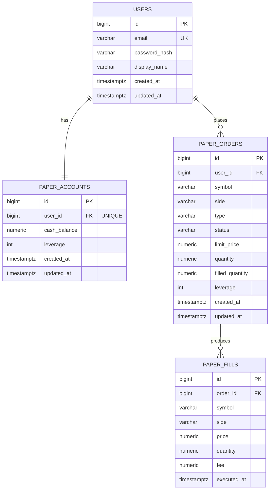

# ERD

이 문서는 실제 운영 스키마인 [`src/main/resources/schema.sql`](../../src/main/resources/schema.sql)을 기준으로,
모의 선물 거래 도메인의 테이블 관계를 정리한다.

테스트에서는 같은 논리 구조를 H2 문법으로 바꾼
[`src/test/resources/schema-h2.sql`](../../src/test/resources/schema-h2.sql)을 사용한다.

## 관계도

## 관계 설명

| 관계 | DB 기준 | 의미 |
|---|---|---|
| `users` 1 : 1 `paper_accounts` | `paper_accounts.user_id`가 `users.id`를 참조하고 `UNIQUE` | 사용자 한 명은 모의 계좌 하나를 가진다. 계좌가 없으면 포트폴리오 조회 시 lazy 생성한다. |
| `users` 1 : N `paper_orders` | `paper_orders.user_id`가 `users.id`를 참조 | 로그인 사용자가 생성한 주문 목록이다. "내 주문만 조회/취소"하는 격리 기준이다. |
| `paper_orders` 1 : N `paper_fills` | `paper_fills.order_id`가 `paper_orders.id`를 참조 | 주문 한 건이 여러 호가 레벨을 소진하면 체결 내역이 여러 건 생긴다. |

`paper_fills`에는 `user_id`가 없다. 체결의 소유자는 `paper_fills.order_id -> paper_orders.id -> paper_orders.user_id` 경로로 판단한다.
그래서 사용자별 체결 조회는 [`PaperFillRepository`](../../src/main/java/com/example/futurespapertrading/paper/repository/PaperFillRepository.java)에서
`paper_fills`와 `paper_orders`를 조인해 가져온다.

## 테이블 역할

| 테이블 | 역할 | 저장하는 핵심 값 |
|---|---|---|
| `users` | 회원 계정 | 이메일, BCrypt 비밀번호 해시, 표시 이름 |
| `paper_accounts` | 사용자별 모의 계좌 | 시드 현금, 신규 주문에 적용할 계좌 레버리지 |
| `paper_orders` | 사용자가 낸 주문 | 주문 방향, 주문 타입, 상태, 수량, 누적 체결 수량, 주문 시점 레버리지 |
| `paper_fills` | 실제 체결 원장 | 체결 가격, 체결 수량, 수수료, 체결 시각 |

## 설계 의도

이 프로젝트는 포지션, 실현 PnL, 미실현 PnL, equity를 별도 테이블에 저장하지 않는다.
대신 `paper_fills`를 체결 원장처럼 두고, 요청이 올 때마다 [`PositionCalculator`](../../src/main/java/com/example/futurespapertrading/paper/domain/PositionCalculator.java)와
[`PortfolioService`](../../src/main/java/com/example/futurespapertrading/paper/service/PortfolioService.java)가 체결 내역을 시간순으로 다시 계산한다.

이렇게 둔 이유는 체결 기록과 포지션 상태가 서로 어긋나는 이중 장부 문제를 피하기 위해서다.
단일 진실 원천은 `paper_fills`이고, 포지션과 PnL은 그 결과로 계산된다.

레버리지는 두 군데에 있다.

| 위치 | 의미 |
|---|---|
| `paper_accounts.leverage` | 사용자가 UI에서 선택한 신규 주문용 기본 레버리지 |
| `paper_orders.leverage` | 주문이 생성된 시점에 고정된 레버리지 |

이미 열린 포지션은 진입 당시 레버리지로 증거금과 청산가가 계산되어야 한다.
따라서 사용자가 나중에 계좌 레버리지 버튼을 바꿔도 기존 포지션 계산이 흔들리지 않도록,
주문 생성 시점의 값을 `paper_orders.leverage`에 복사해 둔다.

## 운영 스키마와 테스트 스키마

운영/로컬/Docker/Railway 실행에서는 PostgreSQL용 [`schema.sql`](../../src/main/resources/schema.sql)을 사용한다.
여기서는 `BIGSERIAL`, `TIMESTAMPTZ`, `NUMERIC(38,8)` 같은 PostgreSQL 타입을 쓴다.

테스트에서는 [`schema-h2.sql`](../../src/test/resources/schema-h2.sql)을 사용한다.
테이블 이름과 관계는 같지만, H2에서 실행되도록 `BIGINT GENERATED BY DEFAULT AS IDENTITY`,
`TIMESTAMP WITH TIME ZONE` 같은 문법으로 바꿔 둔 테스트 전용 스키마다.

즉 테스트에서 H2를 쓰는 것은 운영 DB 구조를 바꾸는 것이 아니라,
같은 테이블 관계를 더 가볍게 띄워 Spring context와 도메인 흐름을 검증하기 위한 분리다.
