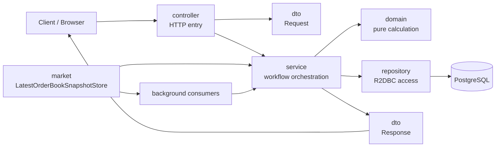
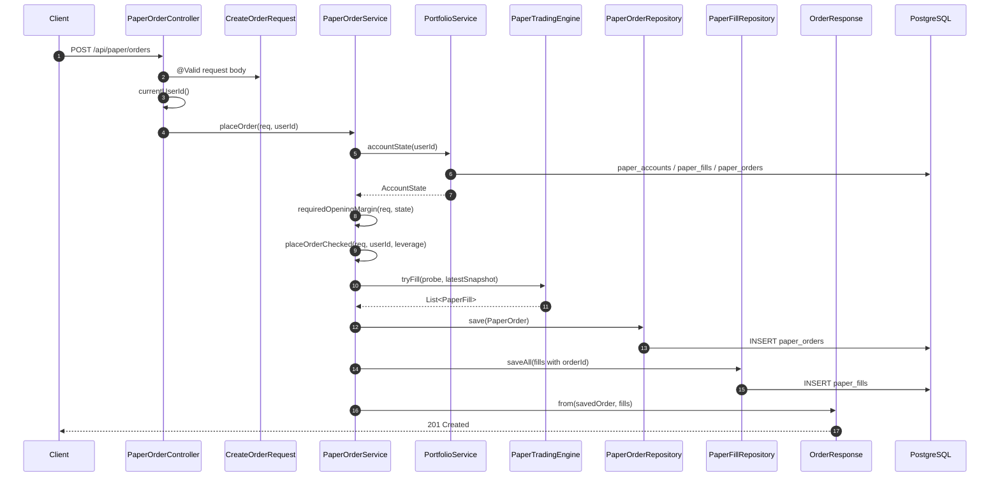
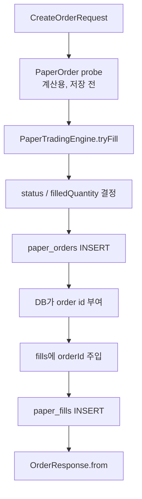
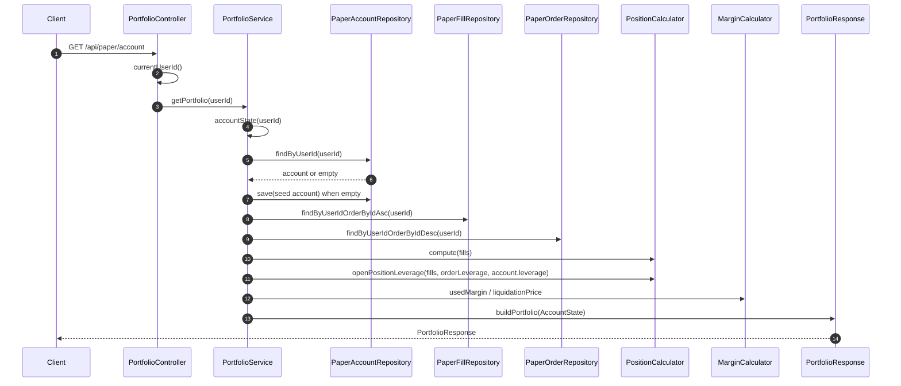
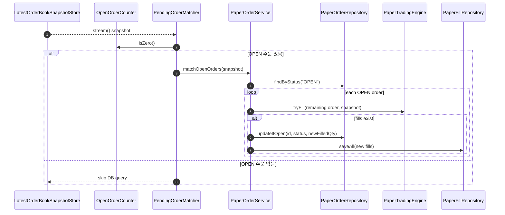
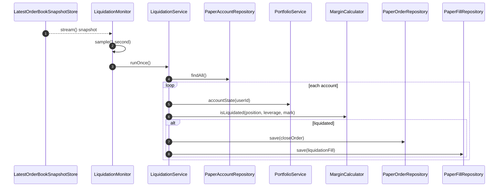

# Paper Request Flow

이 문서는 `paper` 패키지를 실무 코드 리뷰처럼 읽기 위한 요청 흐름 지도다.

DB 테이블 관계는 [ERD](erd.md)로 보고, 이 문서는 "HTTP 요청 또는 백그라운드 이벤트 1개가 어떤 Controller, DTO, Service, Domain, Repository, DB 테이블을 지나가는가"를 정리한다.

핵심 원칙은 파일 트리를 위에서 아래로 전부 읽는 것이 아니라, **기능 하나를 입구부터 저장/응답까지 따라가는 것**이다.

## 전체 의존 방향



책임 경계:

| 계층 | 책임 | 대표 파일 |
|---|---|---|
| Controller | HTTP 경로, 인증 사용자 id 추출, 요청 DTO 수신, 서비스 위임 | [`PaperOrderController`](../../src/main/java/com/example/futurespapertrading/paper/controller/PaperOrderController.java), [`PortfolioController`](../../src/main/java/com/example/futurespapertrading/paper/controller/PortfolioController.java) |
| DTO | 외부 요청/응답 모양과 입력 검증 | [`CreateOrderRequest`](../../src/main/java/com/example/futurespapertrading/paper/dto/CreateOrderRequest.java), [`OrderResponse`](../../src/main/java/com/example/futurespapertrading/paper/dto/OrderResponse.java), [`PortfolioResponse`](../../src/main/java/com/example/futurespapertrading/paper/dto/PortfolioResponse.java) |
| Service | 비즈니스 흐름 조립, DB 저장 순서, 예외 발생, 트랜잭션 경계 후보 | [`PaperOrderService`](../../src/main/java/com/example/futurespapertrading/paper/service/PaperOrderService.java), [`PortfolioService`](../../src/main/java/com/example/futurespapertrading/paper/service/PortfolioService.java) |
| Domain | DB/HTTP를 모르는 순수 계산 | [`PaperTradingEngine`](../../src/main/java/com/example/futurespapertrading/paper/domain/PaperTradingEngine.java), [`PositionCalculator`](../../src/main/java/com/example/futurespapertrading/paper/domain/PositionCalculator.java), [`MarginCalculator`](../../src/main/java/com/example/futurespapertrading/paper/domain/MarginCalculator.java) |
| Repository | 테이블 접근, 파생 쿼리, 직접 SQL UPDATE/JOIN | [`PaperOrderRepository`](../../src/main/java/com/example/futurespapertrading/paper/repository/PaperOrderRepository.java), [`PaperFillRepository`](../../src/main/java/com/example/futurespapertrading/paper/repository/PaperFillRepository.java), [`PaperAccountRepository`](../../src/main/java/com/example/futurespapertrading/paper/repository/PaperAccountRepository.java) |

## 1. 주문 생성

`POST /api/paper/orders`

가장 중요한 흐름이다. 사용자 요청, DTO 검증, 계좌/마진 계산, 호가 기반 체결, 주문 저장, fill 저장, 응답 생성이 모두 엮인다.



### 관련 파일과 메서드

| 순서 | 파일 | 메서드 | 역할 |
|---|---|---|---|
| 1 | [`PaperOrderController`](../../src/main/java/com/example/futurespapertrading/paper/controller/PaperOrderController.java) | `create(...)` | `POST /api/paper/orders` 입구. `@Valid` 요청을 받고 현재 사용자 id를 구해 서비스로 넘긴다. |
| 2 | [`CreateOrderRequest`](../../src/main/java/com/example/futurespapertrading/paper/dto/CreateOrderRequest.java) | `isLimitPriceValid()` | `symbol`, `side`, `type`, `quantity`, `limitPrice` 검증. 지정가 주문은 `limitPrice`가 필수다. |
| 3 | [`PaperOrderService`](../../src/main/java/com/example/futurespapertrading/paper/service/PaperOrderService.java) | `placeOrder(req, userId)` | 주문 생성의 public API. 먼저 계좌 상태를 계산해 신규 주문 증거금이 충분한지 확인한다. |
| 4 | [`PortfolioService`](../../src/main/java/com/example/futurespapertrading/paper/service/PortfolioService.java) | `accountState(userId)` | 계좌, 체결 목록, 주문별 레버리지, 최신 mark를 모아 `AccountState`를 만든다. |
| 5 | [`PaperOrderService`](../../src/main/java/com/example/futurespapertrading/paper/service/PaperOrderService.java) | `requiredOpeningMargin(req, state)` | 새로 여는 수량에 필요한 증거금을 계산한다. 순수 축소/청산 주문이면 0이다. |
| 6 | [`PaperOrderService`](../../src/main/java/com/example/futurespapertrading/paper/service/PaperOrderService.java) | `placeOrderChecked(req, userId, leverage)` | 최신 호가를 읽고, 시장가/지정가 상태를 판정할 준비를 한다. |
| 7 | [`PaperTradingEngine`](../../src/main/java/com/example/futurespapertrading/paper/domain/PaperTradingEngine.java) | `tryFill(order, snapshot)` | 호가 레벨을 소진하며 실제 체결 목록을 계산한다. DB 저장은 하지 않는다. |
| 8 | [`PaperOrderService`](../../src/main/java/com/example/futurespapertrading/paper/service/PaperOrderService.java) | `saveOrder(...)` | `paper_orders`에 주문을 저장하고, DB가 부여한 주문 id로 fill 저장을 이어간다. |
| 9 | [`PaperOrderService`](../../src/main/java/com/example/futurespapertrading/paper/service/PaperOrderService.java) | `saveFills(orderId, fills)` | 계산된 fill에 `orderId`를 박아 `paper_fills`에 저장한다. |
| 10 | [`OrderResponse`](../../src/main/java/com/example/futurespapertrading/paper/dto/OrderResponse.java) | `from(order, fills)` | 저장된 주문과 체결 목록을 클라이언트 응답 DTO로 바꾼다. 평균 체결가도 여기서 계산한다. |

### 상태 판정

| 조건 | 결과 상태 | 이유 |
|---|---|---|
| 시장가, 체결 1건 이상 | `FILLED` | 시장가는 즉시 가능한 만큼만 체결하고 종료한다. |
| 시장가, 체결 0건 | `REJECTED` | 먹을 수 있는 호가가 없으므로 주문을 남기지 않는다. |
| 지정가, 전량 체결 | `FILLED` | 주문 수량 전체가 현재 호가에서 체결됐다. |
| 지정가, 부분 체결 또는 미체결 | `OPEN` | 남은 수량은 지정가로 대기하고 `PendingOrderMatcher`가 이후 호가에서 재평가한다. |

### 저장 순서



중요한 설계 판단:

| 판단 | 이유 |
|---|---|
| 엔진은 `CreateOrderRequest`가 아니라 `PaperOrder`를 받는다 | 도메인 계산기가 웹 DTO에 의존하지 않게 하기 위해서다. |
| `PaperTradingEngine`은 fill 목록만 반환한다 | 상태 판정과 DB 저장은 부수효과가 있는 서비스 계층의 책임이다. |
| 주문을 먼저 저장하고 fill을 나중에 저장한다 | fill의 `order_id`는 DB가 만든 `paper_orders.id`가 있어야 채울 수 있다. |
| `paper_orders.leverage`에 주문 당시 레버리지를 저장한다 | 이후 계좌 레버리지를 바꿔도 이미 열린 포지션의 증거금/청산가가 흔들리지 않게 하기 위해서다. |

## 2. 계좌/포지션 조회

`GET /api/paper/account`

이 흐름은 포지션과 PnL을 테이블에 저장하지 않고, 체결 원장(`paper_fills`)을 매번 재생해서 계산한다는 설계를 보여준다.



### 관련 파일과 메서드

| 순서 | 파일 | 메서드 | 역할 |
|---|---|---|---|
| 1 | [`PortfolioController`](../../src/main/java/com/example/futurespapertrading/paper/controller/PortfolioController.java) | `account()` | 계좌 화면 API 입구. 현재 사용자 id를 구해 `PortfolioService`에 위임한다. |
| 2 | [`PortfolioService`](../../src/main/java/com/example/futurespapertrading/paper/service/PortfolioService.java) | `getPortfolio(userId)` | 계좌 상태를 계산한 뒤 응답 DTO로 변환한다. |
| 3 | [`PortfolioService`](../../src/main/java/com/example/futurespapertrading/paper/service/PortfolioService.java) | `accountState(userId)` | 계좌, 체결 목록, 주문 레버리지 맵을 모아 계산 재료를 만든다. |
| 4 | [`PortfolioService`](../../src/main/java/com/example/futurespapertrading/paper/service/PortfolioService.java) | `getOrCreateAccount(userId)` | 계좌가 없으면 10,000 USDT 시드 계좌를 lazy 생성한다. |
| 5 | [`PaperFillRepository`](../../src/main/java/com/example/futurespapertrading/paper/repository/PaperFillRepository.java) | `findByUserIdOrderByIdAsc(userId)` | `paper_orders`와 JOIN해 사용자 체결을 시간순으로 조회한다. |
| 6 | [`PaperOrderRepository`](../../src/main/java/com/example/futurespapertrading/paper/repository/PaperOrderRepository.java) | `findByUserIdOrderByIdDesc(userId)` | 주문별 레버리지 맵을 만들기 위해 사용자 주문을 조회한다. |
| 7 | [`PositionCalculator`](../../src/main/java/com/example/futurespapertrading/paper/domain/PositionCalculator.java) | `compute(fills)` | 체결을 시간순으로 재생해 현재 포지션과 실현 PnL을 계산한다. |
| 8 | [`PositionCalculator`](../../src/main/java/com/example/futurespapertrading/paper/domain/PositionCalculator.java) | `openPositionLeverage(...)` | 현재 열린 포지션의 진입 시점 레버리지를 복원한다. |
| 9 | [`MarginCalculator`](../../src/main/java/com/example/futurespapertrading/paper/domain/MarginCalculator.java) | `usedMargin(...)`, `liquidationPrice(...)` | 사용 증거금과 청산가를 계산한다. |
| 10 | [`PortfolioService`](../../src/main/java/com/example/futurespapertrading/paper/service/PortfolioService.java) | `buildPortfolio(state)` | `AccountState`를 화면 응답인 `PortfolioResponse`로 바꾼다. |

계산 기준:

| 값 | 저장 여부 | 계산 위치 |
|---|---|---|
| 현금 시드 | `paper_accounts.cash_balance`에 저장 | `PortfolioService.getOrCreateAccount` |
| 계좌 레버리지 | `paper_accounts.leverage`에 저장 | 신규 주문 기본값 |
| 주문 시점 레버리지 | `paper_orders.leverage`에 저장 | 포지션 레버리지 복원 |
| 체결 원장 | `paper_fills`에 저장 | 포지션/PnL의 단일 진실 원천 |
| 포지션 | 저장하지 않음 | `PositionCalculator.compute` |
| 실현/미실현 PnL | 저장하지 않음 | `PositionCalculator`, `PortfolioService.toState` |
| 사용 증거금/청산가 | 저장하지 않음 | `MarginCalculator` |

## 3. 대기 지정가 자동 체결

사용자 요청이 아니라 서버 내부 백그라운드 흐름이다.



핵심 포인트:

| 파일 | 메서드 | 역할 |
|---|---|---|
| [`PendingOrderMatcher`](../../src/main/java/com/example/futurespapertrading/paper/service/PendingOrderMatcher.java) | `start()` | 서버 부팅 후 호가 스트림을 구독하고, OPEN 주문이 있으면 재평가를 트리거한다. |
| [`OpenOrderCounter`](../../src/main/java/com/example/futurespapertrading/paper/service/OpenOrderCounter.java) | `isZero()`, `increment()`, `decrement()` | OPEN 주문이 없을 때 비싼 DB 조회를 건너뛰는 fast-path다. |
| [`PaperOrderService`](../../src/main/java/com/example/futurespapertrading/paper/service/PaperOrderService.java) | `matchOpenOrders(snapshot)` | OPEN 주문을 조회해 한 건씩 재평가한다. |
| [`PaperOrderService`](../../src/main/java/com/example/futurespapertrading/paper/service/PaperOrderService.java) | `fillOpenOrder(order, snapshot)` | 남은 수량만 probe로 만들어 체결 가능한 fill을 계산한다. |
| [`PaperOrderRepository`](../../src/main/java/com/example/futurespapertrading/paper/repository/PaperOrderRepository.java) | `updateIfOpen(...)` | 주문이 아직 OPEN일 때만 상태/누적 체결 수량을 갱신한다. 취소와 체결 경합을 DB 조건으로 정리한다. |

경합 처리:

```text
사용자 취소: cancelIfOpen(id)
자동 체결: updateIfOpen(id, status, filledQuantity)

둘 다 WHERE status = 'OPEN' 조건을 가진다.
먼저 성공한 쪽은 1행을 갱신하고, 늦은 쪽은 0행을 받아 자기 작업을 포기한다.
```

## 4. 강제 청산

이 흐름도 사용자 요청 없이 돈다. 호가 스트림을 1초 샘플링해 모든 계좌의 포지션을 검사한다.



핵심 포인트:

| 파일 | 메서드 | 역할 |
|---|---|---|
| [`LiquidationMonitor`](../../src/main/java/com/example/futurespapertrading/paper/service/LiquidationMonitor.java) | `start()` | 호가 스트림을 1초마다 샘플링해 청산 검사를 트리거한다. |
| [`LiquidationService`](../../src/main/java/com/example/futurespapertrading/paper/service/LiquidationService.java) | `runOnce()` | 모든 계좌의 현재 포지션 상태를 검사한다. |
| [`PortfolioService`](../../src/main/java/com/example/futurespapertrading/paper/service/PortfolioService.java) | `accountState(userId)` | 청산 판단에 필요한 포지션, mark, 포지션 레버리지를 계산한다. |
| [`MarginCalculator`](../../src/main/java/com/example/futurespapertrading/paper/domain/MarginCalculator.java) | `isLiquidated(...)` | 현재 mark가 청산가를 넘겼는지 판단한다. |
| [`LiquidationService`](../../src/main/java/com/example/futurespapertrading/paper/service/LiquidationService.java) | `liquidate(...)` | 반대 방향 시장가 주문과 청산가 fill을 저장해 포지션을 닫는다. |

청산도 포지션 테이블을 직접 수정하지 않는다. `paper_orders`에 청산 주문을 추가하고 `paper_fills`에 반대 방향 체결을 추가한다. 이후 포지션은 기존과 동일하게 체결 원장을 재생해 flat으로 계산된다.

## 리뷰할 때 보는 순서

주문 생성 흐름을 디버깅하거나 리뷰할 때는 아래 순서로 보면 된다.

```text
1. PaperOrderController.create()
2. CreateOrderRequest 검증 조건
3. PaperOrderService.placeOrder()
4. PortfolioService.accountState()
5. PaperOrderService.requiredOpeningMargin()
6. PaperOrderService.placeOrderChecked()
7. PaperTradingEngine.tryFill()
8. PaperOrderService.saveOrder()
9. PaperOrderService.saveFills()
10. OrderResponse.from()
```

포트폴리오 계산이 이상할 때는 아래 순서가 빠르다.

```text
1. PortfolioController.account()
2. PortfolioService.getPortfolio()
3. PortfolioService.accountState()
4. PaperFillRepository.findByUserIdOrderByIdAsc()
5. PositionCalculator.compute()
6. PositionCalculator.openPositionLeverage()
7. PortfolioService.toState()
8. MarginCalculator.usedMargin() / liquidationPrice()
9. PortfolioService.buildPortfolio()
```

## 불변식

이 패키지에서 깨지면 안 되는 핵심 규칙이다.

| 규칙 | 이유 |
|---|---|
| 사용자별 조회는 반드시 `userId` 기준으로 격리한다 | 남의 주문/체결/계좌가 보이면 안 된다. |
| `paper_fills`는 포지션/PnL의 단일 진실 원천이다 | 포지션 테이블을 따로 두면 체결 원장과 어긋날 위험이 생긴다. |
| 주문 1건은 fill N건을 만들 수 있다 | 한 주문이 여러 호가 레벨을 소진할 수 있기 때문이다. |
| 체결 저장은 주문 저장 후에 한다 | fill에는 부모 주문 id가 필요하다. |
| OPEN 주문 갱신은 조건부 UPDATE로 한다 | 취소와 자동 체결의 race를 DB의 `WHERE status='OPEN'` 조건으로 정리한다. |
| 도메인 계산기는 DB/HTTP를 몰라야 한다 | `PaperTradingEngine`, `PositionCalculator`, `MarginCalculator`는 단위 테스트 가능한 순수 계산기로 남긴다. |

## 문서화 기준

모든 메서드를 다이어그램에 넣으면 오히려 읽기 어려워진다. 실무 문서에서는 보통 아래 기준으로 자른다.

| 포함 | 제외 또는 부록 처리 |
|---|---|
| 외부 입구 Controller 메서드 | 단순 getter/setter, record accessor |
| 요청/응답 DTO와 검증 메서드 | DTO 내부 설명성 주석 전체 |
| public service API | private helper 전체 구현 세부사항 |
| 도메인 계산의 핵심 메서드 | 계산 내부 루프의 모든 지역 변수 |
| DB에 실제 접근하는 repository 메서드 | Spring Data가 자동 제공하는 단순 CRUD 전부 |
| 상태 전이가 바뀌는 지점 | 로그, 단순 변환, UI 표시용 포맷 |

즉, 이 문서는 "코드 전체 지도"가 아니라 **기능 흐름 지도**다. 실제 구현 디테일이 필요할 때는 표의 파일 링크를 따라가서 해당 메서드를 읽는다.
