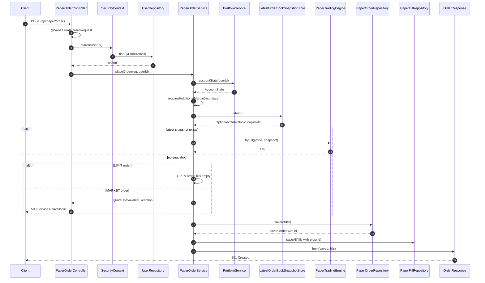

# Paper Create Request Flow

이 문서는 `paper` 패키지 전체 설명서가 아니라, **주문 생성 요청 하나**를 끝까지 따라가는 문서다.

대상 흐름은 하나다.

```text
POST /api/paper/orders
→ PaperOrderController.create()
→ PaperOrderService.placeOrder()
→ 체결 판정
→ 주문/체결 저장
→ OrderResponse 응답
```

목표는 파일을 위에서 아래로 전부 읽는 것이 아니라, `create()` 요청이 들어왔을 때 코드가 실제로 어떤 순서로 실행되는지 이해하는 것이다.

## 큰 그림



## 읽을 파일

| 순서 | 파일 | 메서드 | 역할 |
|---|---|---|---|
| 1 | [`PaperOrderController`](../../src/main/java/com/example/futurespapertrading/paper/controller/PaperOrderController.java) | `create(...)` | HTTP 요청을 받고 현재 사용자 id를 구해 서비스에 넘긴다. |
| 2 | [`CreateOrderRequest`](../../src/main/java/com/example/futurespapertrading/paper/dto/CreateOrderRequest.java) | record 검증, `isLimitPriceValid()` | 요청 JSON 모양과 입력 검증 규칙을 정의한다. |
| 3 | [`PaperOrderService`](../../src/main/java/com/example/futurespapertrading/paper/service/PaperOrderService.java) | `placeOrder(...)` | 주문 생성 유스케이스의 서비스 진입점이다. |
| 4 | [`PortfolioService`](../../src/main/java/com/example/futurespapertrading/paper/service/PortfolioService.java) | `accountState(...)` | 계좌, 포지션, mark, 가용잔고를 계산해 주문 가능 여부 판단에 필요한 상태를 만든다. |
| 5 | [`PaperOrderService`](../../src/main/java/com/example/futurespapertrading/paper/service/PaperOrderService.java) | `requiredAdditionalMargin(...)` | 이번 주문 때문에 추가로 필요한 증거금을 계산한다. |
| 6 | [`PaperOrderService`](../../src/main/java/com/example/futurespapertrading/paper/service/PaperOrderService.java) | `placeOrderAfterMarginCheck(...)` | 증거금 검증 뒤 체결 판정과 저장 분기를 처리한다. |
| 7 | [`PaperTradingEngine`](../../src/main/java/com/example/futurespapertrading/paper/domain/PaperTradingEngine.java) | `tryFill(...)` | 호가 snapshot 기준으로 실제 체결 후보 fill 목록을 계산한다. |
| 8 | [`PaperOrderService`](../../src/main/java/com/example/futurespapertrading/paper/service/PaperOrderService.java) | `saveOrder(...)`, `saveFills(...)` | 주문을 저장하고, 주문 id를 체결 기록에 꽂아 fill을 저장한다. |
| 9 | [`OrderResponse`](../../src/main/java/com/example/futurespapertrading/paper/dto/OrderResponse.java) | `from(...)` | 저장된 주문과 체결 목록을 응답 DTO로 바꾼다. |

## 1. 컨트롤러 입구

요청은 여기로 들어온다.

```java
@PostMapping
@ResponseStatus(HttpStatus.CREATED)
public Mono<OrderResponse> create(@Valid @RequestBody CreateOrderRequest req) {
    return currentUserId().flatMap(userId -> orderService.placeOrder(req, userId));
}
```

이 메서드의 책임은 작다.

```text
1. POST /api/paper/orders 요청을 받는다.
2. JSON body를 CreateOrderRequest로 변환한다.
3. @Valid로 입력값을 검증한다.
4. 현재 로그인 사용자의 userId를 구한다.
5. PaperOrderService.placeOrder(req, userId)에 위임한다.
```

여기서 중요한 점은 `create()`가 직접 주문을 저장하거나 체결하지 않는다는 것이다. 컨트롤러는 HTTP 입구이고, 실제 주문 생성 업무는 서비스가 맡는다.

## 2. 요청 DTO 검증

`CreateOrderRequest`는 주문 요청 JSON의 모양이다.

```java
public record CreateOrderRequest(
        @NotBlank @Pattern(regexp = "BTCUSDT") String symbol,
        @Pattern(regexp = "BUY|SELL") String side,
        @Pattern(regexp = "MARKET|LIMIT") String type,
        @NotNull @Positive BigDecimal quantity,
        BigDecimal limitPrice
) {
    @AssertTrue
    private boolean isLimitPriceValid() {
        if (!"LIMIT".equals(type)) return true;
        return limitPrice != null && limitPrice.signum() > 0;
    }
}
```

검증 의미는 이렇다.

| 필드 | 검증 |
|---|---|
| `symbol` | 현재는 `BTCUSDT`만 허용한다. |
| `side` | `BUY` 또는 `SELL`만 허용한다. |
| `type` | `MARKET` 또는 `LIMIT`만 허용한다. |
| `quantity` | null이 아니고 양수여야 한다. |
| `limitPrice` | `LIMIT` 주문일 때만 필수이고 양수여야 한다. |

검증에 실패하면 컨트롤러 본문이 실행되기 전에 Spring이 400 응답을 만든다.

## 3. 현재 사용자 id 확인

`create()`는 직접 userId를 받지 않는다. 로그인 정보에서 현재 사용자의 email을 꺼내고, DB에서 `User`를 찾아 id를 얻는다.

```java
private Mono<Long> currentUserId() {
    return ReactiveSecurityContextHolder.getContext()
            .map(ctx -> ctx.getAuthentication().getName())
            .flatMap(userRepository::findByEmail)
            .map(User::id);
}
```

흐름은 이렇다.

```text
SecurityContext
→ Authentication
→ email
→ userRepository.findByEmail(email)
→ User.id
```

이 id가 주문의 `user_id`로 저장된다. 그래서 주문 목록 조회나 취소 때도 남의 주문과 섞이지 않는다.

## 4. WebFlux 실행 타이밍

`create()`는 `Mono<OrderResponse>`를 바로 반환한다.

```java
return currentUserId().flatMap(userId -> orderService.placeOrder(req, userId));
```

여기서 메서드가 반환하는 것은 "결과값"이 아니라 "나중에 실행될 파이프라인"이다.

```text
create() 호출 시점
→ Mono 파이프라인 조립
→ 아직 DB 조회/저장 실행 안 됨

WebFlux가 반환된 Mono를 subscribe하는 시점
→ currentUserId() 실행
→ userId가 나오면 placeOrder(req, userId) 실행
→ 저장 완료 후 OrderResponse emit
```

그래서 `flatMap` 안의 `orderService.placeOrder(...)`는 userId가 실제로 흘러온 뒤 호출된다.

## 5. 서비스 진입점: placeOrder

컨트롤러가 호출하는 주문 생성 서비스 진입점이다.

```java
public Mono<OrderResponse> placeOrder(CreateOrderRequest req, Long userId) {
    return portfolioService.accountState(userId).flatMap(state -> {
        boolean isLimit = OrderType.LIMIT.name().equals(req.type());
        if (!isLimit && state.mark() == null)
            return Mono.error(new QuoteUnavailableException(...));

        BigDecimal requiredAdditionalMargin = requiredAdditionalMargin(req, state);
        if (requiredAdditionalMargin.compareTo(state.availableBalance()) > 0)
            return Mono.error(new InsufficientMarginException(...));

        return placeOrderAfterMarginCheck(req, userId, state.account().leverage());
    });
}
```

`placeOrder()`의 책임은 체결이 아니라 **주문을 받아도 되는지 먼저 판단하는 것**이다.

```text
1. PortfolioService.accountState(userId)로 계좌 상태를 계산한다.
2. 시장가 주문인데 mark 가격이 없으면 증거금 계산을 못 하므로 거부한다.
3. 이번 주문에 필요한 추가 증거금을 계산한다.
4. 가용잔고보다 필요 증거금이 크면 거부한다.
5. 통과하면 placeOrderAfterMarginCheck(...)로 넘긴다.
```

### 시장가와 지정가의 증거금 기준가

증거금 계산 기준가는 주문 종류에 따라 다르다.

```java
BigDecimal refPrice = isLimit ? req.limitPrice() : state.mark();
```

| 주문 종류 | 기준가 |
|---|---|
| 지정가 `LIMIT` | 사용자가 입력한 `limitPrice` |
| 시장가 `MARKET` | 현재 mark 가격 |

시장가 주문은 주문 자체에 가격이 없다. 그래서 mark 가격이 없으면 증거금을 계산할 수 없다.

반대로 지정가 주문은 요청 안에 `limitPrice`가 있다. 그래서 현재 mark가 없어도 일단 증거금 계산은 가능하다.

## 6. 추가 증거금 계산

`requiredAdditionalMargin(...)`은 이번 주문 때문에 새로 필요한 증거금만 계산한다.

핵심은 **기존 포지션을 줄이는 수량은 추가 증거금 대상이 아니라는 것**이다.

```text
현재 포지션 없음
→ 주문 수량 전체가 추가 증거금 대상

현재 포지션과 같은 방향 주문
→ 포지션을 늘리므로 주문 수량 전체가 추가 증거금 대상

현재 포지션과 반대 방향 주문
→ 먼저 기존 포지션을 줄임
→ 기존 포지션보다 많이 주문한 초과분만 추가 증거금 대상
```

예시:

```text
현재 LONG 3
SELL 5 주문

앞의 3개는 기존 LONG 청산
남은 2개만 새 SHORT 진입
→ 추가 증거금은 2개에 대해서만 계산
```

계산식은 단순하다.

```text
추가 증거금 = 추가 증거금 대상 수량 × 기준가 / 레버리지
```

## 7. 증거금 통과 후: placeOrderAfterMarginCheck

증거금 검증을 통과하면 이 메서드로 온다.

이 메서드의 관심사는 이제 증거금이 아니라 **체결 판정과 저장**이다.

```java
private Mono<OrderResponse> placeOrderAfterMarginCheck(
        CreateOrderRequest req,
        Long userId,
        int leverage
) {
    boolean isLimit = OrderType.LIMIT.name().equals(req.type());
    Optional<OrderBookSnapshot> maybeSnapshot = latestStore.latest();
    ...
}
```

여기서 `latestStore.latest()`로 최신 호가 snapshot을 다시 꺼낸다.

앞에서 mark 가격을 확인했는데 여기서 snapshot을 또 보는 이유는 역할이 다르기 때문이다.

```text
placeOrder()
→ 증거금 계산에 필요한 가격 확인

placeOrderAfterMarginCheck()
→ 실제 체결 계산에 필요한 호가 snapshot 확인
```

## 8. 호가 snapshot이 없는 경우

```java
if (maybeSnapshot.isEmpty()) {
    if (!isLimit) {
        return Mono.error(new QuoteUnavailableException("호가 수신 전이라 체결할 수 없습니다."));
    }

    return saveOrder(req, userId, OrderStatus.OPEN.name(), BigDecimal.ZERO, List.of(), leverage);
}
```

호가가 없을 때는 주문 종류에 따라 다르게 처리한다.

| 상황 | 처리 |
|---|---|
| 시장가 주문 + 호가 없음 | 지금 체결 기준이 없으므로 503 예외 |
| 지정가 주문 + 호가 없음 | 체결 계산 없이 `OPEN` 대기 주문으로 저장 |

지정가 주문은 현재 체결 평가는 못 해도, 사용자가 원하는 가격이 `limitPrice`로 들어있다. 그래서 주문 자체를 `OPEN`으로 저장해둘 수 있다.

이 저장 때문에 프론트엔드 주문 목록에서도 대기 주문으로 보일 수 있다.

```text
호가 없음 + 지정가 주문
→ filledQuantity = 0
→ fills = 빈 리스트
→ status = OPEN
→ paper_orders에 저장
```

이 메서드가 `PendingOrderMatcher`를 직접 호출하지는 않는다. `OPEN` 주문으로 저장해두면, 이후 새 호가가 들어올 때 `PendingOrderMatcher`가 호가 스트림을 구독하고 있다가 `matchOpenOrders(snapshot)`를 호출해 다시 평가한다.

## 9. 호가 snapshot이 있는 경우

호가가 있으면 지금 체결 가능한지 계산한다.

```java
PaperOrder probe = new PaperOrder(
        null, userId, req.symbol(),
        req.side(), req.type(), OrderStatus.NEW.name(),
        req.limitPrice(), req.quantity(), BigDecimal.ZERO, leverage);

List<PaperFill> fills = engine.tryFill(probe, maybeSnapshot.get());
BigDecimal filledQty = totalQuantity(fills);
```

여기서 만드는 `probe`는 DB에 저장할 주문이 아니다. 체결 엔진에 넘기기 위한 계산용 주문이다.

그래서:

```text
id = null
status = NEW
filledQuantity = 0
```

으로 만든다.

`PaperTradingEngine.tryFill(...)`은 순수 계산기다. DB에 저장하지 않고, 현재 snapshot 기준으로 체결될 수 있는 fill 목록만 계산해서 반환한다.

## 10. 주문 상태 결정

체결 결과를 보고 최종 주문 상태를 정한다.

```java
boolean fullyFilled = filledQty.compareTo(req.quantity()) >= 0;

if (isLimit)
    status = fullyFilled ? OrderStatus.FILLED.name() : OrderStatus.OPEN.name();
else
    status = fills.isEmpty() ? OrderStatus.REJECTED.name() : OrderStatus.FILLED.name();
```

상태 결정표:

| 상황 | 상태 | 이유 |
|---|---|---|
| 지정가 + 전량 체결 | `FILLED` | 주문 수량 전체가 바로 체결됐다. |
| 지정가 + 일부 체결 | `OPEN` | 남은 수량이 대기 주문으로 남는다. |
| 지정가 + 미체결 | `OPEN` | 아직 가격이 닿지 않아 대기 주문으로 남는다. |
| 시장가 + 체결 있음 | `FILLED` | 시장가는 가능한 만큼 즉시 체결하고 끝낸다. |
| 시장가 + 체결 없음 | `REJECTED` | 시장가는 대기 주문으로 남기지 않는다. |

즉 `OPEN` 대기 주문은 지정가에서만 나온다.

```text
호가 없음 + 지정가
→ OPEN

호가 있음 + 지정가 일부 체결/미체결
→ OPEN

시장가
→ FILLED 또는 REJECTED
```

## 11. 주문 저장: saveOrder

상태와 체결 결과가 정해지면 `saveOrder(...)`가 DB 저장을 담당한다.

```java
return saveOrder(req, userId, status, filledQty, fills, leverage);
```

`saveOrder(...)`는 먼저 `paper_orders`에 주문을 저장한다.

```java
PaperOrder toSave = new PaperOrder(
        null, userId, req.symbol(),
        req.side(), req.type(), status,
        req.limitPrice(), req.quantity(), filledQty, leverage);

return orderRepository.save(toSave)
        .doOnNext(saved -> {
            if (OrderStatus.OPEN.name().equals(status)) openOrderCounter.increment();
        })
        .flatMap(saved ->
                saveFills(saved.id(), fills)
                        .thenReturn(OrderResponse.from(saved, fills)));
```

중요한 점:

```text
1. 주문을 먼저 저장한다.
2. DB가 주문 id를 만들어준다.
3. OPEN 주문이면 openOrderCounter를 증가시킨다.
4. 저장된 주문 id를 fill에 꽂아 체결 기록을 저장한다.
5. OrderResponse를 만들어 반환한다.
```

`leverage`는 주문 시점 계좌 레버리지다. 주문에 같이 저장해서, 나중에 계좌 레버리지가 바뀌어도 이 주문은 진입 당시 레버리지를 유지한다.

## 12. 체결 저장: saveFills

체결이 없으면 아무것도 저장하지 않는다.

```java
if (fills.isEmpty()) return Mono.empty();
```

체결이 있으면 fill마다 `orderId`를 넣은 새 `PaperFill`을 만들어 저장한다.

```java
List<PaperFill> withOrderId = fills.stream()
        .map(f -> new PaperFill(null, orderId, f.symbol(),
                f.side(), f.price(), f.quantity(), f.fee()))
        .toList();

return fillRepository.saveAll(withOrderId).then();
```

엔진이 계산한 fill은 아직 DB 저장 전이라 `orderId`가 없다. 주문을 먼저 저장해야 DB가 주문 id를 만들어주고, 그 id를 fill의 외래키로 넣을 수 있다.

```text
paper_orders INSERT
→ order id 생성
→ paper_fills.order_id에 그 id 사용
→ paper_fills INSERT
```

## 13. 응답 생성

저장이 끝나면 `OrderResponse.from(saved, fills)`로 응답 DTO를 만든다.

```java
OrderResponse.from(saved, fills)
```

응답에는 주문 요약이 들어간다.

| 필드 | 의미 |
|---|---|
| `id` | DB가 만든 주문 id |
| `symbol` | 종목 |
| `side` | BUY / SELL |
| `type` | MARKET / LIMIT |
| `status` | FILLED / OPEN / REJECTED |
| `limitPrice` | 지정가 가격, 시장가면 null |
| `quantity` | 주문 수량 |
| `filledQuantity` | 실제 체결된 누적 수량 |
| `avgPrice` | 체결 평균가, 체결이 없으면 null |

정상 완료되면 컨트롤러의 `@ResponseStatus(HttpStatus.CREATED)` 때문에 HTTP 상태는 `201 Created`가 된다.

## 14. create 요청에서 발생할 수 있는 주요 결과

| 입력/상황 | 결과 |
|---|---|
| 비로그인 | 컨트롤러 도달 전 401 |
| DTO 검증 실패 | 컨트롤러 본문 실행 전 400 |
| 시장가인데 mark 없음 | 503 |
| 필요 증거금이 가용잔고 초과 | 400 |
| 시장가 체결 성공 | `FILLED` 저장, fill 저장 |
| 시장가 체결 0건 | `REJECTED` 저장, fill 없음 |
| 지정가 전량 체결 | `FILLED` 저장, fill 저장 |
| 지정가 일부 체결 | `OPEN` 저장, fill 저장 |
| 지정가 미체결 | `OPEN` 저장, fill 없음 |
| 지정가인데 호가 snapshot 없음 | `OPEN` 저장, fill 없음 |

## 15. create 하나만 놓고 보는 핵심 요약

```text
PaperOrderController.create()
→ HTTP 요청을 받는다.
→ @Valid로 요청 DTO를 검증한다.
→ currentUserId()로 로그인 사용자 id를 구한다.
→ PaperOrderService.placeOrder(req, userId)로 넘긴다.

PaperOrderService.placeOrder()
→ 계좌 상태를 계산한다.
→ 시장가에 필요한 mark 가격을 확인한다.
→ 추가 증거금을 계산한다.
→ 가용잔고와 비교한다.
→ 통과하면 placeOrderAfterMarginCheck(...)로 넘긴다.

placeOrderAfterMarginCheck()
→ 최신 호가 snapshot을 확인한다.
→ 호가 없고 지정가면 OPEN 저장한다.
→ 호가 있고 체결 가능하면 엔진으로 fills를 계산한다.
→ 체결 결과로 FILLED / OPEN / REJECTED를 정한다.
→ saveOrder(...)로 주문과 체결을 저장한다.
→ OrderResponse를 반환한다.
```

## 16. 이 문서에서 일부러 다루지 않는 것

이 문서는 `create()` 요청 하나만 이해하기 위한 문서라서 아래 흐름은 자세히 다루지 않는다.

| 제외한 흐름 | 이유 |
|---|---|
| `GET /api/paper/orders` | 주문 생성 흐름이 아니라 목록 조회 흐름이다. |
| `DELETE /api/paper/orders/{id}` | 주문 취소 흐름이다. |
| `GET /api/paper/account` | 포트폴리오 조회 흐름이다. |
| `PendingOrderMatcher` 전체 동작 | create가 직접 호출하지 않는다. 다만 `OPEN` 주문 저장 이후 새 호가에서 재평가한다는 점만 언급한다. |
| `LiquidationMonitor` | 강제청산 백그라운드 흐름이다. |

헷갈릴 때는 이 문서의 기준을 하나만 잡으면 된다.

```text
"POST /api/paper/orders 요청이 들어왔을 때,
create()에서 시작해 어떤 판단을 거쳐 DB에 무엇이 저장되는가?"
```
