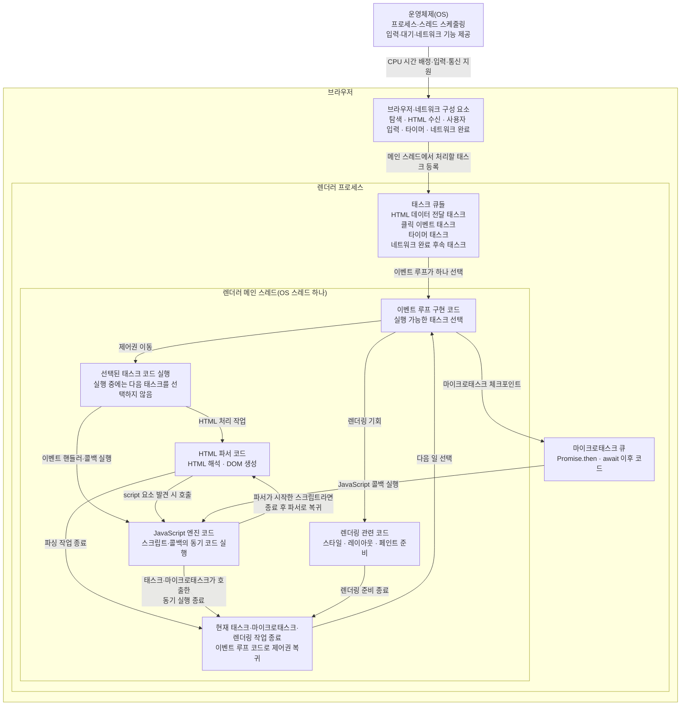

# 이벤트 루프, 메인 스레드, 콜 스택

## 구성 요소와 역할

| **구성 요소** | **역할** |
|---|---|
| **운영체제(OS)** | 브라우저 프로세스와 스레드에 CPU 시간을 배정하고, 입력·타이머·네트워크 같은 저수준 기능을 제공한다. |
| **브라우저** | HTML 파서, JavaScript 엔진, 렌더링 엔진, 네트워크 구성 요소 등을 조합해 페이지를 처리한다. |
| **렌더러 메인 스레드** | 일반적인 페이지에서 이벤트 루프 구현 코드, HTML 파싱, JavaScript, DOM·스타일·레이아웃 준비 등을 번갈아 실행하는 OS 스레드다. |
| **이벤트 루프** | 태스크·마이크로태스크·렌더링 기회를 어떤 절차로 처리할지 정의한 모델이다. 브라우저는 이를 메인 스레드에서 동작하는 내부 코드로 구현한다. |
| **HTML 파서** | HTML을 읽어 DOM을 만들고, `script` 요소를 만나면 조건에 맞는 시점에 스크립트 실행을 시작시킨다. |
| **JavaScript 엔진** | 전달받은 JavaScript를 실제로 실행하고 실행 컨텍스트와 콜 스택을 관리한다. 엔진 자체가 별도 스레드라는 뜻은 아니다. |
| **태스크** | 브라우저가 처리할 작업 묶음이다. 클릭 이벤트 전달, 타이머 콜백 실행, 네트워크 완료 후속 처리 등이 태스크가 될 수 있다. |
| **콜백** | 나중에 호출하도록 등록한 JavaScript 함수다. 콜백 자체가 태스크는 아니며, 태스크나 마이크로태스크의 처리 과정에서 호출될 수 있다. |
| **콜 스택** | 현재 실행 중인 JavaScript 함수 호출과 되돌아갈 위치를 관리하는 JavaScript 엔진의 실행 상태 구조다. |

## OS부터 태스크 실행까지의 관계



> 태스크 큐와 이벤트 루프는 별도 스레드가 아니다. 렌더러 메인 스레드가 이벤트 루프 구현 코드로 태스크를 선택한 뒤 해당 태스크, HTML 파서, JavaScript 엔진 또는 렌더링 관련 코드를 실행한다. 그 실행이 끝나야 이벤트 루프 코드로 돌아가 다음 일을 선택한다.

## JavaScript 실행의 시작

**파서나 태스크가 JavaScript 엔진을 호출한다**

= HTML 파서 또는 브라우저가 실행 중인 태스크의 내용이 “이 JavaScript 함수를 실행하라”고 요청하면, JavaScript 엔진이 그 코드를 실행한다는 뜻입니다.

> 이벤트 루프가 “이번에는 이 태스크를 실행해야겠다”고 선택한다. 그러면 같은 메인 스레드의 실행 제어권이 해당 태스크 코드로 넘어가 HTML 파서나 JavaScript 엔진 등이 실행된다. 해당 작업이 끝나면 제어권이 이벤트 루프 코드로 돌아와 다음 일을 선택한다.

## 하나의 메인 스레드가 번갈아 실행하는 코드

**하나의 메인 스레드가 번갈아 실행하는 코드의 종류**를 나열한 것입니다.

```text
렌더러 메인 스레드(OS 스레드 하나)
├─ 브라우저의 이벤트 루프 구현 코드가 실행되는 시간
├─ HTML 파서 코드가 실행되는 시간
├─ JavaScript 엔진 코드가 실행되는 시간
└─ 렌더링 관련 코드가 실행되는 시간
```

정확한 역할은 다음과 같습니다.

| **질문** | **담당** |
|---|---|
| 다음 태스크를 언제 처리할지 결정 | 이벤트 루프 구현 코드 |
| HTML을 해석해 DOM 생성 | HTML 파서 |
| JavaScript 코드 실행 | JavaScript 엔진 |
| 이 코드들이 실제로 실행되는 통로 | 렌더러 메인 스레드 |
