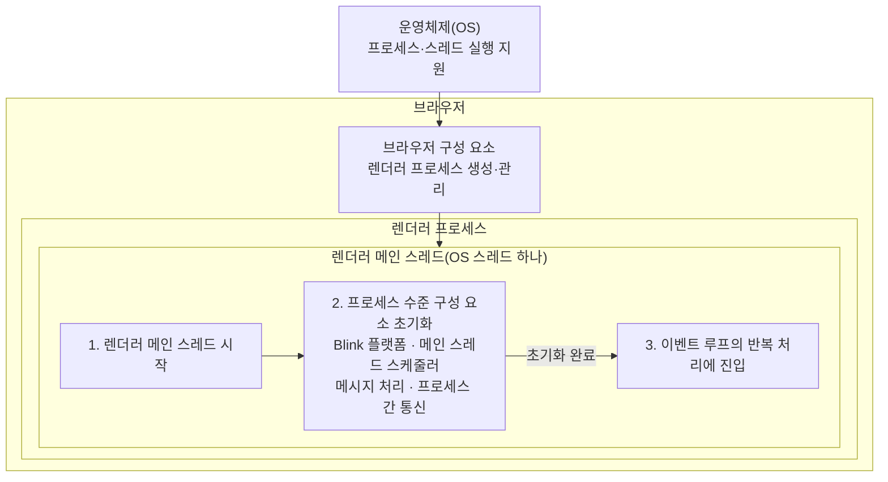
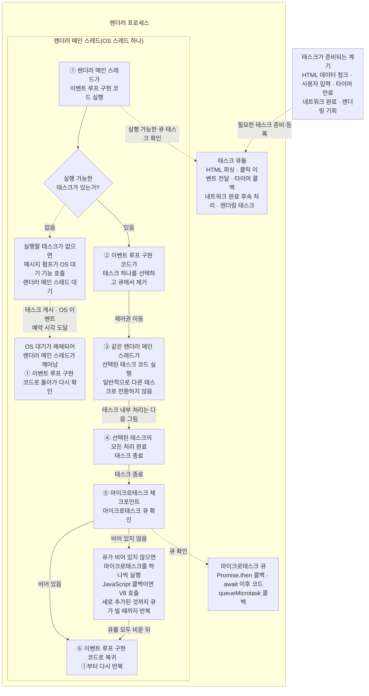
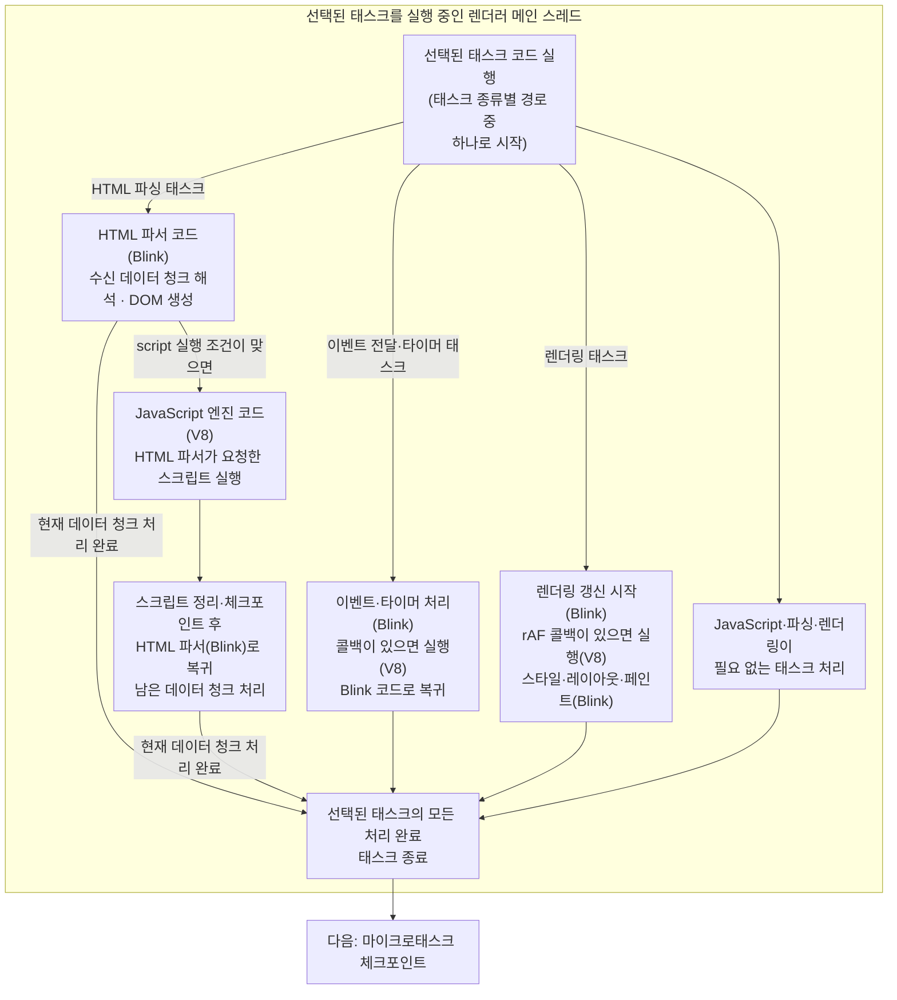

# 이벤트 루프, 메인 스레드, 콜 스택

> 이 문서는 웹 워커가 아닌 일반적인 **Chromium 기반 브라우저의 페이지(Window 실행 환경)**를 중심으로 설명한다. 이벤트 루프는 표준상의 처리 모델이지 OS 스레드 자체가 아니며, 이벤트 루프와 OS 스레드가 모든 구현에서 항상 1:1로 대응하는 것은 아니다.

## 구성 요소와 역할

| **구성 요소** | **역할** |
|---|---|
| **운영체제(OS)** | 브라우저 프로세스와 스레드에 CPU 시간을 배정하고, 입력·타이머·네트워크 같은 저수준 기능을 제공한다. |
| **브라우저(애플리케이션 전체)** | 여러 프로세스와 스레드, HTML 파서, JavaScript 엔진, 렌더링 엔진, 네트워크 서비스 등을 조합해 페이지를 처리한다. |
| **브라우저 프로세스(Chromium 기준)** | Chromium을 구성하는 중심 프로세스로, 브라우저 UI·탐색·렌더러 프로세스 관리와 사용자 입력 전달 등을 담당한다. 브라우저 전체와 같은 말이 아니며 모든 태스크를 직접 등록하지 않는다. |
| **렌더러 프로세스** | 페이지 콘텐츠를 처리하는 프로세스다. 메인 스레드 외에도 합성·래스터·작업용 스레드 등이 있을 수 있지만, 이 문서는 렌더러 메인 스레드에 초점을 맞춘다. |
| **렌더러 메인 스레드** | 일반적인 Chromium 페이지에서 이벤트 루프 구현 코드, HTML 파서 코드, JavaScript 엔진 코드, DOM·스타일·레이아웃 관련 코드 등을 번갈아 실행하는 OS 스레드다. 흔히 웹 개발에서 말하는 JavaScript 메인 스레드가 이 스레드다. |
| **이벤트 루프** | 실행 가능한 태스크의 선택과 실행, 마이크로태스크 체크포인트 등의 처리 순서를 정의한 표준상의 모델이다. 스레드 자체가 아니며, 일반적인 Chromium 렌더러에서는 메인 스레드에서 동작하는 내부 스케줄링 코드로 구현된다. |
| **메시지 펌프(Chromium 내부)** | 태스크 스케줄러와 OS의 대기·깨움 기능을 연결하는 내부 코드다. 별도 스레드가 아니며, 실행할 태스크가 없으면 OS 대기 기능을 호출한다. 태스크 게시·OS 이벤트·예약 시각 도달로 대기가 해제되면 메인 스레드의 실행이 이어진다. |
| **Blink(Chromium의 웹 플랫폼·렌더링 엔진)** | HTML 파싱, DOM과 웹 API, 이벤트 전달, 스타일·레이아웃·페인트 준비 등 페이지 처리에 필요한 여러 브라우저 코드를 제공한다. Blink 자체는 태스크가 아니며 렌더링 태스크와 같은 말도 아니다. |
| **HTML 파서(Blink)** | Blink에 포함된 코드로 HTML을 읽어 DOM을 만들고, `script` 요소의 실행 조건이 맞으면 V8에 스크립트 실행을 요청한다. |
| **V8(Chromium의 JavaScript 엔진)** | 전달받은 JavaScript를 실제로 실행하고 실행 컨텍스트와 콜 스택을 관리한다. V8은 태스크나 스레드 자체가 아닌 엔진이며, 여기서 다루는 페이지 JavaScript 실행은 렌더러 메인 스레드에서 수행된다. HTML 파싱·이벤트 전달·렌더링 태스크의 실행 단계에서 필요할 때 호출될 수 있다. |
| **태스크** | 브라우저가 처리할 작업 묶음이다. HTML 수신 데이터 청크 파싱, 클릭 이벤트 전달, 타이머 콜백 실행, 네트워크 완료 후속 처리, 렌더링 작업 등이 태스크가 될 수 있다. |
| **태스크 큐** | 실행할 준비가 된 태스크를 관리하는 구조다. 이벤트 루프는 하나 이상의 태스크 큐에서 실행 가능한 태스크를 선택한다. 모든 태스크가 하나의 전역 FIFO 큐에 들어가는 것은 아니며, 구체적인 선택 정책은 구현에 따라 달라질 수 있다. |
| **렌더링 태스크** | 렌더링 기회가 생겼을 때 준비되는 태스크다. 이벤트 루프가 선택하면 같은 렌더러 메인 스레드가 Blink의 렌더링 갱신 단계를 실행하며, `requestAnimationFrame` 콜백이 있으면 그 과정에서 V8도 호출한다. |
| **마이크로태스크** | 다음 태스크로 넘어가기 전, 마이크로태스크 체크포인트에서 처리하도록 예약된 작업이다. `Promise.then` 콜백, `await` 이후 코드, `queueMicrotask` 콜백 등이 해당한다. 이름이 실행 시간이 짧다는 뜻은 아니다. |
| **마이크로태스크 큐** | 실행할 준비가 된 마이크로태스크를 보관하는 별도의 큐다. 태스크 큐와 구분되며, 마이크로태스크 체크포인트에서 새로 추가되는 것까지 큐가 빌 때까지 처리된다. |
| **마이크로태스크 체크포인트** | 마이크로태스크 큐를 확인하고, 비어 있지 않으면 새로 추가되는 마이크로태스크까지 모두 처리하는 절차다. 태스크 종료 뒤와 스크립트 실행 정리 과정 등 HTML 표준이 정한 시점에 수행된다. 표준상 마이크로태스크 실행 외의 정리 단계도 포함한다. |
| **콜백** | 다른 코드에 전달되어 특정 시점에 호출되는 JavaScript 함수다. 동기적으로 호출될 수도 있고, 태스크나 마이크로태스크 처리 중 호출될 수도 있다. 콜백 자체가 태스크인 것은 아니다. |
| **콜 스택** | 현재 실행 중인 JavaScript 함수 호출과 되돌아갈 위치를 관리하는 JavaScript 엔진의 실행 상태 구조다. |

> **핵심 구분 — Blink와 V8은 태스크 종류가 아니다.** 둘은 선택된 태스크를 처리하면서 렌더러 메인 스레드가 실행할 수 있는 엔진 코드다. 따라서 `렌더링 태스크 = Blink`, `JavaScript 태스크 = V8`처럼 일대일로 대응시키면 안 된다. 태스크 하나 안에서도 Blink 코드가 V8을 호출한 뒤 다시 Blink 코드로 복귀할 수 있다.

## OS부터 태스크 실행까지의 관계

아래 그림들은 하나의 관계를 **프로세스 수준의 초기화**, **초기화 이후 반복되는 처리**, **선택된 태스크 코드 내부**로 나누어 보여준다.

### 1. 렌더러 메인 스레드 시작과 초기화



첫 번째 그림의 초기화가 한 번 수행된다는 것은 **렌더러 프로세스 수준의 초기화**를 뜻한다. 문서 단위의 HTML 파서와 JavaScript 실행 환경 등은 페이지를 처리하면서 필요할 때 만들어지고 제거될 수 있다.

**브라우저 프로세스**는 Chromium 전체가 아니라 Chromium을 구성하는 중심 프로세스 하나다. 브라우저 UI·탐색·렌더러 프로세스 관리와 입력 전달 등을 담당하지만, 모든 태스크를 렌더러의 태스크 큐에 직접 등록하는 단일 주체는 아니다.

### 2. 초기화 이후 반복되는 이벤트 루프 처리



#### 선택된 태스크 코드 내부(위 그림 ③의 상세 흐름)



그림의 분기는 **태스크 종류별 대표 시작 경로**다. 이번에 선택된 태스크 자체는 그중 한 경로로 시작하지만, 해당 태스크의 실행 단계 안에서는 Blink와 V8 같은 여러 코드를 호출할 수 있다. HTML 파싱 태스크가 V8을 호출했다가 Blink의 파서 코드로 돌아올 수 있고, 이벤트 전달 태스크도 Blink가 V8으로 핸들러를 실행한 뒤 복귀할 수 있다. 렌더링 태스크 역시 `requestAnimationFrame` 콜백을 실행하기 위해 V8을 호출한 뒤 Blink의 스타일·레이아웃 단계로 돌아갈 수 있다. 이는 태스크 두 개가 합쳐진 것이 아니라 **태스크 하나가 다른 엔진 코드를 동기적으로 호출하고 복귀한 것**이다.

**태스크가 있을 때의 주 흐름:** ① 렌더러 메인 스레드가 이벤트 루프 구현 코드 실행 → ② 실행 가능한 태스크 하나 선택 → ③ 같은 렌더러 메인 스레드가 선택된 태스크 코드 실행 → ④ 태스크 종료 → ⑤ 마이크로태스크 체크포인트 → ⑥ 이벤트 루프 구현 코드로 복귀

**렌더링과 체크포인트:** 렌더링은 모든 일반 태스크 뒤에 붙는 고정 단계가 아니다. 렌더링 기회가 생겨 렌더링 태스크가 준비되면, 이벤트 루프가 이를 다른 태스크처럼 선택하고 같은 렌더러 메인 스레드가 렌더링 갱신 단계를 실행한다. 이 과정은 `requestAnimationFrame` 콜백처럼 JavaScript 엔진을 호출하는 단계와 스타일·레이아웃·페인트 준비 같은 렌더링 관련 단계를 함께 포함할 수 있다.

태스크가 끝나면 **마이크로태스크 체크포인트 자체는 수행**한다. 마이크로태스크 큐가 비어 있으면 실행할 마이크로태스크가 없고, 비어 있지 않으면 실행 중 새로 추가되는 것까지 큐가 빌 때까지 처리한다. 체크포인트는 태스크 종료 외에도 HTML 표준이 정한 시점에 수행된다. 예를 들어 HTML 파서가 동기적으로 실행을 요청한 스크립트는 스크립트 실행 정리 과정에서 체크포인트를 거친 뒤 파서로 돌아간다.

**그림 읽는 법:** 두 번째 그림의 맨 위 박스는 특정 프로세스나 스레드가 아니라 **태스크가 준비되는 여러 계기**를 묶어 나타낸 것이다. 이러한 계기를 감지한 브라우저 내부 구성 요소가 필요한 태스크를 준비해 알맞은 태스크 큐에 등록한다.

**대기 중 새 태스크를 알아채는 방법:** 이벤트 루프가 CPU를 사용하면서 태스크 큐를 계속 들여다보는 **바쁜 폴링(busy polling)** 방식은 아니다. 실행 가능한 태스크가 없으면 브라우저의 **메시지 펌프(message pump)** 가 OS 대기 기능을 호출하고 렌더러 메인 스레드는 대기 상태가 된다. 이때 메인 스레드에서는 메시지 펌프 코드도 실행되지 않는다. 이후 다른 스레드나 브라우저 구성 요소의 태스크 게시, 입력·IPC 같은 OS 이벤트, 가장 이른 지연 태스크의 예약 시각 도달로 OS 대기가 해제되면 운영체제가 메인 스레드를 다시 실행 가능한 상태로 바꾼다. 깨어난 메인 스레드는 이벤트 루프 구현 코드로 돌아가 실행 가능한 큐와 태스크를 다시 확인한다. 즉 **실행 중에는 다음 일을 고를 때 큐를 확인하지만, 일이 없는 동안에는 계속 확인하며 CPU를 소비하지 않고 알림을 기다린다.**

맨 위 계기에서 태스크 큐로 향하는 점선은 **태스크 등록**, 이벤트 루프 구현 코드에서 태스크 큐로 향하는 점선은 **실행 가능한 큐·태스크 확인**, ② 상자에서 선택된 태스크로 향하는 화살표는 **제어권 이동**을 뜻한다. 태스크 큐와 마이크로태스크 큐는 데이터를 관리하는 구조이고 이벤트 루프는 처리 모델과 그 구현 코드다. 어느 것도 별도 실행 스레드를 뜻하지 않는다.

## JavaScript 실행의 시작

이벤트 루프 구현 코드가 실행 가능한 태스크를 선택하면 같은 렌더러 메인 스레드의 실행 제어권이 선택된 태스크 코드로 이동한다. 현재 태스크를 수행하는 Blink 등의 브라우저 코드는 필요한 시점에 V8에 JavaScript 실행을 요청할 수 있다. 예를 들어 Blink의 HTML 파서는 같은 HTML 파싱 태스크 안에서 V8에 스크립트 실행을 요청한다.

JavaScript 실행이 끝나면 필요한 정리 과정을 거쳐 V8을 호출한 Blink 코드 또는 태스크 단계로 돌아가 처리를 이어 간다. 실행 컨텍스트 스택이 비는 경우처럼 표준이 정한 조건에서는 이 정리 과정에서 마이크로태스크 체크포인트가 수행된다. 태스크의 모든 처리가 끝나면 태스크 종료 뒤의 체크포인트를 수행하고 이벤트 루프 구현 코드로 돌아간다.

## JavaScript 실행과 콜 스택

JavaScript 엔진이 스크립트나 콜백을 실행하기 시작하면 함수 호출 정보가 콜 스택에 쌓인다. 함수가 다른 함수를 호출하면 새 호출이 위에 쌓이고, 함수가 끝나면 위에서부터 제거되면서 호출한 위치로 돌아간다.

```text
현재 실행 중인 태스크 단계
→ 직접 또는 HTML 파서 코드를 거쳐 JavaScript 엔진 호출
→ JavaScript 함수 실행: 콜 스택에 추가
→ 함수가 다른 함수 호출: 콜 스택 위에 추가
→ 안쪽 함수 종료: 콜 스택에서 제거
→ 처음 함수 종료: 콜 스택에서 제거
→ JavaScript 실행 종료
→ JavaScript 엔진을 호출했던 파서 또는 태스크 단계로 복귀
```

콜 스택은 JavaScript 엔진이 관리하는 **실행 상태 구조**다. 콜 스택도 별도 스레드가 아니며, 콜 스택에 함수 호출 정보가 쌓여 있다고 해서 각 호출이 별도의 태스크가 되는 것도 아니다.

## 하나의 메인 스레드가 번갈아 실행하는 코드

```text
렌더러 메인 스레드(OS 스레드 하나)
├─ 브라우저의 이벤트 루프 구현 코드 실행
├─ HTML 파서 코드(Blink) 실행
├─ JavaScript 엔진 코드(V8) 실행
└─ 렌더링 관련 코드(Blink) 실행
```

정확한 역할은 다음과 같다.

| **질문** | **담당** |
|---|---|
| 실행 가능한 다음 태스크 확인·선택 | 이벤트 루프 구현 코드(내부 태스크 스케줄러 포함) |
| HTML을 해석해 DOM 생성 | HTML 파서(Blink) |
| JavaScript 코드 실행과 콜 스택 관리 | V8 |
| 스타일·레이아웃·페인트 준비 | 렌더링 관련 코드(Blink) |
| 위 코드들을 번갈아 실행하는 OS 스레드 | 렌더러 메인 스레드 |

## 참고 자료

- [HTML Standard: Event loops](https://html.spec.whatwg.org/multipage/webappapis.html#event-loops)
- [HTML Standard: Event loop processing model](https://html.spec.whatwg.org/multipage/webappapis.html#event-loop-processing-model)
- [HTML Standard: Rendering task source](https://html.spec.whatwg.org/multipage/webappapis.html#rendering-task-source)
- [HTML Standard: Perform a microtask checkpoint](https://html.spec.whatwg.org/multipage/webappapis.html#perform-a-microtask-checkpoint)
- [HTML Standard: Clean up after running script](https://html.spec.whatwg.org/multipage/webappapis.html#clean-up-after-running-script)
- [Chromium: Task Scheduling in Blink](https://chromium.googlesource.com/chromium/src/+/HEAD/third_party/blink/renderer/platform/scheduler/TaskSchedulingInBlink.md)
- [Chromium: SequenceManager](https://chromium.googlesource.com/chromium/src/+/HEAD/base/task/sequence_manager/README.md)
- [Chromium: Threading and Tasks](https://chromium.googlesource.com/chromium/src/+/HEAD/docs/threading_and_tasks.md)
