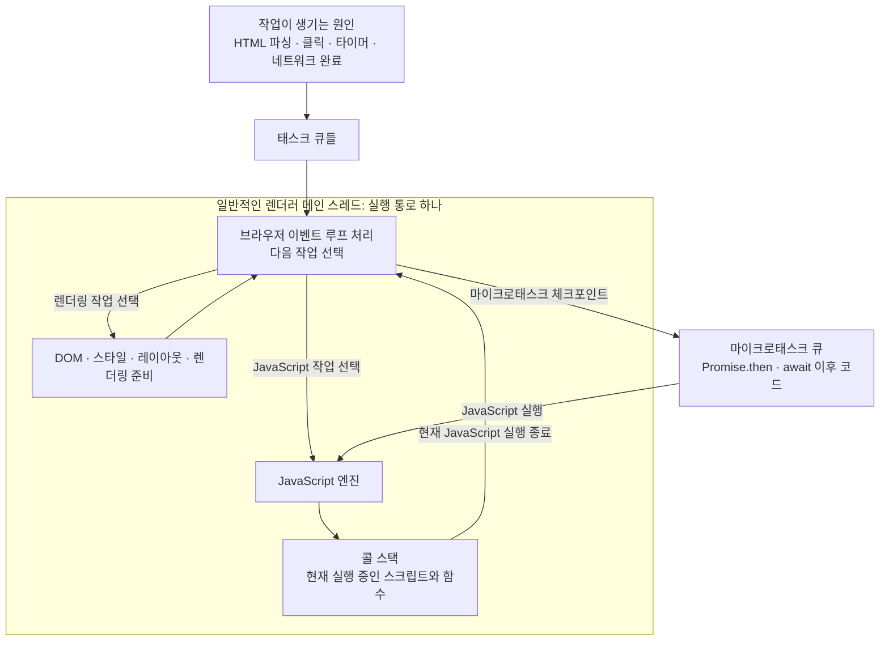
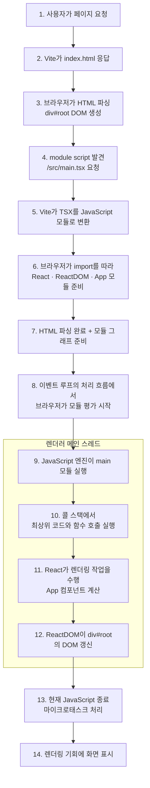

# 이벤트 루프, 메인 스레드, 콜 스택

> **이벤트 루프** = 어떤 작업을 다음에 실행할지 정하는 규칙과 스케줄러
>
> **메인 스레드** = 선택된 작업을 실제로 실행하는 실행 통로
>
> **콜 스택** = 현재 실행 중인 JavaScript 함수들의 상태

핵심은 **이벤트 루프가 별도의 실행 스레드가 아니라는 것**이다.

일반적인 브라우저 페이지에서는 하나의 렌더러 메인 스레드가 다음 일을 번갈아 수행한다.

1. 브라우저의 이벤트 루프 처리 절차가 다음 작업을 선택한다.
2. 선택된 작업이 JavaScript라면 JavaScript 엔진이 메인 스레드에서 실행한다.
3. JavaScript 엔진은 콜 스택으로 현재 실행 중인 함수들을 관리한다.
4. JavaScript 실행이 끝나면 브라우저가 마이크로태스크, 다음 태스크, 렌더링 작업을 처리한다.

## 세 개념의 관계



세 개념은 같은 종류가 아니다. 이벤트 루프는 규칙, 메인 스레드는 실제 실행 주체, 콜 스택은 JavaScript 엔진의 실행 상태 구조다. JavaScript가 메인 스레드를 사용 중이면 다음 JavaScript 태스크를 실행하지 못하므로 긴 반복문은 클릭 처리와 화면 갱신도 늦춘다.

> 브라우저 전체에 메인 스레드가 딱 하나라는 뜻은 아니다. 보통 각 렌더러 프로세스에 메인 스레드가 있고, 한 페이지의 DOM과 일반 JavaScript는 하나의 메인 스레드를 공유한다고 이해하면 된다. Web Worker는 별도의 실행 환경을 만들 수 있다.

## 이 프로젝트의 HTML과 JavaScript 실행 흐름

이 프로젝트의 [`frontend/index.html`](../../frontend/index.html)에는 다음 코드가 있다.

```html
<div id="root"></div>
<script type="module" src="/src/main.tsx"></script>
```

`type="module"`이므로 브라우저는 HTML 파싱과 함께 `main.tsx` 및 `import` 의존성들을 가져온다. 브라우저는 `.tsx`를 직접 실행하지 못하므로 개발 환경에서는 Vite가 TypeScript와 JSX를 브라우저용 JavaScript 모듈로 변환해 응답한다.



페이지가 표시된 뒤 클릭·타이머·네트워크 완료가 발생해도 관계는 같다.

```text
클릭·타이머·네트워크 완료
→ 태스크 또는 마이크로태스크 준비
→ 이벤트 루프가 실행 시점 선택
→ 메인 스레드에서 콜백 실행
→ 콜백 내부의 동기 함수들은 콜 스택에서 즉시 이어서 실행
```

일반 `<script src="app.js">`는 기본적으로 HTML 파싱을 멈추고 파일을 실행한 뒤 파싱을 재개한다. 이 프로젝트의 `<script type="module">`은 기본적으로 `defer`처럼 HTML 파싱과 병렬로 모듈을 준비하고, HTML 파싱이 끝난 뒤 실행한다.

참고: [WHATWG HTML 이벤트 루프](https://html.spec.whatwg.org/multipage/webappapis.html#event-loops), [ECMAScript 실행 컨텍스트](https://tc39.es/ecma262/multipage/executable-code-and-execution-contexts.html#sec-execution-contexts)
