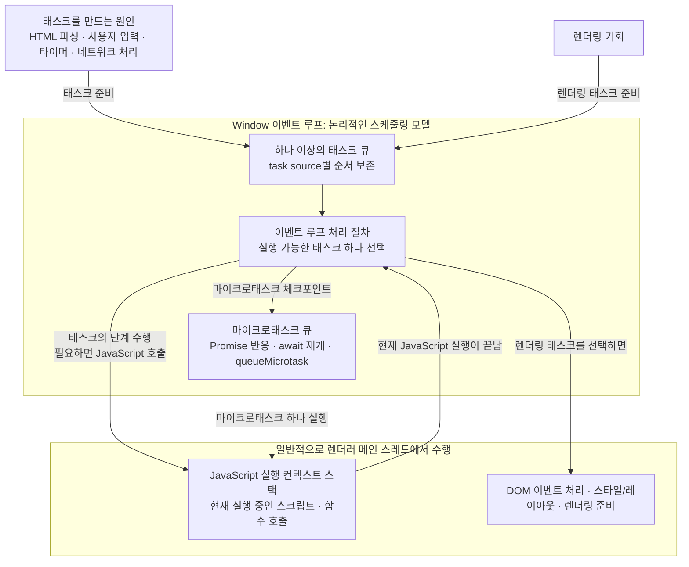
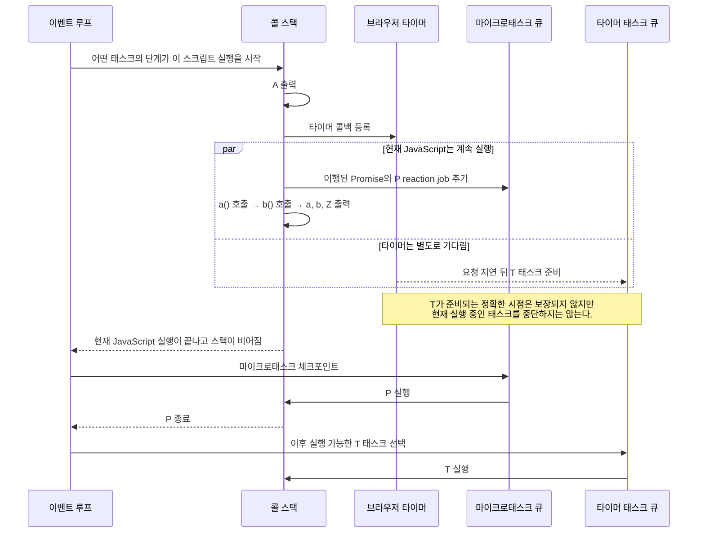

# 메인 스레드, 콜 스택, 이벤트 루프

브라우저가 JavaScript를 실행하는 전체 과정은 크게 세 층으로 나누어 보면 정확하다.

1. HTML의 `<script>` 요소가 JavaScript 파일을 **언제 가져오고 실행할지** 결정한다.
2. 브라우저의 이벤트 루프가 HTML 파싱, 사용자 입력, 타이머, 네트워크 처리 같은 **작업의 실행 순서**를 조정한다.
3. JavaScript 엔진의 실행 컨텍스트 스택, 흔히 말하는 **콜 스택**이 현재 시작된 JavaScript 안에서 전역 코드와 함수 호출을 실행한다.

따라서 “브라우저의 JavaScript 실행 환경은 이벤트 루프 기반이다”라는 말은 맞지만, **모든 JavaScript 문장이나 함수 호출이 태스크 큐에 하나씩 들어간다**는 뜻은 아니다. 브라우저가 어떤 작업 안에서 JavaScript 실행을 시작하면, 그 안의 일반 동기 함수 호출은 콜 스택에서 바로 이어서 실행된다.

아래 그림은 일반적인 브라우저 페이지의 실행 모델을 단순화한 것이다.



## 1. 메인 스레드

일반적인 웹 페이지에서는 다음 작업들이 주로 브라우저 렌더러의 **메인 스레드**에서 수행된다.

- 페이지의 JavaScript 실행
- JavaScript 이벤트 핸들러 실행
- DOM 변경
- 스타일 계산과 레이아웃
- 렌더링에 필요한 일부 준비 작업

그래서 긴 동기 JavaScript가 메인 스레드를 오래 점유하면 클릭 핸들러, 레이아웃, 다음 화면 갱신도 기다려야 한다. 현재 JavaScript 실행이 시작되면 다른 JavaScript 실행이 임의의 문장 사이에 끼어들지 않고, 실행 컨텍스트 스택이 다시 빌 때까지 이어서 실행되는 것이 기본 원칙이다. 이를 **run-to-completion**이라고 한다.

다만 다음 두 가지는 구분해야 한다.

- 운영체제가 입력을 감지하거나 네트워크를 실제로 처리하는 일까지 전부 JavaScript 메인 스레드에서 수행되는 것은 아니다. 다른 브라우저 스레드나 프로세스가 처리할 수 있고, 그 결과를 페이지의 이벤트 루프에 태스크로 전달한다.
- 합성(compositing), 래스터화, GPU 작업처럼 렌더링의 일부도 별도 스레드나 프로세스에서 수행될 수 있다. 하지만 긴 JavaScript가 메인 스레드의 DOM·레이아웃 작업을 막으면 사용자가 화면 멈춤을 체감할 수 있다.

> 이벤트 루프는 스레드 자체가 아니라, 이벤트·스크립트·렌더링·네트워크 관련 작업을 조정하는 **논리적인 처리 모델**이다. HTML 표준도 이벤트 루프와 구현 스레드가 반드시 1:1로 대응한다고 규정하지 않는다. 일반적인 페이지를 이해할 때는 “선택된 JavaScript 작업이 보통 렌더러 메인 스레드에서 실행된다”고 생각하면 충분하다.

`Web Worker`를 만들면 별도의 에이전트와 이벤트 루프에서 JavaScript를 실행할 수 있다. Worker는 페이지의 DOM에 직접 접근할 수 없으며 메시지로 메인 페이지와 통신한다.

## 2. 콜 스택

개발자가 흔히 말하는 콜 스택(call stack)은 ECMAScript 표준의 **실행 컨텍스트 스택(execution context stack)**을 이해하기 쉽게 부르는 표현이다.

실행 컨텍스트는 현재 어떤 스크립트나 함수가 실행 중인지, 어느 지점까지 실행했는지, 변수 이름을 어느 환경에서 찾아야 하는지 같은 실행 상태를 추적한다. 전역 스크립트나 모듈을 평가할 때도 컨텍스트가 필요하고, 일반 동기 함수를 호출하면 새 함수 실행 컨텍스트가 스택 위에 놓인다.

일반적인 동기 함수 호출에서는 가장 나중에 호출한 함수가 먼저 끝나는 후입선출(LIFO) 방식으로 동작한다.

```js
function a() {
  b();
}

function b() {
  console.log('실행');
}

a();
```

실행 중 콜 스택은 다음처럼 변한다.

```text
전역 스크립트 실행 중
[전역 스크립트]

a() 호출
[전역 스크립트, a]

b() 호출
[전역 스크립트, a, b]

b() 종료
[전역 스크립트, a]

a() 종료
[전역 스크립트]

전역 스크립트 종료
[]
```

`a()`와 `b()`는 이미 실행 중인 JavaScript 내부의 동기 호출이다. 따라서 각각이 태스크 큐에 등록되거나 이벤트 루프가 매번 새 작업으로 선택하는 것은 아니다. 현재 실행을 그대로 이어가며 실행 컨텍스트 스택에 쌓인다.

또한 `function a() { ... }` 선언을 만났다고 함수 본문이 그 자리에서 실행되는 것은 아니다. 함수 객체와 바인딩을 준비하고, 실제로 `a()`를 호출했을 때 함수 본문을 실행한다.

## 3. 브라우저가 JavaScript 파일을 가져와 실행하는 과정

이벤트 루프만으로는 JavaScript 파일의 실행 순서를 전부 설명할 수 없다. 먼저 HTML의 `<script>` 요소가 파일을 **언제 가져오고 언제 평가할지** 결정한다.

### `<script>` 형태에 따른 차이

| 형태 | 가져오기와 실행 시점 |
| --- | --- |
| 인라인 `<script>...</script>` | HTML 파서가 해당 요소를 만나면 파싱을 잠시 멈추고 즉시 실행한 뒤 파싱을 재개한다. |
| `<script src="a.js"></script>` | 외부 classic script를 가져오고 실행할 때까지 HTML 파싱을 막는다. 이 형태의 parser-inserted classic script 여러 개는 문서에 나온 순서대로 실행된다. |
| `<script defer src="a.js"></script>` | HTML 파싱과 병렬로 가져오고, 문서 파싱이 끝난 뒤 문서 순서대로 실행한다. `DOMContentLoaded`는 이 스크립트들의 실행을 기다린다. `defer`는 외부 classic script에서 의미가 있다. |
| `<script async src="a.js"></script>` | HTML 파싱과 병렬로 가져오고, 준비되는 즉시 실행한다. 여러 `async` 스크립트 사이의 문서 순서는 보장되지 않으며 `DOMContentLoaded`도 이들의 완료를 기다리지 않는다. |
| `<script type="module" src="app.js"></script>` | 모듈과 정적 `import` 의존성 그래프를 병렬로 가져오고, 기본적으로 문서 파싱이 끝난 뒤 평가한다. 모듈 스크립트에서 `defer` 속성은 효과가 없다. |
| `<script type="module" async src="app.js"></script>` | 모듈 그래프가 준비되는 즉시 평가하며 문서 파싱 완료를 기다리지 않는다. |

위 표는 HTML 파서가 만든 `script` 요소를 기준으로 한 기본 규칙이다. JavaScript로 동적으로 만든 `<script>` 요소는 기본 동작과 순서 규칙이 다를 수 있다.

일반 `<script src>` 때문에 DOM을 만드는 주 HTML 파서가 멈춰 있어도, 브라우저의 speculative parser 또는 preload scanner가 뒤쪽의 리소스를 미리 발견해 가져올 수는 있다. 따라서 “파서 차단”은 페이지의 모든 네트워크 활동이 완전히 멈춘다는 뜻이 아니다.

모듈의 기본 실행 시점은 `defer`와 비슷하지만 완전히 같은 기능은 아니다. 모듈은 의존성 그래프를 먼저 처리하고, 순환 의존성이나 최상위 `await`가 있으면 평가 완료 시점이 더 복잡해질 수 있다.

### 실행하기로 결정된 뒤 JavaScript 엔진에서 일어나는 일

브라우저가 특정 classic script 또는 module script를 실행하기로 결정하면, 개념적으로 다음 과정이 이어진다.

1. 외부 파일이라면 위의 `<script>` 규칙에 맞춰 소스를 가져온다.
2. JavaScript 엔진이 소스를 파싱하고 문법을 검사한다. 내부 바이트코드 생성이나 JIT 컴파일 같은 구체적인 최적화 방식은 엔진 구현마다 다르다.
3. 스크립트 또는 모듈 실행 컨텍스트를 준비하고 실행 컨텍스트 스택에 놓는다.
4. 최상위 코드를 위에서 아래로 동기 실행한다. 함수 선언은 함수를 준비할 뿐, 함수 본문은 실제 호출 전까지 실행하지 않는다.
5. 동기 함수를 호출하면 새 함수 실행 컨텍스트가 스택 위에 놓이고, 함수가 반환되면 제거된다.
6. `setTimeout`, 이벤트 리스너 등록, `fetch`, Promise 같은 API를 만났다면 해당 API의 규칙에 따라 미래 작업이나 반응을 준비한다. 등록 호출 자체는 현재 콜 스택에서 동기적으로 실행된다.
7. 현재 JavaScript 실행이 끝나 실행 컨텍스트 스택이 비면, 브라우저는 정해진 체크포인트에서 마이크로태스크를 처리한다.
8. 별도로 렌더링 기회가 생기고 화면 갱신이 필요하면 렌더링 태스크가 준비될 수 있다. 이 작업도 이벤트 루프가 태스크 큐에서 선택해야 수행된다.

여기서 중요한 점은 **JavaScript 파일 하나가 반드시 독립된 태스크 하나와 일치하지는 않는다**는 것이다. 예를 들어 파서가 만난 인라인 스크립트나 파싱 차단 스크립트는 HTML 파싱 작업 도중 실행될 수 있다. 반대로 타이머나 사용자 입력 태스크가 JavaScript 콜백 하나의 실행을 시작할 수도 있다.

> Vite 개발 환경에서 브라우저가 `.tsx` 파일을 그대로 이해해 실행하는 것은 아니다. Vite가 TypeScript/JSX를 브라우저가 실행할 수 있는 JavaScript 모듈로 변환해 제공하고, 브라우저는 그 모듈과 `import` 의존성 그래프를 가져와 평가한다.

## 4. 이벤트 루프

HTML 표준에서 각 JavaScript 에이전트에는 관련 이벤트 루프가 있다. 페이지의 `Window`와 관련된 것은 **Window 이벤트 루프**, Worker와 관련된 것은 **Worker 이벤트 루프**라고 부른다.

Window 이벤트 루프의 핵심 처리 과정을 학습용으로 단순화하면 다음과 같다.

1. 하나 이상의 태스크 큐 중 실행 가능한 태스크가 있는 큐 하나를 고른다.
2. 선택한 큐에서 가장 오래된 실행 가능한 태스크 하나를 선택해 그 태스크의 단계들을 수행한다.
3. 그 태스크가 JavaScript를 호출하면 JavaScript 엔진이 실행 컨텍스트 스택을 사용해 코드를 실행한다.
4. 태스크 처리가 끝나면 마이크로태스크 체크포인트를 수행하여 마이크로태스크 큐를 빌 때까지 처리한다. 처리 중 새 마이크로태스크가 추가되면 그것도 같은 체크포인트에서 계속 처리한다.
5. 다시 다음 반복으로 간다. Window 환경에서는 이 처리와 함께 렌더링 기회, 렌더링 태스크, idle 작업의 스케줄링도 조정된다.

이벤트 루프가 JavaScript 문장을 하나씩 큐에서 꺼내 해석하는 것은 아니다. 이벤트 루프가 태스크의 단계들을 수행하다 JavaScript 호출이 필요해지면 JavaScript 엔진이 실행 컨텍스트 스택으로 코드를 실행한다. 태스크에는 JavaScript 실행이 포함될 수도 있고, 브라우저 내부 알고리즘만 포함될 수도 있다.

태스크가 담당할 수 있는 대표적인 작업은 다음과 같다.

- HTML 파서가 입력을 토큰화하고 처리하는 작업
- 브라우저가 감지한 클릭·키보드 입력 이벤트를 dispatch하는 작업
- 타이머 완료 콜백
- 비동기로 가져온 리소스의 일부 또는 전체가 준비된 뒤 처리하는 작업
- `postMessage` 메시지 처리
- DOM 변경에 반응하는 일부 브라우저 작업

모든 이벤트가 반드시 새 태스크를 만드는 것은 아니다. 예를 들어 현재 JavaScript에서 `target.dispatchEvent(event)`를 호출하면 이벤트 리스너는 별도 태스크를 기다리지 않고 **현재 콜 스택 안에서 동기적으로** 호출된다. 반면 사용자의 실제 클릭을 브라우저가 전달하는 경우에는 보통 사용자 상호작용 태스크가 이벤트를 dispatch하고, 그 과정에서 이벤트 핸들러가 호출된다.

React의 `onClick`도 브라우저 이벤트 dispatch 과정에서 React가 연결한 이벤트 처리 코드를 거쳐 호출되는 JavaScript 함수다. `onClick` 함수 자체가 별도 스레드에서 실행되는 것은 아니다. 다만 이벤트 이후 React가 상태 업데이트를 언제 렌더링에 반영할지는 React의 스케줄링 정책과 기능에 따라 달라질 수 있다.

> 마이크로태스크 체크포인트는 일반적으로 “현재 태스크가 끝난 뒤, 다음 태스크 전”이라고 이해하면 된다. 정확한 HTML 알고리즘에는 스크립트 실행 정리 과정 등 체크포인트를 수행하는 추가 지점도 있으므로, “오직 이벤트 루프 반복 끝에서 한 번만 실행된다”고 단정하면 안 된다.

## 5. 태스크 큐와 마이크로태스크 큐

### 태스크 큐는 실제로 하나만 있는 것이 아니다

설명할 때 흔히 “태스크 큐” 하나를 그리지만, HTML 표준에서 이벤트 루프는 **하나 이상의 태스크 큐**를 가진다. 태스크는 user interaction, timer, networking, rendering 같은 **task source**에 속하고, 각 task source는 이벤트 루프의 특정 태스크 큐와 연결된다.

같은 task source에서 만들어진 작업의 상대적인 순서는 보존된다. 하지만 서로 다른 source의 모든 태스크를 한 줄로 세운 전역 FIFO 순서는 보장되지 않는다. 브라우저는 실행 가능한 태스크가 있는 큐 중 하나를 구현이 정한 방식으로 선택할 수 있다. 예를 들어 사용자 입력이 있는 큐를 우선해 화면 반응성을 높일 수 있다.

엄밀히 말해 HTML 표준의 task queue는 이름과 달리 자료 구조상 **태스크의 집합(set)**으로 정의된다. 선택된 큐 안에서 가장 오래된 실행 가능한 태스크를 가져오기 때문에 개발자 관점에서는 큐처럼 이해해도 되지만, “모든 브라우저 작업이 단 하나의 FIFO 큐에 들어간다”고 이해하면 틀리다.

### 마이크로태스크는 언제 큐에 들어가는가

마이크로태스크 큐는 일반 태스크 큐와 별개이며 이벤트 루프마다 하나가 있다. 대표적인 원인은 다음과 같다.

- 이미 이행된 Promise에 `.then(handler)`를 호출하면 Promise reaction job이 준비되어 마이크로태스크로 들어간다.
- 아직 대기 중인 Promise에 `.then(handler)`를 호출하면 먼저 reaction을 등록하고, Promise가 이행되거나 거부될 때 해당 job이 마이크로태스크로 준비된다.
- `await`는 현재 `async` 함수 실행을 중단하고, 기다리는 Promise가 처리된 뒤 함수의 나머지 부분을 Promise job을 통해 재개한다.
- `queueMicrotask(callback)`은 callback을 직접 마이크로태스크로 예약한다.
- `MutationObserver` 알림도 마이크로태스크 처리 과정과 연결된다.

마이크로태스크 체크포인트가 시작되면 큐가 빌 때까지 실행한다. 그 처리 중 새 마이크로태스크가 추가되면 새 작업도 같은 체크포인트에서 처리한다. 따라서 마이크로태스크가 계속 새 마이크로태스크를 만들면 다음 태스크와 렌더링 기회를 오래 지연시킬 수 있다.

### `setTimeout`과 `fetch`는 서로 다르게 이어진다

`setTimeout(handler, delay)` 호출 자체는 현재 콜 스택에서 동기적으로 실행되고 바로 반환한다. 요청한 지연 조건이 충족되면 브라우저가 timer task source를 통해 handler를 실행할 태스크를 준비한다. 태스크가 이미 준비되었더라도 현재 실행 중인 태스크를 중단하고 끼어들지는 않는다.

`fetch()`의 실제 네트워크 대기는 JavaScript 콜 스택 밖에서 진행된다. 응답 처리를 위한 브라우저 작업이 `fetch()`가 반환한 Promise를 이행하면, 그 Promise에 등록된 `.then()` 반응이나 `await` 이후 코드는 마이크로태스크로 이어진다. 따라서 “네트워크 응답은 태스크”와 “`fetch().then()`은 마이크로태스크”는 서로 모순이 아니라 서로 다른 단계에 관한 설명이다.

### 실행 순서 예제

```js
console.log('A');

setTimeout(() => console.log('T'), 0);

Promise.resolve().then(() => console.log('P'));

function a() {
  console.log('a');
  b();
}

function b() {
  console.log('b');
}

a();
console.log('Z');
```

출력 순서는 다음과 같다.

```text
A
a
b
Z
P
T
```

실행 흐름은 다음과 같다.



`setTimeout(..., 0)`의 `0`은 요청 지연값을 0으로 지정한다는 뜻이지 즉시 실행이나 정확한 실행 시각을 보장한다는 뜻이 아니다. 타이머 태스크가 준비되어도 현재 태스크를 선점하지 않으며, 이벤트 루프가 이후 그 태스크를 선택해야 handler가 실행된다.

또한 “모든 `setTimeout(..., 0)`은 반드시 4ms 뒤 실행된다”는 설명도 정확하지 않다. HTML 표준은 타이머 중첩 수준이 5를 초과한 상태에서 요청 지연이 4ms보다 작으면 4ms로 보정한다. 그 밖에도 브라우저의 스케줄링, 백그라운드 탭 제한, 메인 스레드 점유 때문에 실제 실행은 더 늦어질 수 있다.

## 6. 렌더링은 매 태스크 뒤에 반드시 실행되지 않는다

화면 갱신은 “태스크 하나 → 마이크로태스크 → 반드시 렌더링 한 번”이라는 고정 순서가 아니다. 브라우저에 렌더링 기회가 생기고 갱신할 내용이 있을 때 렌더링 관련 작업이 준비된다. 브라우저는 불필요한 렌더링을 건너뛰거나 여러 변경을 한 번에 합칠 수 있다.

`requestAnimationFrame` 콜백은 다음 렌더링 업데이트 과정에서 실행된다. 긴 태스크가 메인 스레드를 점유하거나 마이크로태스크가 끝없이 추가되면 이 렌더링 기회와 `requestAnimationFrame` 콜백도 지연될 수 있다.

## 핵심 정리

- **메인 스레드**: 일반적인 페이지에서 JavaScript, DOM 이벤트 리스너, 스타일·레이아웃 등 주요 페이지 작업이 수행되는 구현상의 주 스레드
- **이벤트 루프**: 이벤트, 스크립트, 렌더링, 네트워크 관련 작업의 실행 순서를 조정하는 사양상의 처리 모델. 구현 스레드와 반드시 1:1인 것은 아니다.
- **실행 컨텍스트 스택(콜 스택)**: 현재 실행 중인 스크립트·모듈·함수의 실행 상태를 추적하는 구조
- **태스크**: 브라우저가 수행할 일련의 단계. 그 단계가 JavaScript 콜백을 호출할 수도 있고 브라우저 내부 작업만 수행할 수도 있다.
- **태스크 큐들**: 이벤트 루프에 하나 이상 존재한다. 같은 task source의 순서는 보존되지만 서로 다른 source 전체를 아우르는 단일 FIFO 순서는 없다.
- **마이크로태스크 큐**: Promise reaction, `await` 재개, `queueMicrotask` 등이 기다리는 별도의 큐. 정해진 체크포인트에서 빌 때까지 처리한다.

따라서 브라우저의 큰 작업 순서는 이벤트 루프가 조정하고, 태스크나 마이크로태스크가 JavaScript 실행을 시작하면 그 내부의 일반 동기 함수 호출은 실행 컨텍스트 스택에서 끊김 없이 이어진다. **모든 함수 호출이 이벤트 루프에 개별 등록되는 것은 아니다.**

## 공식 사양 참고

- [WHATWG HTML - Event loops](https://html.spec.whatwg.org/multipage/webappapis.html#event-loops)
- [WHATWG HTML - Event loop processing model](https://html.spec.whatwg.org/multipage/webappapis.html#event-loop-processing-model)
- [WHATWG HTML - Microtask checkpoint](https://html.spec.whatwg.org/multipage/webappapis.html#perform-a-microtask-checkpoint)
- [WHATWG HTML - The script element](https://html.spec.whatwg.org/multipage/scripting.html#the-script-element)
- [WHATWG HTML - Timers](https://html.spec.whatwg.org/multipage/timers-and-user-prompts.html#timers)
- [WHATWG DOM - Dispatching events](https://dom.spec.whatwg.org/#dispatching-events)
- [ECMAScript - Execution contexts](https://tc39.es/ecma262/multipage/executable-code-and-execution-contexts.html#sec-execution-contexts)
