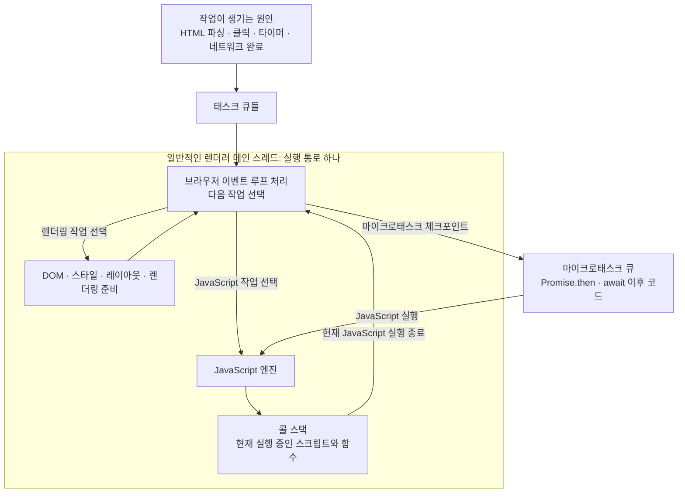
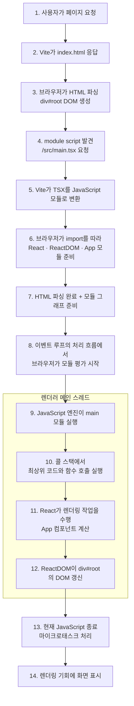

# 이벤트 루프, 메인 스레드, 콜 스택

> **핵심: HTML 표준의 이벤트 루프 처리 모델을 구현한 브라우저 내부 코드는 스레드에서 실행된다. 일반적인 브라우저 페이지에서는 별도의 이벤트 루프 스레드가 아니라 렌더러 메인 스레드가 그 내부 코드와 JavaScript를 번갈아 실행한다.**

## 가장 중요한 구분

- **이벤트 루프**: HTML 표준이 정의한, 실행할 준비가 된 작업을 반복적으로 처리하는 모델이다.
- **메인 스레드**: 이벤트 루프 코드와 선택된 JavaScript 작업 등을 실제로 실행하는 OS 스레드다.
- **콜 스택**: JavaScript 엔진이 현재 실행 중인 함수 호출과 실행 상태를 관리하는 구조다.

## 이벤트 루프라는 이름

이벤트 루프는 클릭, 타이머, 네트워크 완료 등으로 준비된 작업을 **반복(loop)해서 선택하고 처리**하기 때문에 붙은 이름이다. 여기서 이벤트는 DOM 클릭만 뜻하지 않고, 실행할 준비가 된 여러 종류의 작업을 넓게 가리킨다.

HTML 표준은 이 **이벤트 루프 처리 모델**에서 태스크·마이크로태스크·렌더링을 처리할 때 지켜야 할 절차와 순서 제약을 정의한다. Chrome 등의 브라우저는 그 모델을 C++ 등의 실제 내부 코드로 구현한다. 즉 표준은 웹 개발자가 관찰하는 동작을 정의하고, 각 브라우저는 그 결과를 만들 내부 구현 방식을 결정한다.

구현을 설명하는 문맥에서는 이 내부 반복 코드도 편의상 “이벤트 루프 코드”라고 부른다. 그러나 두 가지가 동등한 별개 개념이라는 뜻은 아니다. **브라우저 내부 코드는 HTML 표준의 이벤트 루프 처리 모델을 구현한 것**이다.

## 이벤트 루프 코드는 누가 실행하는가

페이지가 동작하는 동안 렌더러 메인 스레드는 개념적으로 다음과 같은 브라우저 내부 코드를 실행한다.

```text
while (페이지가 살아 있는 동안) {
  다음 실행 가능한 작업을 기다린다
  작업 하나를 선택하여 실행한다
  Promise 등의 마이크로태스크를 처리한다
  필요하면 렌더링한다
}
```

실제 브라우저 구현은 이 의사 코드보다 훨씬 복잡하다. 중요한 것은 이 반복문을 전담하는 별도 스레드가 있고 그 스레드가 작업을 메인 스레드로 보내는 구조가 아니라는 점이다. **메인 스레드 자신이 이벤트 루프 코드를 실행하다가, 선택한 작업이 JavaScript라면 같은 메인 스레드에서 JavaScript 엔진을 호출한다.**

```text
렌더러 메인 스레드의 실행 흐름

브라우저 내부 이벤트 루프 코드
  → 실행할 태스크 선택
    → JavaScript 엔진 진입
      → clickHandler()
        → 사용자 함수들 실행
      ← clickHandler() 반환
    ← 현재 JavaScript 실행 종료
  → 이벤트 루프 코드로 복귀
  → 마이크로태스크 처리 및 다음 작업 검토
```

따라서 “이벤트 루프가 작업을 메인 스레드로 보낸다”는 표현은 개념을 설명하기 위한 비유일 뿐이다. 더 정확한 표현은 다음과 같다.

> **메인 스레드에서 실행 중인 브라우저의 이벤트 루프 코드가 작업을 선택하고, 필요한 경우 JavaScript 엔진을 호출하여 같은 메인 스레드에서 그 작업을 실행한다.**

JavaScript가 실행되는 동안에는 메인 스레드가 JavaScript 코드를 수행하고 있으므로 이벤트 루프의 다음 단계로 진행할 수 없다. 현재 JavaScript 실행이 끝나야 이벤트 루프 코드로 돌아와 마이크로태스크를 처리하거나 다음 태스크와 렌더링 기회를 검토할 수 있다.

### 작업을 기다릴 때는 무엇이 일어나는가

실행할 작업이 없다면 메인 스레드가 빈 반복문을 계속 돌며 CPU를 소비하는 것은 아니다. 브라우저는 운영체제의 대기·깨우기 기능을 사용해 메인 스레드를 대기 상태로 둘 수 있다. 사용자 입력, 타이머 만료, 네트워크 완료 같은 일이 감지되면 브라우저의 다른 구성 요소나 운영체제가 작업을 준비하고 메인 스레드를 깨운다. 그러면 메인 스레드는 이벤트 루프 코드를 이어서 실행한다.

네트워크 처리나 일부 브라우저 기능에 보조 스레드와 별도 프로세스가 사용될 수는 있다. 그러나 이것은 일반 페이지의 이벤트 루프 자체가 메인 스레드와 나란히 실행되는 별도 스레드라는 뜻이 아니다.

## 세 개념의 관계



세 개념은 같은 종류가 아니다. 이벤트 루프는 HTML 표준이 정의한 처리 모델, 메인 스레드는 그 모델을 구현한 브라우저 내부 코드를 실제로 실행하는 주체, 콜 스택은 JavaScript 실행 상태를 관리하는 구조다. JavaScript가 메인 스레드를 오래 점유하면 이벤트 루프 구현 코드로 돌아오지 못하므로 다음 태스크, 클릭 처리, 마이크로태스크 체크포인트, 화면 갱신도 함께 늦어진다.

> 브라우저 전체에 메인 스레드가 딱 하나라는 뜻은 아니다. 보통 각 렌더러 프로세스에 메인 스레드가 있고, 한 페이지의 DOM과 일반 JavaScript는 하나의 메인 스레드를 공유한다고 이해하면 된다. Web Worker는 별도의 실행 환경을 만들 수 있다.

## 이 프로젝트의 HTML과 JavaScript 실행 흐름

이 프로젝트의 [`frontend/index.html`](../../frontend/index.html)에는 다음 코드가 있다.

```html
<div id="root"></div>
<script type="module" src="/src/main.tsx"></script>
```

`type="module"`이므로 브라우저는 HTML 파싱과 함께 `main.tsx` 및 `import` 의존성들을 가져온다. 브라우저는 `.tsx`를 직접 실행하지 못하므로 개발 환경에서는 Vite가 TypeScript와 JSX를 브라우저용 JavaScript 모듈로 변환해 응답한다.



페이지가 표시된 뒤 클릭·타이머·네트워크 완료가 발생해도 관계는 같다.

```text
클릭·타이머·네트워크 완료
→ 태스크 또는 마이크로태스크 준비
→ 이벤트 루프가 실행 시점 선택
→ 메인 스레드에서 콜백 실행
→ 콜백 내부의 동기 함수들은 콜 스택에서 즉시 이어서 실행
```

일반 `<script src="app.js">`는 기본적으로 HTML 파싱을 멈추고 파일을 실행한 뒤 파싱을 재개한다. 이 프로젝트의 `<script type="module">`은 기본적으로 `defer`처럼 HTML 파싱과 병렬로 모듈을 준비하고, HTML 파싱이 끝난 뒤 실행한다.

참고: [WHATWG HTML 이벤트 루프](https://html.spec.whatwg.org/multipage/webappapis.html#event-loops), [ECMAScript 실행 컨텍스트](https://tc39.es/ecma262/multipage/executable-code-and-execution-contexts.html#sec-execution-contexts)
