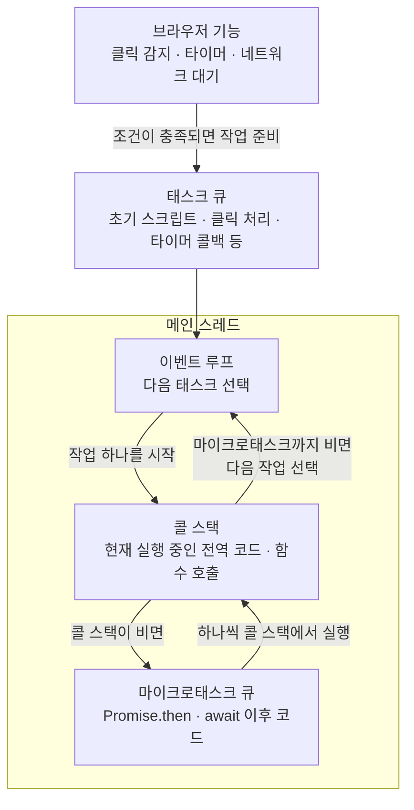
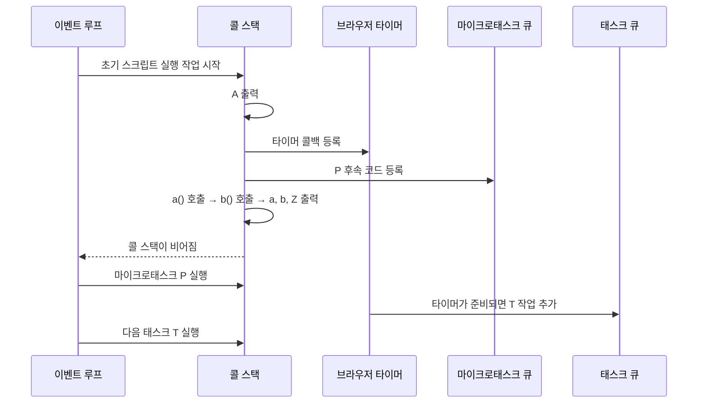

# 메인 스레드, 콜 스택, 이벤트 루프

브라우저의 JavaScript 실행 환경은 이벤트 루프 기반이다. 다만 이 말은 **모든 함수 호출이 큐에 등록되어 하나씩 실행된다**는 뜻은 아니다.

이벤트 루프는 메인 스레드에서 다음 실행 작업을 시작할 시점을 관리하고, 콜 스택은 선택된 작업 안에서 현재 실행 중인 동기 함수 호출을 관리한다.



## 1. 메인 스레드

일반적인 웹 페이지에서 JavaScript 실행, 사용자 입력 이벤트 처리, 화면 갱신은 주로 하나의 **메인 스레드**에서 이루어진다.

그래서 긴 동기 코드가 메인 스레드를 오래 점유하면, 그동안 클릭 처리나 화면 갱신도 기다려야 한다. JavaScript 작업 하나가 실행되기 시작하면, 현재 콜 스택이 빌 때까지 다른 JavaScript 작업이 중간에 끼어들 수 없다. 이를 **run-to-completion**이라고 한다.

> 이벤트 루프는 메인 스레드와 별도의 JavaScript 스레드가 아니다. 메인 스레드에서 다음 실행 작업을 고르는 브라우저의 작업 방식이다.

## 2. 콜 스택

콜 스택(call stack)은 **아직 끝나지 않은 함수 호출을 쌓아 두는 구조**다. 가장 나중에 호출된 함수가 먼저 끝나는 후입선출(LIFO) 방식이다.

```js
function a() {
  b();
}

function b() {
  console.log('실행');
}

a();
```

실행 중 콜 스택은 다음처럼 변한다.

```text
전역 코드 실행 중
[전역]

a() 호출
[전역, a]

b() 호출
[전역, a, b]

b() 종료
[전역, a]

a() 종료
[전역]

전역 코드 종료
[]
```

`a()`와 `b()`는 이미 실행 중인 작업 내부의 동기 호출이다. 따라서 각각이 태스크 큐에 등록되거나 이벤트 루프가 매번 새 작업으로 선택하는 것은 아니다. 호출 즉시 콜 스택에 쌓여 실행된다.

## 3. 이벤트 루프

이벤트 루프는 개념적으로 다음 순서를 반복한다.

1. 실행할 태스크 하나를 선택한다.
2. 그 태스크의 JavaScript 코드를 실행한다.
3. 콜 스택이 비면 마이크로태스크를 모두 처리한다.
4. 다시 다음 태스크를 선택한다.

이벤트 루프가 직접 JavaScript 코드를 한 줄씩 해석하는 것은 아니다. 이벤트 루프가 실행 작업을 시작시키면, JavaScript 엔진이 콜 스택을 사용해 그 작업의 동기 코드를 끝까지 실행한다.

태스크는 콜백만을 뜻하지 않는다. 다음과 같은 JavaScript 실행의 시작 단위가 태스크가 될 수 있다.

- 문서 파싱 과정에서의 초기 스크립트 실행
- 클릭·키보드 등의 사용자 이벤트 처리
- 타이머 완료 콜백
- 네트워크 응답 처리
- 메시지 처리

## 4. 태스크 큐와 마이크로태스크 큐

`setTimeout`, 클릭 이벤트, 네트워크 응답처럼 나중에 시작할 일반 작업은 보통 **태스크**로 준비된다. `Promise.then()`과 `await` 뒤의 코드는 **마이크로태스크**로 준비된다.

현재 태스크의 동기 코드가 끝나면, 이벤트 루프는 다음 태스크를 실행하기 전에 마이크로태스크 큐를 먼저 비운다.

```js
console.log('A');

setTimeout(() => console.log('T'), 0);

Promise.resolve().then(() => console.log('P'));

function a() {
  console.log('a');
  b();
}

function b() {
  console.log('b');
}

a();
console.log('Z');
```

출력 순서는 다음과 같다.

```text
A
a
b
Z
P
T
```

실행 흐름은 다음과 같다.



`setTimeout(..., 0)`의 `0`은 즉시 실행을 보장하지 않는다. 최소 대기 시간이 지난 뒤 타이머 콜백이 실행 가능한 태스크로 준비될 수 있다는 뜻이다. 그 시점에도 콜 스택이 비어 있어야 하며, 준비된 마이크로태스크가 있다면 마이크로태스크가 먼저 실행된다.

## 핵심 정리

- **메인 스레드**: JavaScript, UI 이벤트 처리, 화면 갱신 등이 이루어지는 주 실행 스레드
- **콜 스택**: 현재 실행 중인 동기 함수 호출의 쌓임
- **이벤트 루프**: 콜 스택이 비었을 때 다음 태스크를 시작하고, 그 전에 마이크로태스크를 처리하는 작업 방식
- **태스크 큐**: 클릭, 타이머, 네트워크 완료 등 일반적인 나중 작업의 대기열
- **마이크로태스크 큐**: `Promise.then`, `await` 이후 코드의 대기열

따라서 JavaScript의 큰 실행 단위는 이벤트 루프가 시작시키고, 그 내부에서 일반 동기 함수 호출은 콜 스택을 통해 끊김 없이 이어서 실행된다.
