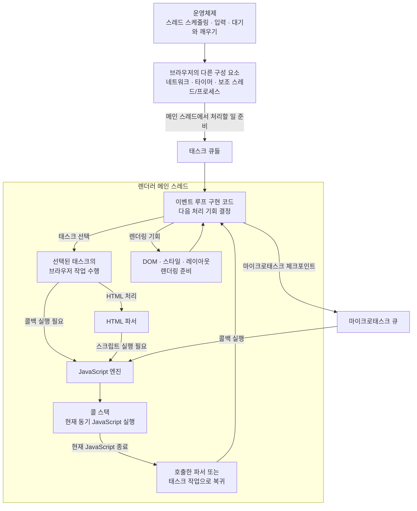

# 이벤트 루프, 메인 스레드, 콜 스택

> **핵심: HTML 파서와 JavaScript 엔진은 스스로 실행되는 별도 스레드가 아니다. 일반적인 브라우저 페이지에서는 렌더러 메인 스레드가 브라우저 내부 코드를 실행하고, 그 흐름에서 HTML 파서나 선택된 태스크가 JavaScript 엔진을 호출한다. 한 번 시작된 JavaScript의 동기 코드는 끝까지 실행된 뒤 호출한 쪽으로 돌아간다.**

## 먼저 역할을 구분한다

| 구성 요소 | 역할 |
|---|---|
| **운영체제(OS)** | 브라우저 프로세스와 스레드에 CPU 시간을 배정하고, 입력·타이머·네트워크 같은 저수준 기능을 제공한다. |
| **브라우저** | HTML 파서, JavaScript 엔진, 렌더링 엔진, 네트워크 구성 요소 등을 조합해 페이지를 처리한다. |
| **렌더러 메인 스레드** | 일반적인 페이지에서 이벤트 루프 구현 코드, HTML 파싱, JavaScript, DOM·스타일·레이아웃 준비 등을 번갈아 실행하는 OS 스레드다. |
| **이벤트 루프** | 태스크·마이크로태스크·렌더링 기회를 어떤 절차로 처리할지 정의한 모델이다. 브라우저는 이를 메인 스레드에서 동작하는 내부 코드로 구현한다. |
| **HTML 파서** | HTML을 읽어 DOM을 만들고, `script` 요소를 만나면 조건에 맞는 시점에 스크립트 실행을 시작시킨다. |
| **JavaScript 엔진** | 전달받은 JavaScript를 실제로 실행하고 실행 컨텍스트와 콜 스택을 관리한다. 엔진 자체가 별도 스레드라는 뜻은 아니다. |
| **태스크** | 브라우저가 처리할 작업 묶음이다. 클릭 이벤트 전달, 타이머 콜백 실행, 네트워크 완료 후속 처리 등이 태스크가 될 수 있다. |
| **콜백** | 나중에 호출하도록 등록한 JavaScript 함수다. 콜백 자체가 태스크는 아니며, 태스크나 마이크로태스크의 처리 과정에서 호출될 수 있다. |
| **콜 스택** | 현재 실행 중인 JavaScript 함수 호출과 되돌아갈 위치를 관리하는 JavaScript 엔진의 실행 상태 구조다. |

이 구성 요소들은 같은 종류가 아니다. **메인 스레드는 실행 주체**, 이벤트 루프는 **처리 모델과 이를 구현한 제어 코드**, HTML 파서와 JavaScript 엔진은 **실제 작업을 수행하는 브라우저 구성 요소**, 콜 스택은 **JavaScript의 실행 상태**다.

## 핵심: 파서나 태스크가 JavaScript 엔진을 호출한다

**파서나 태스크가 JavaScript 엔진을 호출한다**

= HTML 파서 또는 브라우저가 실행 중인 태스크의 내용이 “이 JavaScript 함수를 실행하라”고 요청하면, JavaScript 엔진이 그 코드를 실행한다는 뜻입니다.

태스크는 함수가 아니라 브라우저가 처리할 **작업 묶음**입니다.

클릭을 예로 들면:

```text
사용자 클릭
→ 브라우저가 “클릭 이벤트 처리” 태스크를 준비
→ 이벤트 루프가 그 태스크를 선택
→ 브라우저가 클릭 이벤트를 전달
→ 등록된 clickHandler를 JavaScript 엔진으로 실행
→ clickHandler 내부 동기 코드가 끝까지 실행
→ 태스크 종료, 이벤트 루프로 복귀
```

HTML 파서의 경우는:

```text
HTML 파서가 <script src="app.js"> 발견
→ 파서가 JavaScript 엔진에 app.js 실행 요청
→ app.js 내부 동기 코드가 끝까지 실행
→ 실행이 끝나면 HTML 파서가 이어서 HTML 처리
```

즉 “파서나 태스크”는 JavaScript를 시작시키는 **계기**이고, JavaScript 엔진은 실제 코드를 실행하는 **실행기**입니다.

위 HTML 파서 흐름은 핵심 관계를 보여 주기 위해 파일 가져오기 단계를 생략한 것이다. 외부 클래식 스크립트라면 브라우저가 먼저 파일을 가져와야 한다. 일반적인 파서 삽입 클래식 스크립트는 준비되면 파서가 실행하고, `async`·`defer`·`type="module"` 스크립트는 각 규칙에 따라 실행 시작 시점이 달라진다.

## 이벤트 루프가 하는 일과 하지 않는 일

페이지가 동작하는 동안 렌더러 메인 스레드는 개념적으로 다음과 같은 이벤트 루프 구현 코드를 실행한다.

```text
while (페이지가 살아 있는 동안) {
  실행 가능한 태스크를 기다린다
  태스크 하나를 선택하여 그 작업 내용을 수행한다
  마이크로태스크 체크포인트에 도달하면 마이크로태스크를 처리한다
  렌더링 기회라면 화면 갱신에 필요한 작업을 수행한다
}
```

이벤트 루프는 다음 실행 시점을 조정하지만 모든 작업을 직접 수행하는 만능 실행기는 아니다.

- HTML 내용은 HTML 파서가 해석한다.
- JavaScript는 JavaScript 엔진이 실행한다.
- DOM·스타일·레이아웃·페인트 준비는 브라우저의 렌더링 구성 요소가 수행한다.
- 이벤트 루프 구현 코드는 이 작업들이 메인 스레드에서 진행될 순서와 기회를 조정한다.

또한 이벤트 루프가 별도 스레드에서 태스크를 선택해 메인 스레드로 보내는 것도 아니다. **메인 스레드 자신이 이벤트 루프 구현 코드를 실행하다가, 선택한 태스크의 작업 내용을 수행하고, 필요한 경우 같은 메인 스레드에서 HTML 파서나 JavaScript 엔진으로 진입한다.**

```text
렌더러 메인 스레드

이벤트 루프 구현 코드
  → 태스크의 브라우저 작업 수행
    → 필요하면 HTML 파서 실행
    → 필요하면 JavaScript 엔진 진입
      → JavaScript 동기 코드 실행
    ← JavaScript 실행 종료
  ← 태스크의 작업 종료
→ 이벤트 루프 구현 코드로 복귀
```

## JavaScript 파일과 태스크는 다르다

JavaScript 파일은 브라우저가 가져와 해석·실행할 **소스 코드 리소스**다. 태스크는 브라우저가 실행할 **작업 절차의 묶음**이다. 따라서 `app.js` 파일 자체가 태스크 큐에 그대로 들어간다고 표현하면 부정확하다.

JavaScript 실행은 크게 두 경로로 시작될 수 있다.

### 1. HTML 파서가 스크립트 실행을 시작하는 경우

일반적인 파서 삽입 클래식 스크립트는 HTML 파서가 `script` 요소를 발견하고, 파일이 준비되면 JavaScript 엔진으로 진입해 실행한다. 이때 스크립트는 클릭 태스크처럼 파일 전체가 태스크 큐에서 선택된 것이 아니라, **현재 브라우저 처리 흐름에서 파서가 실행을 시작시킨 것**이다.

### 2. 선택된 태스크가 콜백 실행을 시작하는 경우

클릭·타이머·네트워크 완료 등으로 태스크가 준비될 수 있다. 이벤트 루프가 그 태스크를 선택하면 브라우저는 태스크에 적힌 작업 절차를 수행하고, 그 절차가 이벤트 핸들러나 콜백을 호출해야 한다면 JavaScript 엔진으로 진입한다.

`async`·`defer`·모듈 스크립트처럼 나중에 실행되는 스크립트는 브라우저가 규칙에 맞는 후속 작업으로 실행할 수 있다. 이 경우에도 핵심은 파일이 태스크가 되는 것이 아니라, **스크립트를 실행하는 브라우저 작업이 적절한 시점에 수행된다**는 것이다.

따라서 “JavaScript가 이벤트 루프를 거치지 않고 바로 메인 스레드에서 실행되는가?”라는 질문은 둘 중 하나를 고르는 문제가 아니다.

> **이벤트 루프 구현 코드 자체가 메인 스레드에서 실행된다. 그 브라우저 처리 흐름이 파서나 태스크를 통해 JavaScript 엔진으로 진입하면, JavaScript도 같은 메인 스레드에서 실행된다.**

## 태스크, 콜백, 마이크로태스크의 관계

| 개념 | 의미 | 예시 |
|---|---|---|
| **태스크** | 이벤트 루프가 선택해 처리할 브라우저 작업 묶음 | 클릭 이벤트 전달, 타이머 만료 후 콜백 실행, 네트워크 완료 후속 처리 |
| **콜백** | 작업 과정에서 호출할 JavaScript 함수 | `clickHandler`, `setTimeout`에 전달한 함수 |
| **마이크로태스크** | 현재 JavaScript 실행이 끝난 뒤 마이크로태스크 체크포인트에서 처리할 작은 작업 | `Promise.then` 콜백, `await` 이후의 이어지는 코드 |

콜백을 등록했다고 그 함수가 즉시 실행되는 것은 아니다. 브라우저가 적절한 태스크나 마이크로태스크를 준비하고, 그 작업이 처리될 때 JavaScript 엔진이 콜백을 호출한다. 그러나 **호출된 콜백 함수의 본문은 다시 동기 코드로서 끝까지 실행**된다.

```text
클릭 태스크 선택
→ clickHandler 호출
→ clickHandler 내부 동기 코드 끝까지 실행
→ 현재 태스크 종료
→ 마이크로태스크 체크포인트
→ 다음 태스크 또는 렌더링 기회 검토
```

네트워크 요청 자체는 네트워크 프로세스나 보조 스레드, 운영체제에서 진행될 수 있다. 네트워크 작업이 끝난 뒤 페이지에서 실행해야 할 후속 처리가 생기면 브라우저가 메인 스레드에서 처리할 태스크 등을 준비한다.

## 콜 스택과 동기 코드의 끝까지 실행

JavaScript 엔진으로 진입하면 최상위 스크립트나 콜백의 실행 컨텍스트가 콜 스택에 놓인다. 그 코드가 다른 동기 함수를 호출하면 새 실행 컨텍스트가 쌓이고, 함수가 반환되면 빠진다.

```text
JavaScript 엔진 진입
→ 최상위 스크립트 또는 콜백 실행
  → 함수 A 호출
    → 함수 B 호출
    ← 함수 B 반환
  ← 함수 A 반환
← 현재 JavaScript 실행 종료
→ 호출했던 파서 또는 태스크의 브라우저 코드로 복귀
```

이벤트 루프는 이 함수들을 하나씩 선택하지 않는다. 한 번 시작된 현재 JavaScript 실행은 함수 호출과 반환을 콜 스택으로 관리하며 끝까지 진행된다. 이 성질을 흔히 **run-to-completion**이라고 부른다.

따라서 긴 반복문처럼 JavaScript가 메인 스레드를 오래 점유하면 이벤트 루프 구현 코드로 돌아가지 못한다. 그동안 다음 클릭 태스크, 타이머 콜백, 마이크로태스크 체크포인트, 메인 스레드가 담당할 화면 갱신도 늦어진다.

## 운영체제, 브라우저 보조 구성 요소와의 관계

이벤트 루프는 운영체제의 커널 명령이 아니라 브라우저가 구현한 처리 모델과 내부 코드다. 다만 브라우저는 운영체제의 기능을 사용한다.

- 운영체제는 렌더러 메인 스레드에 CPU 시간을 배정한다.
- 실행할 작업이 없다면 브라우저는 운영체제의 대기 기능을 이용해 메인 스레드를 잠시 재울 수 있다.
- 입력, 타이머 만료, 네트워크 완료 등이 감지되면 운영체제나 브라우저의 다른 구성 요소가 메인 스레드에 처리할 일이 생겼음을 알리고 깨울 수 있다.
- 네트워크, 파일 I/O, 이미지 디코딩, 합성 등의 일부 작업은 별도 스레드나 프로세스에서 진행될 수 있다.

보조 스레드나 프로세스가 있다는 사실은 일반 페이지의 이벤트 루프가 메인 스레드와 나란히 실행되는 전용 스레드라는 뜻이 아니다. 일반적인 페이지에서는 렌더러 메인 스레드가 이벤트 루프 구현 코드와 페이지의 JavaScript를 번갈아 실행한다. Web Worker는 별도의 실행 환경을 만들며 자체 이벤트 루프를 가질 수 있다.

## 전체 관계



이 그림에서 모든 상자가 별도 스레드를 뜻하는 것은 아니다. `이벤트 루프 구현 코드`, `선택된 태스크의 작업`, `HTML 파서`, `JavaScript 엔진`, `콜 스택`, `렌더링 준비`는 일반적인 페이지에서 **같은 렌더러 메인 스레드가 번갈아 실행하는 역할과 상태**다.

## 기억할 문장

1. 이벤트 루프는 HTML이나 JavaScript를 직접 해석하는 엔진이 아니라, 브라우저 작업의 처리 절차와 시점을 조정하는 모델이다.
2. 이벤트 루프 구현 코드도 실행되어야 하므로 일반적인 페이지에서는 렌더러 메인 스레드에서 동작한다.
3. HTML 파서나 선택된 태스크가 JavaScript 실행을 필요로 하면 JavaScript 엔진으로 진입한다.
4. JavaScript 파일 자체는 태스크가 아니다. 태스크는 브라우저가 처리할 작업 절차의 묶음이다.
5. 콜백 자체도 태스크가 아니다. 태스크나 마이크로태스크의 처리 과정에서 호출되는 JavaScript 함수다.
6. JavaScript가 한 번 시작되면 현재 동기 실행은 콜 스택을 사용해 끝까지 진행된 뒤 파서나 태스크의 브라우저 코드로 돌아간다.
7. 이벤트 루프가 작업을 별도 메인 스레드로 보내는 것이 아니라, 같은 메인 스레드가 이벤트 루프 코드와 선택된 작업, JavaScript를 번갈아 실행한다.

참고: [WHATWG HTML 이벤트 루프](https://html.spec.whatwg.org/multipage/webappapis.html#event-loops), [WHATWG script 요소 처리 모델](https://html.spec.whatwg.org/multipage/scripting.html#script-processing-model), [ECMAScript 실행 컨텍스트](https://tc39.es/ecma262/multipage/executable-code-and-execution-contexts.html#sec-execution-contexts)
