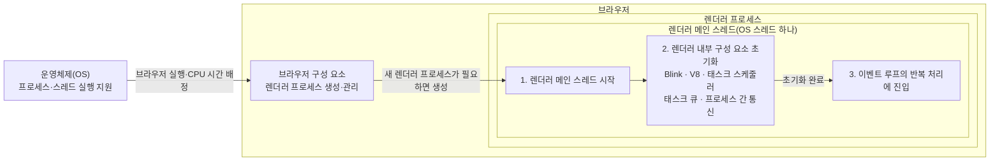
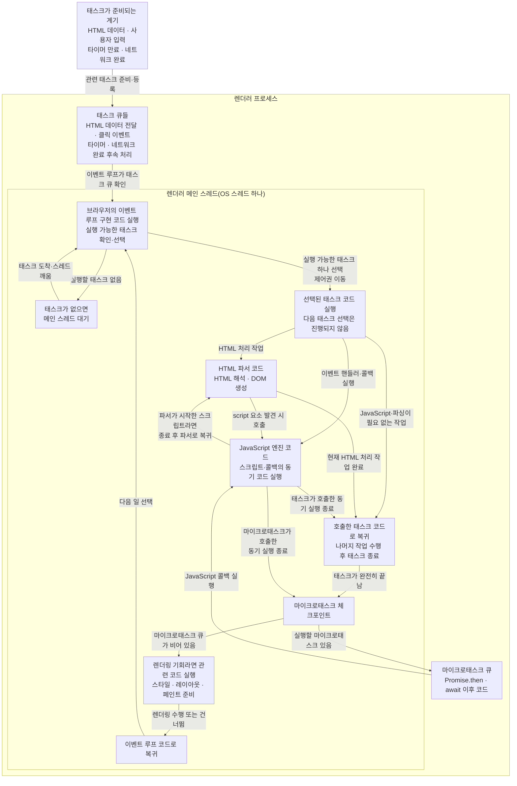

# 이벤트 루프, 메인 스레드, 콜 스택

## 구성 요소와 역할

| **구성 요소** | **역할** |
|---|---|
| **운영체제(OS)** | 브라우저 프로세스와 스레드에 CPU 시간을 배정하고, 입력·타이머·네트워크 같은 저수준 기능을 제공한다. |
| **브라우저(애플리케이션 전체)** | 여러 프로세스와 스레드, HTML 파서, JavaScript 엔진, 렌더링 엔진, 네트워크 서비스 등을 조합해 페이지를 처리한다. |
| **브라우저 프로세스(Chrome)** | Chrome을 구성하는 중심 프로세스로, 브라우저 UI·탐색·렌더러 프로세스 관리와 사용자 입력 전달 등을 담당한다. Chrome 전체와 같은 말이 아니며 모든 태스크를 직접 등록하지 않는다. |
| **렌더러 메인 스레드** | 일반적인 페이지에서 이벤트 루프 구현 코드, HTML 파싱, JavaScript, DOM·스타일·레이아웃 준비 등을 번갈아 실행하는 OS 스레드다. |
| **이벤트 루프** | 태스크·마이크로태스크·렌더링 기회를 어떤 절차로 처리할지 정의한 모델이다. 브라우저는 이를 메인 스레드에서 동작하는 내부 코드로 구현한다. |
| **HTML 파서** | HTML을 읽어 DOM을 만들고, `script` 요소를 만나면 조건에 맞는 시점에 스크립트 실행을 시작시킨다. |
| **JavaScript 엔진** | 전달받은 JavaScript를 실제로 실행하고 실행 컨텍스트와 콜 스택을 관리한다. 엔진 자체가 별도 스레드라는 뜻은 아니다. |
| **태스크** | 브라우저가 처리할 작업 묶음이다. 클릭 이벤트 전달, 타이머 콜백 실행, 네트워크 완료 후속 처리 등이 태스크가 될 수 있다. |
| **태스크 큐** | 실행할 준비가 된 태스크들을 태스크 종류와 우선순위 등에 따라 관리하는 구조다. 이벤트 루프는 여러 태스크 큐에서 실행 가능한 태스크를 선택한다. |
| **마이크로태스크** | 현재 JavaScript 실행이 끝난 뒤 다음 태스크보다 먼저 처리할 작은 작업이다. `Promise.then` 콜백, `await` 이후 코드, `queueMicrotask` 콜백 등이 해당한다. |
| **마이크로태스크 큐** | 실행할 준비가 된 마이크로태스크를 보관하는 별도의 큐다. 태스크 큐와 구분되며, 마이크로태스크 체크포인트에서 큐가 빌 때까지 처리된다. |
| **마이크로태스크 체크포인트** | 현재 JavaScript 실행을 마친 뒤 다음 태스크나 렌더링으로 넘어가기 전에 `Promise.then`·`await` 이후 코드 같은 마이크로태스크를 확인하고, 큐가 빌 때까지 처리하는 시점이다. |
| **콜백** | 나중에 호출하도록 등록한 JavaScript 함수다. 콜백 자체가 태스크는 아니며, 태스크나 마이크로태스크의 처리 과정에서 호출될 수 있다. |
| **콜 스택** | 현재 실행 중인 JavaScript 함수 호출과 되돌아갈 위치를 관리하는 JavaScript 엔진의 실행 상태 구조다. |

## OS부터 태스크 실행까지의 관계

두 그림은 하나의 관계도를 **한 번만 실행되는 초기화**와 **계속 반복되는 처리**로 나누어 확대한 것이다.

### 1. 렌더러 메인 스레드 시작과 초기화



### 2. 초기화 이후 반복되는 이벤트 루프 처리



> 두 번째 그림의 맨 위 박스는 특정 프로세스나 스레드가 아니라 **태스크가 준비되는 여러 계기**를 묶어 나타낸 것이다. 작업 종류에 맞는 브라우저 내부 코드가 필요한 태스크를 준비해 태스크 큐에 등록한다.
>
> **브라우저 프로세스**는 Chrome 전체가 아니라 Chrome을 구성하는 중심 프로세스 하나다. 브라우저 UI·탐색·렌더러 프로세스 관리와 입력 전달 등을 담당하지만, 모든 태스크를 렌더러의 태스크 큐에 직접 등록하는 단일 주체는 아니다.
>
> 렌더러 메인 스레드의 초기화는 한 번만 수행된다. 이후에는 태스크 대기·선택·실행과 이벤트 루프로의 복귀가 반복된다. 그림에서 태스크 큐로 향하는 화살표는 **태스크 등록**, 태스크 큐에서 이벤트 루프 구현 코드로 향하는 화살표는 **큐 확인**, 이벤트 루프 구현 코드에서 선택된 태스크로 향하는 화살표는 **선택 결과에 따른 제어권 이동**을 뜻한다. 태스크 큐와 이벤트 루프는 별도 스레드가 아니다.

## JavaScript 실행의 시작

**파서나 태스크가 JavaScript 엔진을 호출한다**

= HTML 파서 또는 브라우저가 실행 중인 태스크의 내용이 “이 JavaScript 함수를 실행하라”고 요청하면, JavaScript 엔진이 그 코드를 실행한다는 뜻입니다.

> 이벤트 루프가 “이번에는 이 태스크를 실행해야겠다”고 선택한다. 그러면 같은 메인 스레드의 실행 제어권이 해당 태스크 코드로 넘어가 HTML 파서나 JavaScript 엔진 등이 실행된다. 해당 작업이 끝나면 제어권이 이벤트 루프 코드로 돌아와 다음 일을 선택한다.

## 하나의 메인 스레드가 번갈아 실행하는 코드

**하나의 메인 스레드가 번갈아 실행하는 코드의 종류**를 나열한 것입니다.

```text
렌더러 메인 스레드(OS 스레드 하나)
├─ 브라우저의 이벤트 루프 구현 코드가 실행되는 시간
├─ HTML 파서 코드가 실행되는 시간
├─ JavaScript 엔진 코드가 실행되는 시간
└─ 렌더링 관련 코드가 실행되는 시간
```

정확한 역할은 다음과 같습니다.

| **질문** | **담당** |
|---|---|
| 다음 태스크를 언제 처리할지 결정 | 이벤트 루프 구현 코드 |
| HTML을 해석해 DOM 생성 | HTML 파서 |
| JavaScript 코드 실행 | JavaScript 엔진 |
| 이 코드들이 실제로 실행되는 통로 | 렌더러 메인 스레드 |
