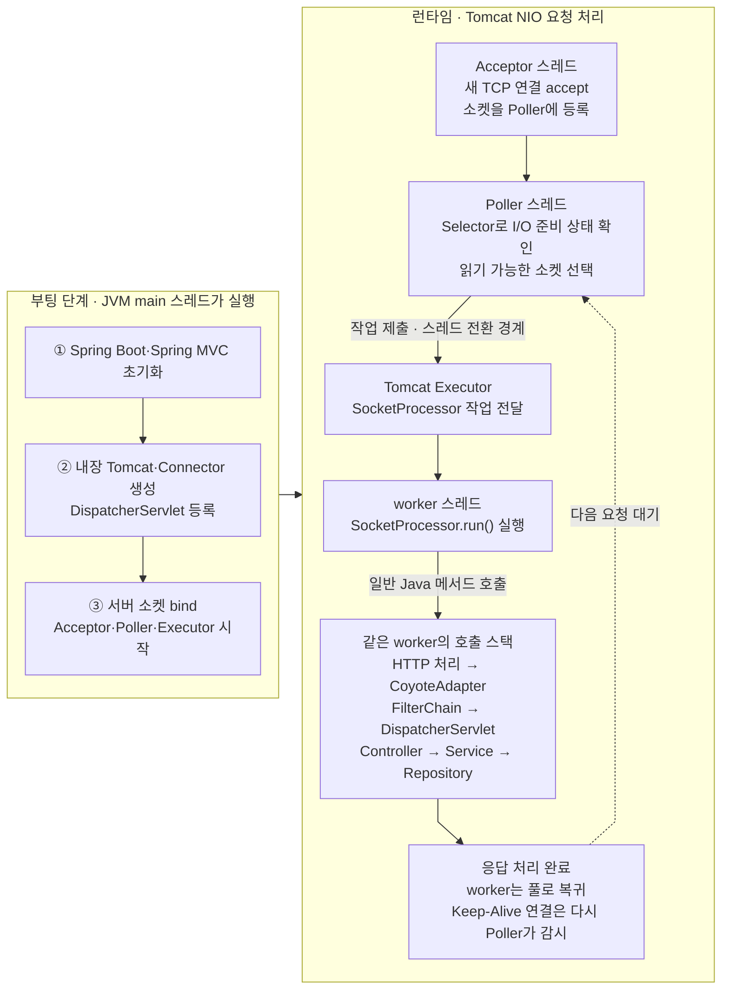

# Spring MVC + Tomcat: 요청 처리와 스레드의 관계

> [`06-main-thread-call-stack-and-event-loop.md`](06-main-thread-call-stack-and-event-loop.md)의 핵심 질문을 Spring MVC와 Tomcat에 적용한다. 즉, **어떤 스레드가 소켓의 I/O 준비 상태를 확인하고, 선택된 요청과 Spring MVC 코드는 누가 실행하는가?**

이 문서는 일반적인 Spring Boot 내장 Tomcat의 **NIO Connector와 플랫폼 worker 스레드 풀**을 기준으로 설명한다. Tomcat 버전·Connector·Executor 설정에 따라 세부 구현은 달라질 수 있지만 스레드 역할을 구분하는 핵심은 같다.

## 핵심 답

브라우저에서는 렌더러 메인 스레드가 이벤트 루프 구현 코드와 JavaScript를 번갈아 실행한다. Reactor Netty에서는 EventLoop worker가 I/O 준비 상태 확인과 그 I/O가 호출한 WebFlux 코드를 함께 실행한다.

Tomcat NIO에서는 역할이 나뉜다. **Acceptor 스레드**가 새 TCP 연결을 받아 Poller에 등록하고, **Poller 스레드**가 여러 연결의 I/O 준비 상태를 확인한다. 읽을 요청이 준비되면 Poller는 `SocketProcessor` 작업을 Tomcat Executor에 제출한다. 그 뒤 **Tomcat worker 스레드**가 작업을 꺼내 HTTP 처리·Servlet Filter·Spring MVC·Controller 코드를 같은 Java 호출 스택에서 실행한다.

> **핵심: Poller 스레드는 준비된 소켓을 찾아 요청 처리 작업을 worker 풀에 넘기고, 선택된 worker 스레드가 Tomcat의 요청 처리 코드와 그 코드가 호출하는 Spring MVC·Controller·비즈니스 코드를 직접 실행한다.**

> **Poller와 worker는 역할이 다르다.** Poller가 `DispatcherServlet`이나 Controller를 실행하는 것이 아니며, worker가 Poller의 `run()` 반복문을 실행하는 것도 아니다.

## main, Acceptor, Poller, worker의 관계

부팅 단계에서는 보통 JVM `main` 스레드가 다음 초기화 코드를 실행한다.

```text
JVM main 스레드
→ Spring Boot 초기화 코드 실행
→ Spring ApplicationContext 생성·갱신
→ 내장 Tomcat과 HTTP Connector 생성
→ Spring MVC 구성과 DispatcherServlet 등록·초기화
→ Tomcat Executor와 NIO Endpoint 초기화
→ 서버 소켓 bind와 Tomcat 시작
→ Acceptor·Poller 등 Tomcat 내부 스레드 시작
```

서버가 시작된 뒤 일반적인 동기 요청 하나가 처리되는 흐름을 단순화하면 다음과 같다.

```text
Acceptor 스레드                         → 참고로 Netty는 parent/acceptor EventLoop이 담당
└─ 새 TCP 연결 accept
   └─ 소켓을 Poller의 Selector에 등록

Poller 스레드                           → 참고로 Netty는 worker EventLoop이 이 역할도 담당
└─ 여러 소켓의 I/O 준비 상태를 반복 확인
   └─ 읽기 가능한 소켓 발견
      └─ SocketProcessor 작업을 Executor에 제출

Tomcat worker 스레드                    → 참고로 Netty는 같은 worker EventLoop이 요청 코드까지 실행
└─ SocketProcessor.run() 실행
   └─ HTTP 요청 파싱·처리
      └─ CoyoteAdapter → Tomcat Servlet 처리 체인
         └─ FilterChain → DispatcherServlet
            └─ Controller → Service → Repository
               └─ 응답 생성·쓰기
└─ 요청 처리가 끝나면 worker 풀로 복귀
```

즉, Tomcat은 `Poller 스레드 → Tomcat worker 스레드`로 실행 주체가 바뀌지만, Netty는 worker EventLoop가 I/O 준비 상태를 확인한 뒤 별도의 요청 worker에게 넘기지 않고 ChannelPipeline·WebFlux·Controller 코드까지 직접 실행한다.

### 각 구성 요소와 스레드의 역할

**Tomcat NIO Connector는 연결 감시와 요청 코드 실행을 서로 다른 스레드 역할로 분리한다. Poller는 I/O 준비 상태를 감지하고 실행할 `SocketProcessor` 작업을 만든다. worker는 이 작업의 `run()`에 진입해 Tomcat과 Spring MVC의 메서드를 차례로 호출한다. 동기 처리 중 별도의 스레드 전환이 없다면 Controller와 비즈니스 코드까지 모두 같은 worker 스레드가 실행한다.**

- **OS:** TCP 연결과 소켓을 관리하고 읽기·쓰기 가능한 I/O 상태를 만든다.
- **Tomcat 개발자:** Acceptor·Poller·Executor·HTTP 처리·Servlet 호출 로직을 구현했다.
- **Spring 개발자:** `DispatcherServlet`, HandlerMapping, HandlerAdapter 등 Spring MVC 처리 코드를 구현했다.
- **애플리케이션 개발자:** Controller·Service·Repository와 비즈니스 코드를 작성한다.
- **Acceptor 스레드:** 새 연결을 `accept()`하고 NIO 소켓을 Poller에 등록한다.
- **Poller 스레드:** Selector로 여러 소켓의 I/O 준비 상태를 확인하고 처리 작업을 Executor에 제출한다.
- **Tomcat worker 스레드:** 제출된 작업과 그 작업이 호출한 Tomcat·Servlet·Spring MVC·애플리케이션 코드를 실제로 실행한다.

바로 위 Tomcat worker 스레드 항목을 Java의 일반적인 메서드 호출 관계로 풀어 보면 다음과 같다. worker가 `SocketProcessor.run()`을 실행하다가 다른 처리 메서드를 호출하면, 같은 worker가 호출 스택을 따라 그 코드까지 이어서 실행한다.

```text
Tomcat worker 스레드
└─ SocketProcessor.run() 실행
   └─ HTTP 프로토콜 처리 코드 호출
      └─ CoyoteAdapter.service() 호출
         └─ ApplicationFilterChain.doFilter() 호출
            └─ DispatcherServlet.service() 호출
               └─ DispatcherServlet.doDispatch() 호출
                  └─ Controller 메서드 호출
                     └─ Service·Repository 메서드 호출
```

예를 들면 일반적인 Java 호출과 같다.

```java
void socketProcessorRun() {
    parseHttpRequest();       // 같은 worker 스레드가 실행
    coyoteAdapterService();   // 이것도 같은 worker 스레드가 실행
}

void coyoteAdapterService() {
    filterChainDoFilter();    // 같은 worker가 Servlet 처리 체인으로 진입
}

void filterChainDoFilter() {
    dispatcherServletService(); // 같은 worker가 Spring MVC로 진입
}
```

`socketProcessorRun()`을 실행하던 worker 스레드는 `coyoteAdapterService()`가 호출되면 그 메서드 안으로 들어가 코드를 실행하고, 호출이 끝나면 다시 `socketProcessorRun()`으로 돌아온다. Poller 스레드가 Spring MVC 메서드를 하나씩 호출하면서 worker에게 넘기는 구조가 아니다. **Poller에서 worker로 작업을 제출할 때 한 번 스레드가 전환된 뒤, worker가 일반적인 Java 호출 관계로 요청 처리 코드를 이어서 실행하는 구조다.**

### 전체 실행 흐름



- `main` 스레드는 서버를 초기화하고 Tomcat 내부 스레드를 시작하지만, 정상적인 HTTP 요청마다 Controller를 직접 실행하지 않는다.
- Acceptor는 새 **연결**을 받아들이고, Poller는 등록된 여러 연결의 I/O 준비 상태를 감시한다.
- Poller가 읽기 가능한 소켓을 발견하면 처리할 `SocketProcessor`를 Executor에 제출한다. 이 제출 지점이 Poller에서 worker로 넘어가는 스레드 전환 경계다.
- worker가 작업 실행을 시작한 뒤에는 HTTP 처리부터 Controller까지 일반적인 Java 메서드 호출로 이어진다.
- 요청 처리가 끝나면 worker는 특정 연결에 계속 묶여 있지 않고 풀로 돌아가 다른 요청을 처리할 수 있다.

## Tomcat의 요청 처리 작업과 worker

Tomcat NIO 구현의 구조와 주요 메서드 이름만 남겨 단순화하면 다음과 같다. 실제 소스에는 오류·타임아웃·TLS·비동기 Servlet·HTTP/2 처리 등 더 많은 분기가 있다.

```java
class Poller implements Runnable {
    @Override
    public void run() {
        while (serverIsRunning()) {
            selector.select();

            for (SelectionKey key : selectedKeys()) {
                if (key.isReadable()) {
                    // dispatch=true이면 SocketProcessor를 Executor에 제출한다.
                    processSocket(socketOf(key), OPEN_READ, true);
                }
            }
        }
    }
}

boolean processSocket(Socket socket, Event event, boolean dispatch) {
    Runnable task = new SocketProcessor(socket, event);
    executor.execute(task);  // 여기서 worker 풀에 실행을 요청한다.
    return true;
}

class SocketProcessor implements Runnable {
    @Override
    public void run() {
        protocolHandler.process(socket, event);
        // HTTP 처리 → CoyoteAdapter → Servlet 체인으로 이어질 수 있다.
    }
}
```

전통적인 플랫폼 스레드 풀을 사용하면 `executor.execute(task)`는 worker에게 실행할 `Runnable`을 전달한다. 선택된 worker가 `task.run()`을 호출하고, `run()`에서 시작된 호출 체인이 Spring MVC까지 이어진다. **Executor와 작업 큐는 실행 대상을 보관·배정하는 객체이지, 코드를 실행하는 스레드 자체가 아니다.**

Spring MVC Controller까지의 대표적인 호출 경로를 단순화하면 다음과 같다.

```text
Tomcat worker
→ SocketProcessor.run()
→ Coyote HTTP 프로토콜 처리
→ CoyoteAdapter.service()
→ Tomcat Container Pipeline
→ ApplicationFilterChain.doFilter()
→ DispatcherServlet.service()
→ DispatcherServlet.doDispatch()
→ HandlerAdapter
→ Controller
→ Service
→ Repository
→ 호출이 끝나면 역순으로 복귀
→ SocketProcessor.run() 종료
→ worker 풀로 복귀
```

`DispatcherServlet`이나 Controller 코드가 Executor의 큐에 각각 따로 저장되는 것은 아니다. 큐에 전달되는 대표적인 실행 단위는 소켓 이벤트를 처리할 `SocketProcessor`이고, Spring MVC 코드는 그 작업을 실행하는 동안 Java 메서드 호출로 도달한다.

단, 요청 라인·헤더 등 필요한 바이트가 아직 모두 도착하지 않았다면 한 번의 `SocketProcessor.run()`에서 Controller까지 도달하지 않을 수 있다. 현재 처리를 반환하고 소켓을 다시 Poller가 감시한 뒤, 데이터가 더 들어오면 새 `SocketProcessor` 작업에서 이어서 처리할 수 있다. **필요한 요청 정보가 준비되어 동기 Servlet 처리 체인에 진입한 뒤에는, 비동기 경계가 없는 한 그때 선택된 같은 worker가 Controller 호출과 응답 처리를 완료할 때까지 담당한다.**

## 연결 1개와 worker 1개가 영구적으로 묶이는가

그렇지 않다. Tomcat NIO에서 **TCP 연결 1개가 worker 스레드 1개를 연결이 닫힐 때까지 계속 점유하는 것은 아니다.**

```text
Keep-Alive 연결 A에 요청이 없는 동안
→ Poller가 연결 A를 감시
→ worker를 점유하지 않음

연결 A에 요청 1이 도착
→ worker 1이 요청 1 처리
→ 처리 완료 후 worker 1은 풀로 복귀

같은 연결 A에 요청 2가 나중에 도착
→ Poller가 다시 감지
→ 그때 사용 가능한 worker가 처리
→ worker 1일 수도 있고 worker 2일 수도 있음
```

따라서 전통적인 동기 Spring MVC 모델은 다음과 같이 표현하는 것이 정확하다.

> **연결 1개 = 스레드 1개가 아니라, 처리 중인 동기 요청 1개가 worker 스레드 1개를 점유한다.**

## 블로킹 작업이 발생하면

동기 Controller가 `Thread.sleep()`, 블로킹 JDBC, 동기 외부 HTTP 호출을 수행하면 해당 요청의 worker 스레드는 결과가 나올 때까지 점유된다.

```text
worker 1 → 요청 A → JDBC 응답 대기 중
worker 2 → 요청 B를 계속 처리 가능
worker 3 → 요청 C를 계속 처리 가능
```

worker 하나가 블로킹되어도 Poller와 다른 worker가 즉시 함께 멈추는 것은 아니다. 다만 블로킹 요청이 많아 사용 가능한 worker가 모두 소진되면 새 요청은 Executor나 연결 대기열에서 기다리게 되고 전체 지연이 커진다.

이 점이 Netty EventLoop worker를 블로킹했을 때와 다르다. Netty에서는 한 EventLoop worker가 여러 Channel의 I/O 처리도 담당하므로 그 worker를 블로킹하면 같은 EventLoop에 등록된 다른 Channel까지 지연된다. Tomcat의 전통적인 모델에서는 블로킹 영향이 우선 해당 worker 하나에 한정되지만, 그 대가로 동시 처리 요청 수만큼 worker가 필요하다.

## 꼭 기억할 예외 세 가지

- **Servlet 비동기 처리:** Controller가 `Callable`, `DeferredResult`, `WebAsyncTask` 등을 사용하면 `DispatcherServlet`과 Filter가 최초 Tomcat worker에서 빠져나오고 그 worker를 반환할 수 있다. 결과는 별도 Executor나 다른 스레드에서 만들어질 수 있으며, 완료 후 Servlet 컨테이너에 다시 dispatch될 때 다른 Tomcat worker가 후속 처리를 맡을 수 있다.
- **애플리케이션의 명시적 스레드 전환:** `@Async`, 별도 `Executor`, `CompletableFuture`의 비동기 실행 등을 사용하면 해당 경계 이후 코드는 Tomcat worker가 아닌 애플리케이션 Executor의 스레드에서 실행될 수 있다.
- **가상 스레드 Executor:** Tomcat을 가상 스레드 기반 Executor로 설정하면 `SocketProcessor`가 플랫폼 worker 풀 대신 가상 스레드에서 실행될 수 있다. 실행 스레드 종류는 달라져도 하나의 동기 요청 호출 스택이 Controller와 비즈니스 코드까지 이어진다는 기본 구조는 같다.

## WebFlux + Netty와 비교

| **구분** | **Spring MVC + Tomcat NIO** | **Spring WebFlux + Reactor Netty** |
|---|---|---|
| I/O 준비 상태 확인 | Tomcat Poller 스레드 | Netty EventLoop worker |
| Controller 실행 | Poller가 Executor에 넘긴 작업을 Tomcat worker가 실행 | 스레드 전환이 없다면 같은 EventLoop worker가 실행 |
| I/O 감시와 Controller 실행 | 서로 다른 스레드 역할 | 보통 같은 EventLoop worker |
| 요청 처리 중 블로킹 | 해당 worker를 점유 | 해당 EventLoop와 그에 연결된 여러 Channel을 지연 |
| 요청 완료 후 | worker가 풀로 복귀 | EventLoop worker가 반복문으로 복귀 |

자세한 WebFlux 실행 구조는 [`webflux-netty-event-loop.md`](webflux-netty-event-loop.md)를 참고한다.

## 참고 자료

- [Apache Tomcat 11: Request Process Flow](https://tomcat.apache.org/tomcat-11.0-doc/architecture/requestProcess.html)
- [Apache Tomcat 11: HTTP Connector](https://tomcat.apache.org/tomcat-11.0-doc/config/http.html)
- [Apache Tomcat 11: NioEndpoint API](https://tomcat.apache.org/tomcat-11.0-doc/api/org/apache/tomcat/util/net/NioEndpoint.html)
- [Apache Tomcat 11: NioEndpoint.SocketProcessor API](https://tomcat.apache.org/tomcat-11.0-doc/api/org/apache/tomcat/util/net/NioEndpoint.SocketProcessor.html)
- [Apache Tomcat 11: ApplicationFilterChain API](https://tomcat.apache.org/tomcat-11.0-doc/api/org/apache/catalina/core/ApplicationFilterChain.html)
- [Spring MVC: DispatcherServlet API](https://docs.spring.io/spring-framework/docs/current/javadoc-api/org/springframework/web/servlet/DispatcherServlet.html)
- [Spring MVC: Asynchronous Requests](https://docs.spring.io/spring-framework/reference/web/webmvc/mvc-ann-async.html)
