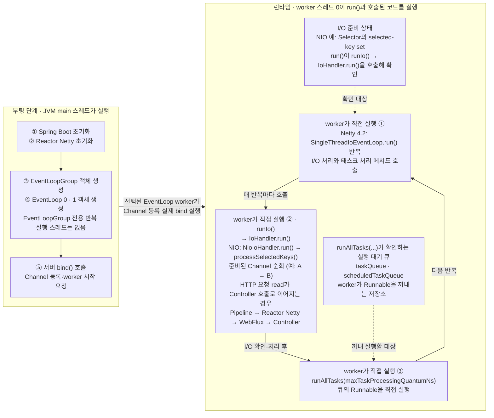

# Spring WebFlux + Netty: EventLoop와 스레드의 관계

> [`06-main-thread-call-stack-and-event-loop.md`](06-main-thread-call-stack-and-event-loop.md)의 핵심 질문을 Netty에 적용한다. 즉, **어떤 스레드가 이벤트 루프 구현 코드를 실행하고, 선택된 작업은 누가 실행하는가?**

## 핵심 답

브라우저에서는 렌더러 메인 스레드가 이벤트 루프 구현 코드와 JavaScript를 번갈아 실행한다.

Netty에서는 **JVM `main` 스레드가 EventLoop의 `run()` 반복문을 실행하지 않는다.** `main`은 Spring Boot와 서버를 시작할 뿐이다. 이후에는 여러 **Netty worker 스레드**가 각각 자신에게 연결된 `EventLoop`의 `run()` 구현 코드를 반복 실행한다.

> **핵심: worker 스레드가 EventLoop 객체의 `run()` 코드와, 그 코드가 호출하는 Channel I/O 처리·WebFlux·`Runnable` 코드를 직접 실행한다.**

> **EventLoop는 스레드가 아니다.** I/O와 태스크를 관리하는 실행기 객체이며, 실제 코드를 실행하는 것은 그 EventLoop를 담당하는 JVM/OS worker 스레드다.

## main, worker, EventLoop, Channel의 관계

부팅 단계에서는 다음 코드를 JVM `main` 스레드가 실행한다.

```text
JVM main 스레드
→ Spring Boot 초기화 코드 실행
→ Reactor Netty 초기화 코드 실행
→ EventLoopGroup 객체 생성
→ EventLoop 객체들 생성
→ 서버 bind() 호출
→ Channel 등록과 EventLoop worker 시작 요청
```

서버가 시작된 뒤에는 각 worker가 자신에게 연결된 EventLoop의 반복 코드를 실행한다. 아래는 현재 프로젝트가 사용하는 Netty 4.2 구조의 NIO 예시이며, Channel A와 B의 처리 순서는 설명을 위한 것이다.

```text
worker 스레드 0이 아래 코드를 모두 실행
└─ EventLoop 0의 SingleThreadIoEventLoop.run() 실행 중
   ├─ run()이 runIo() 호출
   │  └─ runIo()가 IoHandler.run() 호출
   │     └─ NIO에서는 NioIoHandler.run() 실행
   │        ├─ 준비된 Channel I/O 확인
   │        └─ processSelectedKeys() 호출
   │           ├─ Channel A의 HTTP 요청 read를 worker가 처리
   │           │  └─ 스레드 전환 경계 없이 처리가 이어진다면
   │           │     ChannelPipeline → Reactor Netty → WebFlux → Controller 실행
   │           ├─ Channel A 처리 후 processSelectedKeys()로 복귀
   │           └─ Channel B도 HTTP 요청 read가 준비됐다면 worker가 I/O 처리 메서드 실행
   ├─ I/O 처리가 끝나면 runIo() → run()으로 복귀
   ├─ run()이 runAllTasks(maxTaskProcessingQuantumNs) 호출
   │  └─ worker가 큐의 Runnable 실행
   └─ worker가 run()의 다음 반복 실행
```

#### **EventLoop와 worker 스레드의 역할**

**EventLoop는 전담 worker 스레드가 반복 실행하는 객체다. EventLoop 구현 코드는 준비된 Channel I/O와 큐의 태스크를 확인하고 해당 처리 메서드를 차례로 호출한다. EventLoop 코드뿐 아니라 호출된 I/O·WebFlux·`Runnable` 코드까지 실제로 실행하는 주체는 모두 같은 worker 스레드다.**



- `EventLoopGroup`은 여러 EventLoop를 생성·보관·선택하는 객체다. EventLoopGroup 전용 반복 실행 스레드는 따로 없다. 부팅 중 생성·초기화 메서드는 이를 호출한 스레드, 보통 `main`이 실행한다.
- `main`은 bind를 시작하지만 실제 서버 Channel 등록·bind 단계는 선택된 EventLoop worker에 위임될 수 있다.
- `EventLoop 0`에는 Channel A·B가 등록되며, EventLoop 0은 이들의 I/O 준비 상태와 태스크 큐를 관리한다.
- 그림의 ① `run()`, ② Channel I/O·WebFlux 처리, ③ 큐의 `Runnable`은 **모두 worker 스레드 0이 실행**한다.
- 일반적인 Netty 구현에서는 EventLoop 하나와 전담 worker 하나가 장기간 연결되며, 요청마다 새 스레드나 EventLoop를 만들지 않는다.

## worker가 실행하는 EventLoop 구현 코드

현재 프로젝트의 Netty 4.2에서 I/O EventLoop의 중심 반복문은 `SingleThreadIoEventLoop.run()`에 있다. worker 스레드 0은 이 메서드에 진입해 I/O 처리와 태스크 처리를 반복한다. 아래는 실제 소스의 구조와 주요 메서드 이름만 남긴 의사 코드다.

```java
class SingleThreadIoEventLoop extends SingleThreadEventLoop {

    private final IoHandler ioHandler;

    @Override
    protected void run() {
        ioHandler.initialize();

        do {
            runIo();  // worker가 I/O 처리 코드를 실행한다.

            if (isShuttingDown()) {
                ioHandler.prepareToDestroy();
            }

            // worker가 일반·예약 태스크의 Runnable을 실행한다.
            runAllTasks(maxTaskProcessingQuantumNs);
        } while (!confirmShutdown() && !canSuspend());
    }

    protected int runIo() {
        // NIO에서는 NioIoHandler.run()이 select와 processSelectedKeys()를 수행한다.
        return ioHandler.run(context);
    }
}
```

Netty 4.1에서는 `NioEventLoop.run()`이 I/O 처리를 직접 담당했지만, Netty 4.2에서는 공통 반복문인 `SingleThreadIoEventLoop.run()`과 트랜스포트별 `IoHandler`로 역할이 나뉘었다. 구조가 나뉘어도 **같은 worker가 `run()` → `runIo()` → `IoHandler.run()` → Channel 처리 코드와 `runAllTasks(...)`를 실행한다**는 핵심은 같다.

실제 구현에는 종료·일시 중지 처리와 반복 한 번에서 태스크 처리에 사용할 최대 시간 등의 세부 로직이 더 들어간다. NIO는 `NioIoHandler`, epoll·kqueue는 각 트랜스포트의 `IoHandler`가 I/O 준비 확인과 처리를 담당한다.

### I/O·태스크·WebFlux는 EventLoop와 어떻게 연결되는가

I/O 준비 상태와 태스크 큐는 실행 코드가 아니라, EventLoop가 처리할 대상을 알려 주는 상태와 저장소다. 각 대상이 EventLoop와 연결되는 방식은 다음과 같다.

| **대상** | **EventLoop와 연결되는 방식** |
|---|---|
| 소켓 I/O | Channel을 EventLoop에 등록하면 해당 EventLoop의 `IoHandler`가 I/O 준비 상태를 확인한다. NIO 트랜스포트에서는 Channel의 I/O 핸들이 Selector에 등록된다. |
| 일반·예약 태스크 | `Runnable` 형태로 EventLoop의 일반 태스크 큐 또는 예약 태스크 큐에 저장된다. |
| WebFlux 코드 | EventLoop에 저장되지 않는다. HTTP Channel의 `ChannelPipeline` → Reactor Netty HTTP 처리 → Spring `HttpHandler`·WebFlux 처리 체인을 통해 호출된다. |

다음 흐름은 추가 I/O나 비동기 완료 신호를 기다리지 않고, 실행이 다른 Scheduler나 handler executor로 전환되지 않는 경우다. 이때 Controller는 별도 태스크로 큐에서 꺼내지는 것이 아니라, 소켓 read를 처리하던 **같은 worker의 Java 호출 스택**에서 다음처럼 호출된다.

```text
SingleThreadIoEventLoop.run()
→ runIo()
→ NioIoHandler.run()
→ processSelectedKeys()
→ 준비된 Channel 처리
→ ChannelPipeline
→ Reactor Netty
→ Spring WebFlux
→ Controller
→ 호출이 끝나면 runIo()를 거쳐 run()으로 복귀
```

단, 요청 본문처럼 추가 I/O를 기다려야 하면 현재 호출 스택은 먼저 반환된다. 데이터가 도착하면 스레드 전환 경계가 없는 한 그 Channel을 담당하는 EventLoop의 worker가 새 호출 스택에서 처리를 이어 가며 Controller를 호출할 수 있다. **같은 worker가 담당한다는 말이 요청 전체가 하나의 호출 스택으로 실행된다는 뜻은 아니다.**

### 브라우저 이벤트 루프와 다른 점

Netty는 브라우저의 태스크·마이크로태스크 모델과 다르다. 한 번의 반복에서 준비된 여러 I/O 이벤트와 큐의 태스크를 처리할 수 있으며, I/O와 태스크의 구체적인 처리 방식은 트랜스포트·버전·설정에 따라 달라질 수 있다.

## 꼭 기억할 예외 두 가지

- **스레드 전환:** `publishOn`은 이후 downstream 신호를, `subscribeOn`은 구독과 upstream 요청 경로를 지정한 Scheduler에서 실행하게 한다. `delay`·`interval`·`timeout` 같은 시간 연산자도 Scheduler를 사용할 수 있다. R2DBC는 Scheduler 전환 연산자가 아니라, 드라이버의 I/O 완료 신호가 들어오는 비동기 경계다. 응답 처리가 어느 스레드에서 이어지더라도 최종 소켓 `write()`·`flush()`는 Channel의 EventLoop에서 직렬화된다.
- **worker 블로킹:** Controller 코드가 EventLoop worker에서 실행되는 상태에서 `Thread.sleep`, 블로킹 JDBC 같은 실제 블로킹 작업이나 긴 CPU 작업을 수행하면 worker가 EventLoop 코드로 돌아가지 못하므로 **그 EventLoop에 등록된 다른 Channel도 함께 지연**된다.

## 참고 자료

- [Netty 4.2: EventLoop API](https://netty.io/4.2/api/io/netty/channel/EventLoop.html)
- [Netty 4.2: SingleThreadIoEventLoop 소스](https://netty.io/4.2/xref/io/netty/channel/SingleThreadIoEventLoop.html)
- [Netty 4.2: NioIoHandler 소스](https://netty.io/4.2/xref/io/netty/channel/nio/NioIoHandler.html)
- [Reactor Netty: Event Loop Group](https://projectreactor.io/docs/netty/release/reference/http-server.html#_event_loop_group)
- [Spring WebFlux: concurrency model](https://docs.spring.io/spring-framework/reference/web/webflux/new-framework.html#webflux-concurrency-model)
