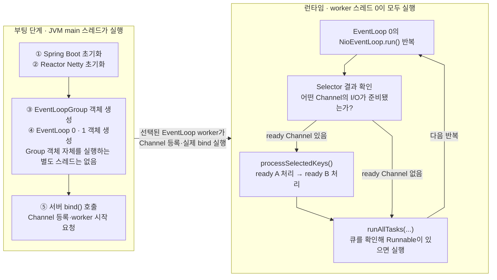
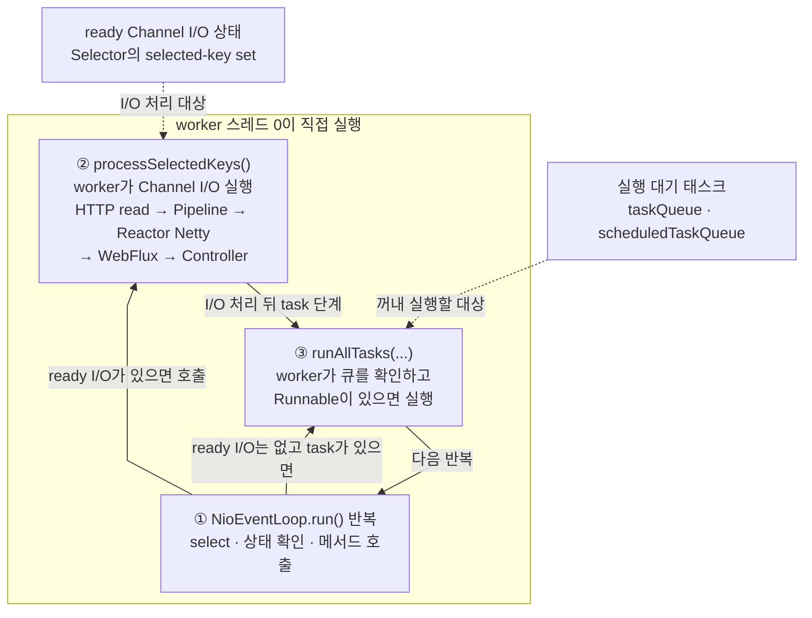

# Spring WebFlux + Netty: EventLoop와 스레드의 관계

> [`06-main-thread-call-stack-and-event-loop.md`](06-main-thread-call-stack-and-event-loop.md)의 핵심 질문을 Netty에 적용한다. 즉, **어떤 스레드가 이벤트 루프 구현 코드를 실행하고, 선택된 작업은 누가 실행하는가?**

## 핵심 답

브라우저에서는 렌더러 메인 스레드가 이벤트 루프 구현 코드와 JavaScript를 번갈아 실행한다.

Netty에서는 **JVM `main` 스레드가 EventLoop의 `run()` 반복문을 실행하지 않는다.** `main`은 Spring Boot와 서버를 시작할 뿐이다. 이후에는 여러 **Netty worker 스레드**가 각각 자신에게 연결된 `EventLoop`의 `run()` 구현 코드를 반복 실행한다.

> **EventLoop는 스레드가 아니다.** I/O와 태스크를 관리하는 실행기 객체이며, 실제 코드를 실행하는 것은 그 EventLoop를 담당하는 JVM/OS worker 스레드다.

## main, worker, EventLoop, Channel의 관계

부팅 단계에서는 다음 코드를 JVM `main` 스레드가 실행한다.

```text
JVM main 스레드
→ Spring Boot 초기화 코드 실행
→ Reactor Netty 초기화 코드 실행
→ EventLoopGroup 객체 생성
→ EventLoop 객체들 생성
→ 서버 bind() 호출
→ Channel 등록과 EventLoop worker 시작 요청
```

서버가 시작된 뒤에는 각 worker가 자신에게 연결된 EventLoop의 반복 코드를 실행한다. Channel A와 B의 순서는 설명을 위한 예시다.

```text
worker 스레드 0
└─ EventLoop 0의 run() 실행 중
   ├─ 어떤 Channel의 I/O가 준비됐는지 확인
   ├─ Channel A가 준비됐다면 Channel A 처리 메서드 호출
   ├─ Channel A 처리가 끝나면 processSelectedKeys()로 복귀
   ├─ Channel B도 준비됐다면 Channel B 처리 메서드 호출
   ├─ 큐의 Runnable 실행
   └─ run()의 다음 반복
```



- `EventLoopGroup`은 여러 EventLoop를 생성·보관·선택하는 객체다. Group 객체 자체의 코드를 계속 실행하는 전용 스레드는 없으며, 부팅 중 생성·초기화 메서드는 이를 호출한 스레드, 보통 `main`이 실행한다.
- `main`은 bind를 시작하지만 실제 서버 Channel 등록·bind 단계는 선택된 EventLoop worker에 위임될 수 있다.
- `EventLoop 0`은 Channel A·B가 자신에게 등록되어 있다는 관계와 I/O 준비 상태·task queue를 관리한다.
- Channel 자체를 실행하는 것이 아니라, **EventLoop 0의 `run()`을 실행 중인 worker 스레드 0이 ready Channel의 I/O 메서드와 Pipeline 코드를 호출해 실행**한다.
- 일반적인 Netty 구현에서는 EventLoop 하나와 전담 worker 하나가 장기간 연결되며, 요청마다 새 스레드나 EventLoop를 만들지 않는다.

## worker가 실행하는 이벤트 루프 구현 코드

`EventLoop 0`은 `NioEventLoop` 객체 하나다. worker 스레드 0은 이 객체의 `run()`에 한 번 진입하고, `run()` 안의 `for (;;)`를 서버가 종료될 때까지 반복한다. 아래 코드는 실제 Netty 소스의 구조와 주요 메서드 이름만 남긴 의사 코드다.

```java
final class NioEventLoop extends SingleThreadEventLoop {

    @Override
    protected void run() {  // worker 스레드가 이 메서드에 한 번 진입한다.
        for (;;) {
            int strategy = selectStrategy.calculateStrategy(
                    selectNowSupplier,
                    hasTasks()
            );

            // 실행할 task가 없고 기다려야 할 때만 blocking select를 수행한다.
            if (strategy == SelectStrategy.SELECT && !hasTasks()) {
                long deadline = nextScheduledTaskDeadlineNanos();
                if (deadline == -1L) {
                    deadline = NONE;
                }
                strategy = select(deadline);
            }

            // select 결과 준비된 Channel I/O가 있을 때만 처리한다.
            if (strategy > 0) {
                processSelectedKeys();
            }

            // 일반 task와 실행 시각이 된 scheduled task를 처리한다.
            runAllTasks();
        }
    }
}
```

실제 `run()`에는 예외 처리, 종료 처리, Selector 복구와 `ioRatio`에 따른 I/O·task 실행 시간 조절이 더 들어간다. 하지만 **worker가 `run()`에 진입 → `for (;;)` 반복 → I/O 처리 → task 처리 → 다음 반복**이라는 뼈대는 위와 같다. 위 코드는 NIO transport 기준이며 epoll·kqueue transport도 각자의 EventLoop 구현을 전담 worker가 실행한다.



ready I/O와 task queue는 스레드나 실행 코드가 아니라 **실행할 대상을 알려 주는 상태·저장소**다. EventLoop 구현은 중심 반복문인 `run()`과 여기서 호출하는 `processSelectedKeys()`·`runAllTasks(...)` 같은 Netty 메서드로 이루어진다. worker 스레드 0은 이 메서드를 따라 Channel I/O, WebFlux 처리와 `Runnable`까지 직접 실행하고, 호출이 끝나면 `run()`의 다음 반복으로 돌아간다. **WebFlux 코드 자체가 EventLoop 내부에 저장되어 있는 것은 아니다.**

| **대상** | **EventLoop와 연결되는 방법** |
|---|---|
| 소켓 I/O | Channel을 EventLoop에 등록하면 해당 EventLoop가 I/O 준비 상태를 감시한다. NIO transport에서는 Channel이 그 EventLoop의 Selector에 등록된다. |
| 일반·예약 태스크 | `Runnable` 형태로 EventLoop의 일반 task queue 또는 scheduled task queue에 저장된다. |
| WebFlux 코드 | EventLoop에 저장되지 않는다. HTTP Channel의 `ChannelPipeline` → Reactor Netty HTTP 처리 → Spring `HttpHandler`·WebFlux 처리 체인을 통해 호출된다. |

따라서 별도 Scheduler 경계가 없다면 Controller는 별도의 “Controller 태스크”로 큐에서 다시 꺼내지는 것이 아니다. 소켓 read를 처리하던 **같은 worker의 Java 호출 스택**에서 다음처럼 이어진다.

```text
NioEventLoop.run()
→ 준비된 Channel 처리
→ ChannelPipeline
→ Reactor Netty
→ Spring WebFlux
→ Controller
→ 호출이 끝나면 NioEventLoop.run()으로 복귀
```

단, request body처럼 추가 I/O를 기다려야 하면 현재 호출 스택은 먼저 반환된다. 이후 body가 도착한 다음 EventLoop 반복의 새로운 호출 스택에서 Controller가 호출될 수 있다. **같은 worker가 담당한다는 말이 요청 전체가 하나의 호출 스택으로 실행된다는 뜻은 아니다.**

Netty는 브라우저의 태스크·마이크로태스크 모델과 다르다. 한 번의 반복에서 여러 준비된 I/O와 큐 작업을 처리할 수 있으며, I/O와 태스크의 구체적인 처리 순서와 비율은 transport·버전·설정에 따라 달라질 수 있다.

## 꼭 기억할 예외 두 가지

- `publishOn`, `subscribeOn`, 타이머, R2DBC 같은 비동기 경계를 만나면 이후 Reactor 신호는 같은 worker 또는 다른 스레드에서 이어질 수 있다. 실제 Channel write는 해당 Channel의 EventLoop를 통해 직렬화된다.
- Controller에서 `Thread.sleep`, blocking JDBC 같은 실제 blocking 작업이나 긴 CPU 작업을 실행하면 worker가 이벤트 루프 코드로 돌아가지 못하므로 **그 EventLoop에 등록된 다른 Channel도 함께 지연**된다.

## 참고 자료

- [Netty: EventLoop API](https://netty.io/4.1/api/io/netty/channel/EventLoop.html)
- [Netty: NioEventLoop 소스](https://netty.io/4.1/xref/io/netty/channel/nio/NioEventLoop.html)
- [Reactor Netty: Event Loop Group](https://projectreactor.io/docs/netty/release/reference/http-server.html#_event_loop_group)
- [Spring WebFlux: concurrency model](https://docs.spring.io/spring-framework/reference/web/webflux/new-framework.html#webflux-concurrency-model)
