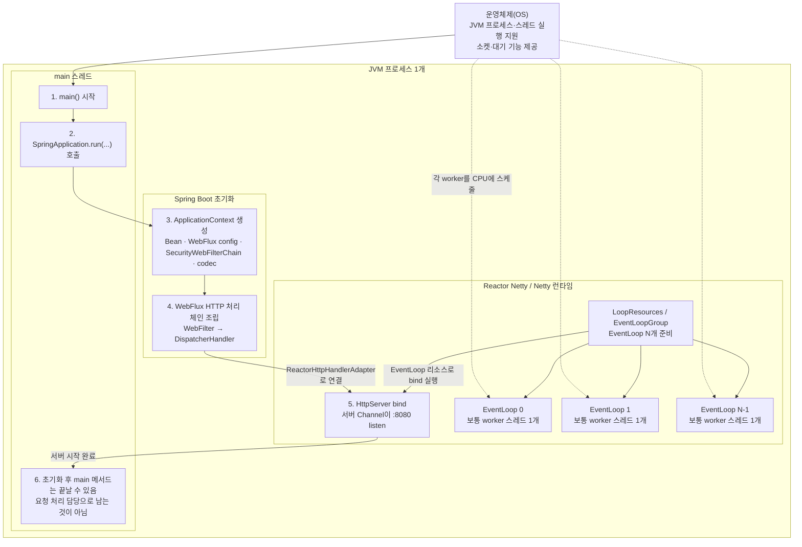
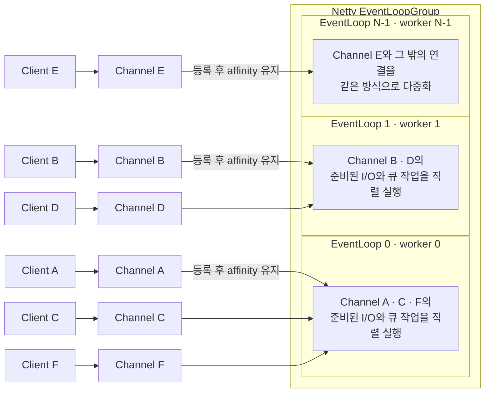
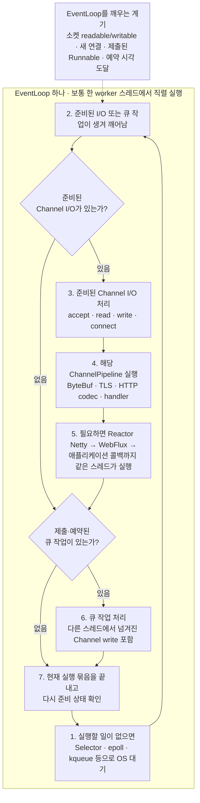
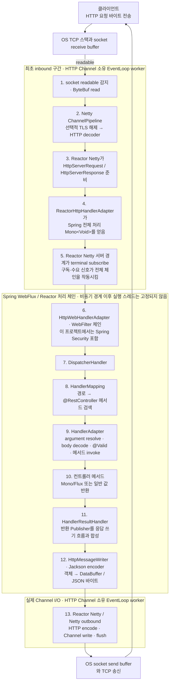
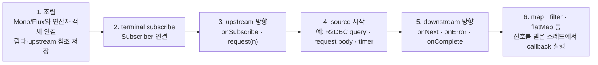
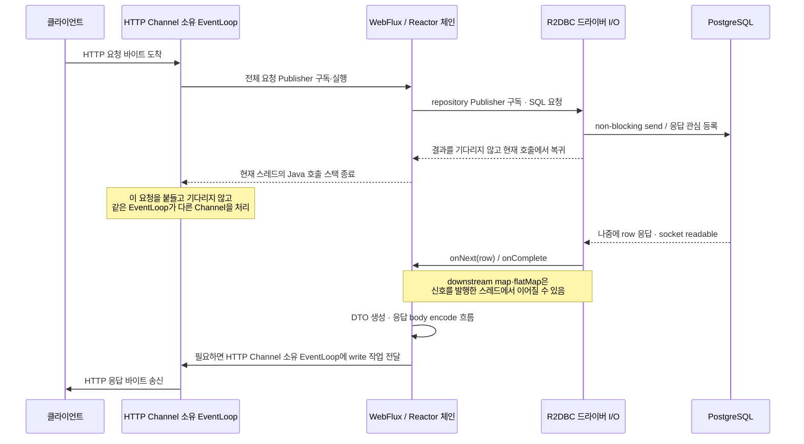
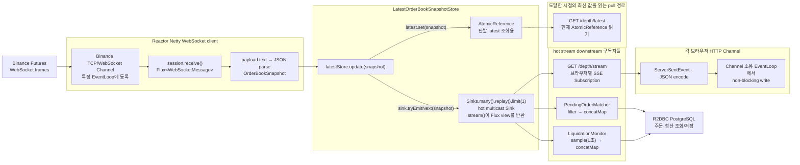
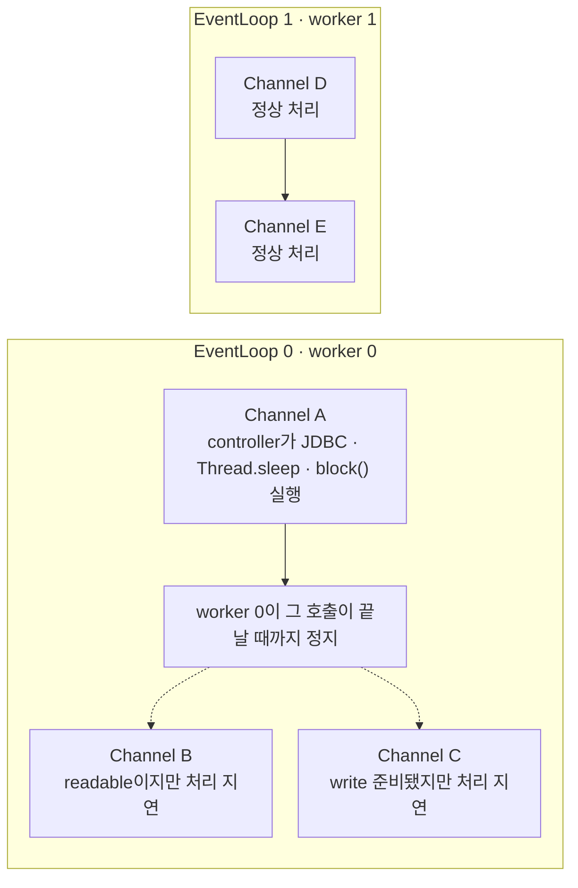

# Spring WebFlux + Reactor Netty 이벤트 루프 — OS 네트워크부터 응답까지

> 이 문서는 [`06-main-thread-call-stack-and-event-loop.md`](06-main-thread-call-stack-and-event-loop.md)의 브라우저 설명과 같은 관점으로, **Spring WebFlux + Reactor Netty 서버가 시작되고 요청을 처리하는 흐름**을 정리한다. 현재 프로젝트의 `Spring Boot 4.0.6`, Java 21, `spring-boot-starter-webflux`, R2DBC 구성을 기준으로 하되, 스레드 수와 NIO/native transport 같은 세부 구현은 버전·OS·설정에 따라 달라질 수 있다.

## 먼저 결론

Spring WebFlux 애플리케이션에는 브라우저 JavaScript처럼 요청을 처리하는 **단 하나의 메인 스레드**가 없다.

```text
JVM main 스레드
└─ 애플리케이션을 부팅하고 서버를 시작한다.
   └─ 런타임 요청 처리는 Reactor Netty의 EventLoop들이 맡는다.

EventLoopGroup
├─ EventLoop 0 ─ Channel A, D, G ...
├─ EventLoop 1 ─ Channel B, E, H ...
└─ EventLoop N-1 ─ Channel C, F, I ...
```

핵심 관계는 다음과 같다.

- `main` 스레드는 **부팅 담당**이지 요청 처리용 메인 스레드가 아니다.
- Netty의 `EventLoopGroup`은 여러 `EventLoop`를 관리한다.
- `EventLoop`는 스레드 그 자체가 아니라 **I/O와 큐 작업을 직렬 실행하는 실행기 객체**이며, 일반적인 Netty transport에서는 보통 한 플랫폼 스레드에서 실행된다.
- 연결을 나타내는 `Channel` 하나는 등록된 `EventLoop` 하나가 계속 담당하고, `EventLoop` 하나는 많은 `Channel`을 번갈아 처리한다.
- Spring WebFlux는 별도 스레드가 아니라 **필터·라우팅·컨트롤러 호출·코덱을 제공하는 라이브러리 코드**다. 처음에는 Netty EventLoop 스레드가 이 코드까지 그대로 실행한다.
- `Mono`와 `Flux`도 스레드나 큐가 아니다. 구독 관계와 나중에 전달될 신호의 흐름을 표현하는 객체다.
- 비동기 I/O 대기 중에는 요청 전용 스레드가 멈춰 있는 것이 아니라, 첫 스레드 호출 스택이 끝나고 `Publisher`·`Subscriber`·`Subscription` 객체에 다음 처리 관계만 남는다.
- JavaScript의 태스크 큐·마이크로태스크 큐·마이크로태스크 체크포인트와 Netty/Reactor를 일대일로 대응시키면 안 된다.

> **핵심 구분 — Spring WebFlux ≠ Reactor Core ≠ Reactor Netty ≠ Netty EventLoop ≠ OS 스레드.** 서로 협력하지만 같은 대상이 아니다.

## 브라우저 이벤트 루프와 무엇이 다른가

| **질문** | **브라우저 페이지** | **WebFlux + Reactor Netty 서버** |
|---|---|---|
| 부팅 후 핵심 실행 스레드 | 렌더러 메인 스레드가 페이지 태스크와 JavaScript를 계속 처리 | JVM `main`은 부팅 담당, 요청은 여러 EventLoop worker가 처리 |
| 이벤트 루프 수 | 문서에서 다룬 일반 페이지는 렌더러 메인 스레드의 이벤트 루프에 초점 | 일반적으로 `EventLoopGroup` 안에 여러 EventLoop가 존재 |
| 주된 작업 단위 | 태스크, 마이크로태스크, 렌더링 기회 | 준비된 Channel I/O, EventLoop 큐 작업, Reactor 신호 |
| 실행 코드 | Blink가 필요할 때 V8을 호출 | Netty가 Reactor Netty와 WebFlux를 거쳐 애플리케이션 코드를 호출 |
| 비동기 후속 처리 | 태스크/마이크로태스크로 예약 | I/O 완료 신호 또는 Scheduler 작업이 `onNext`·`onError`·`onComplete`를 전달 |
| 연결과 스레드 관계 | 페이지 실행 환경 중심 | Channel 하나는 EventLoop 하나에 등록되고, EventLoop 하나가 여러 Channel을 다중화 |
| 마이크로태스크 체크포인트 | HTML 표준에 정의되어 있음 | 같은 개념이 없음 |

공통점도 있다. 둘 다 **할 일이 없을 때 OS의 대기 기능을 사용하고**, 이벤트가 준비되면 스레드가 깨어나 짧은 처리를 한 뒤 다시 대기한다. 그러나 큐의 종류, 선택 규칙, 실행 단위는 서로 다른 런타임의 구현이다.

## 구성 요소와 역할

| **구성 요소** | **역할** |
|---|---|
| **운영체제(OS) 커널** | TCP 연결과 소켓 버퍼를 관리하고 패킷을 수신·송신한다. Netty가 사용하는 NIO Selector나 epoll·kqueue 같은 대기 기능에 소켓 준비 상태를 알려주며, JVM 스레드에 CPU 시간을 배정한다. Java 컨트롤러 코드를 직접 실행하지는 않는다. |
| **JVM 프로세스** | Spring Boot, Netty, WebFlux, Reactor와 애플리케이션 바이트코드를 적재하고 실행하는 하나의 프로세스다. |
| **JVM `main` 스레드** | `SpringApplication.run(...)`을 호출해 ApplicationContext와 서버를 초기화한다. 초기화 후 매 요청을 처리하는 스레드로 변하는 것은 아니다. |
| **Spring Boot** | 의존성과 설정을 보고 WebFlux 인프라, 코덱, 보안 필터, Reactor Netty 서버 등을 조립하고 시작한다. 네트워크 이벤트 루프 자체는 아니다. |
| **Netty** | 비동기 네트워크 I/O의 저수준 기반이다. `Channel`, `ChannelPipeline`, `EventLoopGroup`, HTTP codec 등을 제공한다. |
| **Reactor Netty** | Netty HTTP 서버·클라이언트를 Reactor의 `Publisher` 모델과 연결한다. 소켓 I/O를 `Flux`/`Mono` 신호와 연결하고 Reactive Streams backpressure를 지원한다. |
| **`EventLoopGroup`** | 여러 `EventLoop`를 관리하고 새 Channel을 어느 EventLoop에 등록할지 결정하는 그룹이다. |
| **`EventLoop`** | 등록된 Channel의 준비된 I/O 이벤트와 제출된 작업을 직렬 실행하는 실행기 객체다. 일반적인 구현에서는 보통 전용 스레드 하나가 루프를 수행한다. |
| **서버 Channel** | `:8080` 같은 주소에서 새 TCP 연결을 받는 listening Channel이다. 연결이 accept되면 통신용 child Channel이 만들어진다. |
| **연결 Channel** | 보통 TCP 연결 하나를 표현한다. **HTTP 요청 하나와 같은 말이 아니다.** HTTP/1.1 keep-alive에서는 한 Channel로 여러 요청이 오고, HTTP/2에서는 한 연결 안에 여러 stream이 존재할 수 있다. |
| **`ChannelPipeline`** | Channel마다 붙는 Netty `ChannelHandler` 체인이다. TLS 처리, HTTP 바이트 디코딩, inbound/outbound 이벤트 전달 등을 맡는다. Reactor의 `map`·`flatMap` 연산자 파이프라인과는 다른 구조다. |
| **`ByteBuf` / HTTP codec** | 들어온 바이트를 버퍼링해 HTTP 메시지로 디코딩하고, 응답 메시지를 다시 바이트로 인코딩한다. |
| **Spring WebFlux** | `WebFilter`, `DispatcherHandler`, 라우팅, 컨트롤러 호출, 요청 body decode, 응답 encode를 제공하는 reactive 웹 프레임워크다. |
| **`DispatcherHandler`** | WebFlux의 front controller다. `HandlerMapping`으로 핸들러를 찾고, `HandlerAdapter`로 실행하고, `HandlerResultHandler`로 결과를 응답에 쓴다. |
| **Reactor Core** | `Mono`·`Flux`, 연산자, `Subscriber`·`Subscription`, Scheduler와 Reactive Streams 신호 흐름을 구현한다. 네트워크 서버 자체는 아니다. |
| **`Publisher`** | 구독이 생기면 0개 이상의 데이터 또는 완료·오류 신호를 제공할 수 있는 대상이다. `Mono`와 `Flux`가 대표 구현이다. |
| **`Subscriber` / `Subscription`** | `Subscriber`는 신호를 받으며, `Subscription`은 취소와 `request(n)` 수요를 제어한다. 이 객체들이 비동기 처리의 다음 단계와 상태를 연결한다. |
| **R2DBC 드라이버** | SQL 요청과 DB 응답을 non-blocking `Publisher`로 연결한다. 드라이버의 I/O 스레드와 HTTP EventLoop가 반드시 같은 풀이라고 가정하면 안 된다. |
| **Reactor `Scheduler`** | `publishOn`·`subscribeOn` 같은 연산자가 실행 문맥을 바꿀 때 사용하는 실행기 추상화다. `Mono`·`Flux`를 만들었다고 자동으로 Scheduler가 생기지는 않는다. |
| **스레드별 Java 호출 스택** | 현재 스레드에서 실행 중인 동기 메서드 호출과 복귀 위치를 보관한다. 비동기 대기 중인 요청을 매달아 두는 저장소는 아니다. |

## 1. JVM 시작과 Reactor Netty 초기화



`spring-webflux.jar`나 `reactor-netty.jar`가 스레드는 아니다. 부팅 중 `main` 스레드가 그 라이브러리의 초기화 코드를 실행하고, 그 코드가 Netty의 EventLoop 리소스를 만들도록 요청한다. 실제 worker는 JVM의 플랫폼 스레드이며 OS가 CPU 코어에 스케줄한다.

현재 Reactor Netty 기본 문서상 worker 수는 런타임이 확인한 프로세서 수를 바탕으로 하되 최소 4개이며 설정으로 바꿀 수 있다. 따라서 **`EventLoop 수 = CPU 코어 수`가 언제나 고정된 규칙**이라고 외우면 안 된다. 별도 accept/selector 스레드 구성, NIO와 native transport 선택도 환경과 설정에 따라 달라질 수 있다.

## 2. EventLoop와 Channel의 관계

### 2-1. 여러 연결을 적은 수의 EventLoop가 나눠 맡는다



새 TCP 연결을 accept하면 child Channel이 EventLoop 하나에 등록된다. 등록된 Channel의 Netty I/O 콜백은 그 EventLoop에서 직렬 실행되므로, 같은 Channel의 handler가 동시에 실행되는 일을 크게 줄일 수 있다.

다른 스레드가 해당 Channel에 `write`를 요청할 수는 있다. 이때 Netty는 필요하면 작업을 **Channel 소유 EventLoop의 큐에 넘겨** 실제 Channel I/O를 그 EventLoop에서 처리한다. 따라서 “한 HTTP 요청의 모든 Java 코드가 처음부터 끝까지 반드시 같은 스레드”라는 뜻은 아니다.

### 2-2. EventLoop 하나의 개념적 반복



이 그림은 핵심 관계를 보여주는 **개념도**다. 큐 작업만으로 깨어난 경우에는 I/O 경로를 거치지 않을 수 있고, 실제 구현은 transport와 버전에 따라 I/O와 큐 작업을 더 세분화하거나 번갈아 처리할 수 있다.

중요한 점은 EventLoop가 Channel A의 긴 작업이 끝날 때까지 다른 Java 작업을 동시에 실행하지 않는다는 것이다. 짧은 non-blocking 처리를 전제로 여러 Channel을 빠르게 번갈아 맡는다.

## 3. HTTP 요청 하나가 컨트롤러와 응답까지 가는 흐름



### 이 그림에서 스레드를 읽는 법

`ChannelPipeline`, Reactor Netty, WebFlux, 컨트롤러가 각각 별도 스레드에서 실행된다는 뜻이 아니다. 요청이 처음 들어왔을 때 **추가 body 데이터나 비동기 결과를 기다리는 경계를 만나기 전까지**는, 보통 같은 Channel 소유 EventLoop worker의 현재 Java 호출 스택에서 다음 코드가 동기적으로 이어질 수 있다.

```text
Netty read callback
→ ChannelPipeline handler
→ Reactor Netty HTTP handler
→ ReactorHttpHandlerAdapter
→ HttpWebHandlerAdapter / WebFilter
→ DispatcherHandler
→ 지금 즉시 실행 가능한 WebFlux / Reactor 단계
```

예를 들어 `@RequestBody` 데이터가 아직 덜 도착했다면 argument resolver는 inbound body Publisher를 기다린다. 현재 호출 스택은 종료되고, 나중에 다음 body chunk가 도착한 이벤트의 새 호출 스택에서 컨트롤러 호출이 이어질 수 있다. R2DBC·WebClient·timer·Scheduler 경계 이후의 downstream과 응답 encode도 원래 HTTP EventLoop가 아닌 신호 스레드에서 실행될 수 있다. 실제 Channel read/write만 Channel 소유 EventLoop의 affinity를 따른다.

현재 Spring/Reactor Netty 구현에서는 요청 수신 시 Reactor Netty가 Spring의 `HttpHandler`에서 전체 처리 `Mono<Void>`를 얻고, 서버 경계가 이 Publisher에 terminal subscription을 만든다. 그 구독 하나가 필터, 컨트롤러, 컨트롤러가 반환한 body Publisher, 응답 쓰기까지 연결된 체인을 실행한다. `flatMap` 같은 연산자는 런타임에 반환된 inner Publisher를 내부적으로 다시 구독해 바깥 결과로 합친다.

따라서 “WebFlux가 컨트롤러의 `Mono`만 따로 꺼내 독립적으로 `subscribe()`한다”라고 이해하기보다, **한 요청의 전체 처리 Publisher가 서버 I/O 생명주기에 연결되어 구독된다**고 이해하는 편이 정확하다.

## 4. Mono/Flux의 조립, 구독, 신호

Reactor 파이프라인에는 서로 다른 세 국면이 있다.



| **국면** | **무슨 일이 일어나는가** |
|---|---|
| **조립** | `map`, `flatMap`, `filter` 등이 새 Publisher 객체를 만들고 upstream과 람다 참조를 저장한다. |
| **구독·수요** | terminal `Subscriber`가 연결되고 `Subscription.request(n)`이 source 방향으로 전달된다. |
| **데이터·종료 신호** | source가 `onNext`, `onError`, `onComplete`를 downstream으로 전달하고 각 연산자 콜백이 실행된다. |

“구독 전에는 아무것도 실행되지 않는다”는 말은 모든 일반 Java 코드에 적용되는 마법 규칙이 아니다. **cold Publisher가 감싼 지연 작업**이 구독 전에는 시작되지 않는다는 뜻이다.

```java
Mono.just(blockingCall());              // blockingCall()은 조립하는 지금 실행된다.

Mono.defer(() -> Mono.just(value()));   // value()는 구독 시점까지 미뤄진다.
```

`Mono.defer`는 실행 시점만 늦출 뿐 스레드를 바꾸지 않는다. 스레드 전환이 필요하면 source와 목적에 맞는 Scheduler 경계를 별도로 설계해야 한다.

## 5. R2DBC 비동기 대기에서는 무엇이 남는가

다음은 이 프로젝트의 reactive repository 호출을 단순화한 흐름이다.



비동기 대기는 원래 스레드의 Java 호출 스택을 정지해 둔 상태가 아니다.

```text
첫 번째 스레드 호출 스택
요청 처리 → R2DBC 구독/등록 → 메서드 return → 현재 스레드 호출 스택 제거

대기 중
Publisher · Subscriber · Subscription · 요청/응답 객체가 관계와 상태를 보관
HTTP EventLoop worker는 다른 Channel 처리 가능

두 번째 스레드 호출 스택
DB socket 준비 → R2DBC onNext → map/flatMap → 응답 write
```

비동기 source 이후의 downstream 코드는 **그 source가 신호를 발행한 스레드**에서 실행될 수 있다. 원래 HTTP EventLoop로 자동 복귀한다고 가정하면 안 된다. 다만 최종 Channel I/O는 Channel의 thread-affinity를 지키도록 소유 EventLoop에서 직접 실행되거나 그 EventLoop 큐로 전달된다.

이런 스레드 이동 가능성 때문에 요청 범위 정보를 일반 `ThreadLocal`에만 두면 안전하지 않다. 이 프로젝트가 로그인 정보를 `ReactiveSecurityContextHolder`로 읽는 이유도 인증 상태가 Reactor `Context`를 따라가도록 하기 위해서다.

## 6. 현재 프로젝트에서 실제로 이어지는 흐름

이 프로젝트에는 일반 REST + R2DBC 요청뿐 아니라 **Binance WebSocket → 메모리 hot stream → 브라우저 SSE** 흐름도 있다.



현재 코드의 구체적인 연결점은 다음과 같다.

1. [`BinanceFuturesRawDepthStreamer`](../../src/main/java/com/example/futurespapertrading/market/stream/BinanceFuturesRawDepthStreamer.java)가 `@PostConstruct`에서 outbound WebSocket 연결 Publisher를 구독한다.
2. Binance 프레임이 들어오면 `session.receive()`의 `Flux`가 `onNext`를 보내고 JSON을 `OrderBookSnapshot`으로 파싱한다.
3. [`LatestOrderBookSnapshotStore`](../../src/main/java/com/example/futurespapertrading/market/stream/LatestOrderBookSnapshotStore.java)가 최신 값을 `AtomicReference`에 저장하고 hot `Sink`에도 발행한다.
4. [`BinanceFuturesDepthController`](../../src/main/java/com/example/futurespapertrading/market/controller/BinanceFuturesDepthController.java)의 SSE `Flux`, [`PendingOrderMatcher`](../../src/main/java/com/example/futurespapertrading/paper/service/PendingOrderMatcher.java), [`LiquidationMonitor`](../../src/main/java/com/example/futurespapertrading/paper/service/LiquidationMonitor.java)가 같은 stream을 구독한다.
5. SSE 연결은 오래 열려 있지만 **브라우저 연결 하나당 대기 스레드 하나가 붙어 있지 않다.** snapshot이 없을 때는 연결과 Subscription 상태만 남고, 보낼 값이나 socket 이벤트가 준비될 때 EventLoop가 잠깐 실행된다.

현재 프로젝트 코드에는 `publishOn`이나 `subscribeOn`으로 지정한 명시적 스레드 전환이 없다. 그러므로 SSE의 `map`과 PendingOrderMatcher의 R2DBC 경계 전 연산자들은 hot Sink가 snapshot을 emit한 스레드에서 이어질 수 있다. 다만 `LiquidationMonitor.sample(Duration)` 같은 시간 기반 연산자는 기본 Scheduler를 사용하고, R2DBC 완료 이후는 드라이버의 신호 스레드에서 이어질 수 있다. 명시적 `publishOn`/`subscribeOn`이 없다고 해서 모든 콜백이 한 스레드에서 실행되는 것은 아니다. 각 브라우저 Channel의 실제 write는 그 Channel 소유 EventLoop가 다를 경우 해당 EventLoop로 넘겨진다.

Reactor Netty의 기본 global I/O 리소스를 쓰면 같은 JVM의 HTTP 서버와 Reactor Netty 클라이언트가 EventLoop 리소스를 공유할 수 있다. 위 그림은 inbound/outbound Channel의 **논리적 역할**을 나눈 것이지, 반드시 서로 다른 스레드 풀을 쓴다는 뜻이 아니다.

## 7. EventLoop에서 blocking 작업을 하면 왜 위험한가



EventLoop 하나를 막으면 서버의 모든 스레드가 반드시 동시에 멈추는 것은 아니다. 하지만 **그 EventLoop에 등록된 모든 Channel**이 함께 지연되고, 전체 처리 용량과 tail latency가 크게 악화된다.

위험한 예시는 다음과 같다.

- JDBC/JPA, 동기 HTTP SDK, 동기 파일 I/O
- `Thread.sleep`, `.block()`, `.toIterable()`처럼 현재 스레드를 기다리게 하는 코드
- EventLoop에서 오래 수행되는 대형 JSON 변환이나 복잡한 계산
- BCrypt처럼 의도적으로 비용이 큰 CPU 작업

피할 수 없는 blocking API는 호출 자체를 지연하고 제한된 별도 worker로 격리한다.

```java
Mono.fromCallable(() -> blockingCall())
    .subscribeOn(Schedulers.boundedElastic());
```

이 코드는 blocking 작업을 non-blocking으로 바꾸지 않는다. EventLoop 대신 `boundedElastic` worker가 기다리게 하여 EventLoop의 진행을 보호할 뿐이다. 반대로 `Mono.just(blockingCall())`은 `Mono`를 만들기 전에 현재 스레드에서 호출이 끝나므로 격리가 되지 않는다.

`Schedulers.parallel()`은 CPU-bound 작업을 위한 제한된 병렬 worker이고, `boundedElastic()`은 피할 수 없는 blocking I/O를 격리하는 용도다. 작업 성격과 동시성 상한을 함께 고려해야 한다.

> **현재 프로젝트의 점검 포인트:** [`AuthService.signup`](../../src/main/java/com/example/futurespapertrading/auth/service/AuthService.java)의 `Mono.defer` 안에서 `passwordEncoder.encode(...)`를 호출한다. `defer`는 중복 이메일인 경우 불필요한 BCrypt 실행을 피하도록 시점을 미루지만, 실제 해싱을 별도 스레드로 옮기지는 않는다. BCrypt 비용이 EventLoop 지연에 미치는 영향은 부하 기준으로 따로 확인해야 한다.

## 8. Backpressure가 하는 일과 하지 않는 일

Reactive Streams의 backpressure는 downstream이 upstream에 **지금 처리할 수 있는 요소 수**를 `request(n)`으로 알리는 규약이다.

```text
downstream Subscriber ── request(n) ──→ upstream Publisher
downstream Subscriber ←─ onNext(x) ─── upstream Publisher
```

다음은 구분해야 한다.

- `n`은 바이트 수가 아니라 **요소 수**다.
- TCP flow control, Netty Channel의 writability, Reactive Streams demand는 서로 다른 계층이다. Reactor Netty가 이 계층들을 연결하지만 완전히 같은 신호는 아니다.
- backpressure는 동시 HTTP 요청 수를 자동 제한하는 기능이 아니다.
- backpressure가 blocking 코드를 안전하게 바꾸지는 않는다.
- 생산 속도를 늦출 수 없는 hot source는 drop, latest, bounded buffer 같은 overflow 정책이 따로 필요할 수 있다.
- `onBackpressureBuffer`는 압력을 제거하는 것이 아니라 메모리 큐로 옮길 수 있으므로 크기와 실패 정책이 필요하다.
- `Mono`보다 여러 row를 내는 R2DBC `Flux`, 요청 body stream, SSE처럼 값이 계속 흐르는 구간에서 특히 중요하다.

브라우저가 SSE 연결을 끊으면 서버 쪽 HTTP 처리 Subscription에도 취소가 전파될 수 있다. 올바르게 합성된 reactive chain은 이 취소와 오류를 요청 생명주기 안에서 정리한다. 그래서 컨트롤러나 서비스 안에서 결과를 반환하지 않고 임의로 `subscribe()`하면, HTTP 요청의 취소·오류·보안 Context 생명주기와 분리될 수 있다.

## 9. 자주 생기는 오해

| **오해** | **정확한 이해** |
|---|---|
| WebFlux에도 JavaScript 같은 메인 스레드가 하나 있다. | `main`은 부팅 담당이며, 런타임 요청은 EventLoopGroup의 여러 worker가 처리한다. |
| EventLoop와 OS 스레드는 완전히 같은 말이다. | EventLoop는 실행기 객체다. 일반적인 구현에서 보통 전용 스레드 하나가 루프를 실행하지만 개념은 구분해야 한다. |
| 요청 하나마다 Channel 하나가 만들어진다. | Channel은 보통 연결 하나다. 한 연결로 여러 HTTP 요청을 처리할 수 있다. |
| ChannelPipeline이 `map`·`flatMap` 체인이다. | ChannelPipeline은 Netty handler 체인이고, Reactor 파이프라인은 Publisher/Subscriber 연산자 체인이다. |
| `Mono`를 반환하면 그 코드가 자동으로 다른 스레드에서 실행된다. | Scheduler 경계나 비동기 source가 없다면 콜백은 현재 신호를 발행한 스레드에서 실행된다. |
| `Mono.defer`가 blocking 코드를 별도 스레드로 옮긴다. | 실행 시점만 구독 때로 미룬다. 실행 스레드는 바꾸지 않는다. |
| DB 응답 후에는 반드시 원래 HTTP EventLoop로 돌아온다. | R2DBC 등 source의 신호 스레드에서 downstream이 이어질 수 있고, 최종 Channel I/O만 소유 EventLoop로 전달된다. |
| SSE 연결 하나가 EventLoop 스레드 하나를 계속 점유한다. | 연결과 Subscription 상태만 유지하며, 준비된 데이터나 socket 이벤트가 있을 때 EventLoop가 처리한다. |
| backpressure가 있으면 메모리와 지연이 자동으로 안전하다. | source 성격, prefetch, buffer, hot-stream overflow와 네트워크 writability 정책을 함께 봐야 한다. |
| WebFlux에서 JSON 변환은 MVC의 `HttpMessageConverter`가 한다. | reactive stack에서는 `HttpMessageReader`·`HttpMessageWriter`와 encoder/decoder 계층을 통해 처리한다. |

## 10. 전체 흐름 한 줄 요약

```text
OS가 TCP 바이트를 socket buffer에 받음
→ 해당 Channel의 준비 상태로 EventLoop worker가 깨어남
→ Netty ChannelPipeline이 HTTP를 decode
→ Reactor Netty가 Spring 전체 처리 Publisher를 얻고 subscribe
→ WebFilter · DispatcherHandler · Controller · Mono/Flux 체인 실행
→ 비동기 I/O를 등록한 뒤 현재 스레드 호출 스택 종료, EventLoop는 다른 Channel 처리
→ 나중에 I/O 완료 source가 새 신호와 새 스레드 호출 스택으로 downstream 실행
→ WebFlux가 결과를 encode
→ Channel 소유 EventLoop가 non-blocking write
→ OS가 TCP 응답 송신
```

## 관련 프로젝트 문서

- [브라우저 이벤트 루프, 메인 스레드, 콜 스택](06-main-thread-call-stack-and-event-loop.md)
- [WebFlux 엔드포인트별 Mono/Flux 실행 흐름](../backend/webflux-execution-flow.md)
- [MVC와 WebFlux 비교](../study/mvc-vs-webflux.md)

## 참고 자료

- [Spring Framework: WebFlux concurrency model and threading model](https://docs.spring.io/spring-framework/reference/web/webflux/new-framework.html#webflux-concurrency-model)
- [Spring Framework: DispatcherHandler](https://docs.spring.io/spring-framework/reference/web/webflux/dispatcher-handler.html)
- [Spring Framework: Reactive Core and HttpHandler](https://docs.spring.io/spring-framework/reference/web/webflux/reactive-spring.html)
- [Reactor Netty: HTTP Server and Event Loop Group](https://projectreactor.io/docs/netty/release/reference/http-server.html#_event_loop_group)
- [Netty API: EventLoop](https://netty.io/4.2/api/io/netty/channel/EventLoop.html)
- [Netty User Guide: ChannelPipeline and handlers](https://netty.io/wiki/user-guide-for-4.x.html)
- [Reactor Core: Threading and Schedulers](https://projectreactor.io/docs/core/release/reference/coreFeatures/schedulers.html)
- [Reactor Core: subscription and backpressure](https://projectreactor.io/docs/core/release/reference/reactiveProgramming.html)
- [Reactive Streams JVM specification](https://github.com/reactive-streams/reactive-streams-jvm)
- [R2DBC specification](https://r2dbc.io/spec/)
