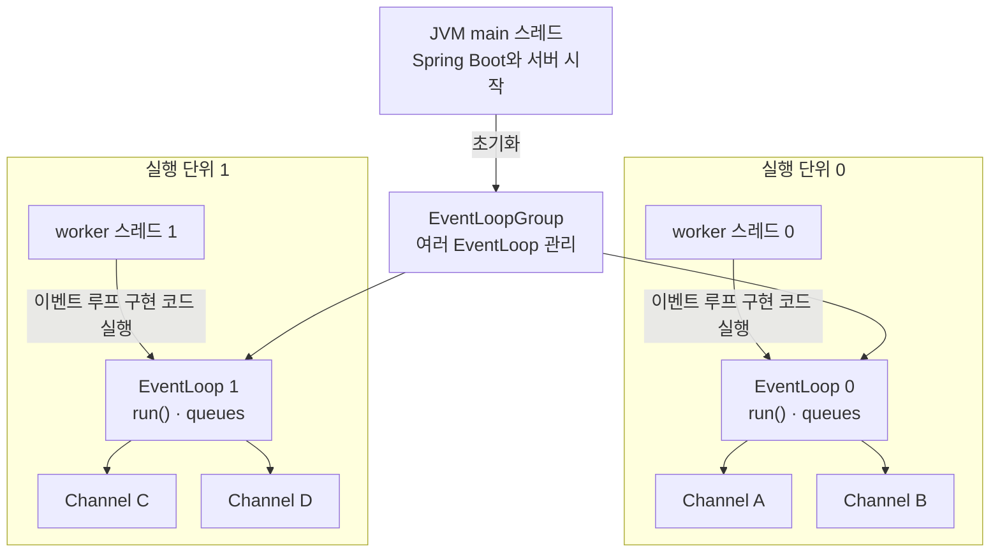
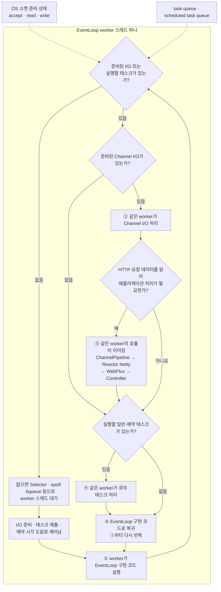

# Spring WebFlux + Netty: EventLoop와 스레드의 관계

> [`06-main-thread-call-stack-and-event-loop.md`](06-main-thread-call-stack-and-event-loop.md)의 핵심 질문을 Netty에 적용한다. 즉, **어떤 스레드가 이벤트 루프 구현 코드를 실행하고, 선택된 작업은 누가 실행하는가?**

## 핵심 답

브라우저에서는 렌더러 메인 스레드가 이벤트 루프 구현 코드와 JavaScript를 번갈아 실행한다.

Netty에서는 **JVM `main` 스레드가 EventLoop의 `run()` 반복문을 실행하지 않는다.** `main`은 Spring Boot와 서버를 시작할 뿐이다. 이후에는 여러 **Netty worker 스레드**가 각각 자신에게 연결된 `EventLoop`의 `run()` 구현 코드를 반복 실행한다.

```text
브라우저
렌더러 메인 스레드
└─ 이벤트 루프 코드 → 선택된 태스크·JavaScript → 이벤트 루프 코드

Netty
worker 스레드 0
└─ EventLoop 0 코드 → I/O·태스크·WebFlux 코드 → EventLoop 0 코드

worker 스레드 1
└─ EventLoop 1 코드 → I/O·태스크·WebFlux 코드 → EventLoop 1 코드
```

> **EventLoop는 스레드가 아니다.** I/O와 태스크를 관리하는 실행기 객체이며, 실제 코드를 실행하는 것은 그 EventLoop를 담당하는 JVM/OS worker 스레드다.

## main, worker, EventLoop, Channel의 관계



- `EventLoopGroup`은 여러 EventLoop의 묶음이다.
- 일반적인 Netty 구현에서는 **EventLoop 하나와 전담 worker 스레드 하나가 장기간 연결**된다.
- Channel은 등록되어 있는 동안 EventLoop 하나가 담당하고, EventLoop 하나는 여러 Channel을 번갈아 처리한다.
- 따라서 HTTP 요청마다 새 스레드나 EventLoop가 생기는 구조가 아니다.

브라우저의 렌더러 메인 스레드에 대응하는 것은 JVM `main`이 아니라 **각 Netty EventLoop worker**다. 차이는 브라우저 문서에서는 메인 스레드 하나에 초점을 두지만, Netty 서버에는 이런 실행 단위가 여러 개 있다는 점이다.

## worker가 실행하는 이벤트 루프 구현 코드

Netty NIO 이벤트 루프의 핵심을 단순화하면 다음과 같다.

```java
// JVM main이 아니라 Netty worker 스레드가 실행한다.
for (;;) {
    decideSelectStrategy();
    selectIfNeeded();        // 태스크가 있으면 blocking select를 생략할 수 있다.

    if (hasSelectedIo()) {
        processSelectedKeys();
    }

    runQueuedAndDueScheduledTasks();
}
```



별도 Scheduler 경계가 없다면 Controller는 별도의 “Controller 태스크”로 큐에서 다시 꺼내지는 것이 아니다. 소켓 read를 처리하던 **같은 worker의 Java 호출 스택**에서 다음처럼 이어진다.

```text
NioEventLoop.run()
→ 준비된 Channel 처리
→ ChannelPipeline
→ Reactor Netty
→ Spring WebFlux
→ Controller
→ 호출이 끝나면 NioEventLoop.run()으로 복귀
```

단, request body처럼 추가 I/O를 기다려야 하면 현재 호출 스택은 먼저 반환된다. 이후 body가 도착한 다음 EventLoop 반복의 새로운 호출 스택에서 Controller가 호출될 수 있다. **같은 worker가 담당한다는 말이 요청 전체가 하나의 호출 스택으로 실행된다는 뜻은 아니다.**

Netty는 브라우저의 태스크·마이크로태스크 모델과 다르다. 한 번의 반복에서 여러 준비된 I/O와 큐 작업을 처리할 수 있으며, I/O와 태스크의 구체적인 처리 순서와 비율은 transport·버전·설정에 따라 달라질 수 있다.

## 꼭 기억할 예외 두 가지

- `publishOn`, `subscribeOn`, 타이머, R2DBC 같은 비동기 경계를 만나면 이후 Reactor 신호는 같은 worker 또는 다른 스레드에서 이어질 수 있다. 실제 Channel write는 해당 Channel의 EventLoop를 통해 직렬화된다.
- Controller에서 `Thread.sleep`, blocking JDBC 같은 실제 blocking 작업이나 긴 CPU 작업을 실행하면 worker가 이벤트 루프 코드로 돌아가지 못하므로 **그 EventLoop에 등록된 다른 Channel도 함께 지연**된다.

## 참고 자료

- [Netty: EventLoop API](https://netty.io/4.1/api/io/netty/channel/EventLoop.html)
- [Netty: NioEventLoop 소스](https://netty.io/4.1/xref/io/netty/channel/nio/NioEventLoop.html)
- [Reactor Netty: Event Loop Group](https://projectreactor.io/docs/netty/release/reference/http-server.html#_event_loop_group)
- [Spring WebFlux: concurrency model](https://docs.spring.io/spring-framework/reference/web/webflux/new-framework.html#webflux-concurrency-model)
