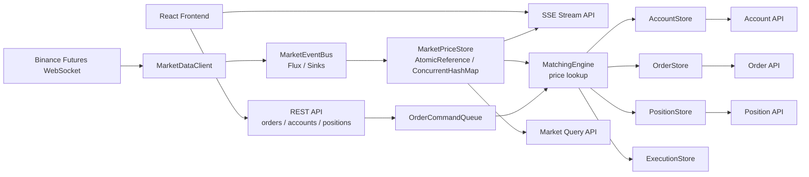

# futures-paper-trading 구현 로드맵

작성일: 2026-05-12  
프로젝트 목표: Binance USDⓈ-M Futures 실시간 시세를 받아, 학습용 모의 선물 거래소 백엔드를 단계적으로 구현하고, 시세 조회와 거래 흐름이 준비되면 React 프론트엔드와 실시간 차트를 붙인다.

이 문서는 단순한 아이디어 메모가 아니라 **프로젝트 개발 로드맵 + 아키텍처 설계서** 역할을 한다.  
`concurrency` 프로젝트에서 배운 Step01~Step09를 실제 백엔드 구조에 연결해서, 무엇을 왜 만들고 어떤 순서로 구현할지 정리한다.

---

## 1. 프로젝트 방향

처음부터 완전한 거래소를 만들기보다, 아래 흐름을 작고 단단하게 완성한다.

1. Binance Futures WebSocket에서 실시간 시세를 받는다.
2. 최신 bid, ask, mark price를 서버 메모리에 안전하게 저장한다.
3. 사용자가 모의 계좌로 MARKET/LIMIT 주문을 낸다.
4. 주문 체결 엔진이 현재 시세를 기준으로 주문을 체결한다.
5. 계좌, 주문, 포지션, PnL을 일관성 있게 갱신한다.
6. WebSocket 끊김, 느린 응답, 장애 상황에 대응한다.
7. 시세 조회/스트리밍 API가 준비되면 React 화면과 TradingView Lightweight Charts 기반 실시간 차트를 붙여 모의 거래 경험을 확인한다.

핵심 원칙은 다음과 같다.

```text
외부 I/O = Reactor / WebClient / Flux
거래소 핵심 상태 = 단일 엔진에서 순차 처리
조회 모델 = ConcurrentHashMap / AtomicReference로 안전하게 공유
장애 대응 = timeout / retry / reconnect / fallback
```

작업 진행 기준은 `AGENTS.md`를 따른다.

```text
단계별 md 작성
-> 세부 구현 단위로 쪼개기
-> 필요한 코드만 구현
-> 테스트 또는 수동 확인
-> 문서 체크리스트 갱신
```

---

## 2. 현재 프로젝트 상태

Spring Initializr 선택값:

```text
Project: Gradle - Groovy
Language: Java
Spring Boot: 4.0.6
Java: 21
Package: com.example.futurespapertrading
Configuration: YAML
```

현재 포함된 dependency:

```text
Spring Web
Spring Reactive Web
Validation
Actuator
DevTools
```

각 dependency의 역할:

- Spring Web
  - REST API를 만들기 위한 의존성이다.
  - 주문 생성, 계좌 조회, 포지션 조회 같은 일반 HTTP API를 구현할 때 사용한다.

- Spring Reactive Web
  - WebClient, Mono, Flux를 사용하기 위한 의존성이다.
  - Binance WebSocket 연결, 실시간 시세 스트림, SSE 응답에 사용한다.

- Validation
  - 요청값을 검증하기 위한 의존성이다.
  - 주문 수량, 주문 가격, 심볼, 레버리지 같은 값이 올바른지 `@Valid`, `@NotNull`, `@Positive` 등으로 검사한다.

- Actuator
  - 서버 상태를 확인하기 위한 의존성이다.
  - health check, 애플리케이션 상태 확인, 추후 Binance WebSocket 연결 상태 모니터링에 사용한다.

- DevTools
  - 개발 편의를 위한 의존성이다.
  - 코드 수정 시 서버 자동 재시작 같은 기능을 제공하며, 운영 환경에서는 사용하지 않는다.

초기에는 DB 없이 인메모리로 구현한다. DB는 주문, 체결, 입출금 기록을 저장해야 하는 단계에서 추가한다.

---

## 3. 전체 아키텍처



가장 중요한 설계 판단:

```text
주문, 체결, 잔고, 포지션 변경은 MatchingEngine의 단일 처리 흐름에서 순차적으로 처리한다.
```

이유는 계좌와 포지션은 서로 묶여 있는 상태이기 때문이다. 여러 스레드가 동시에 잔고와 포지션을 바꾸면 `concurrency` Step03에서 본 lost update, race condition 문제가 실제 거래 로직에서 바로 발생한다.

---

## 4. concurrency Step 매핑

| concurrency Step | futures-paper-trading에서 쓰는 곳 | 이유 |
|---|---|---|
| Step01 Spring Boot 기본 | Controller, Bean 등록, 요청 처리 흐름 | 프로젝트 기본 골격 |
| Step02 Thread / ExecutorService | 주문 명령 큐, 단일 소비자 처리 모델 | 작업을 분리하고 순서 있게 실행 |
| Step03 공유 상태 | 시세 저장소, 계좌, 주문, 포지션 | 동시 조회/수정에서 데이터 정합성 유지 |
| Step04 CompletableFuture | 시작 시 설정, 심볼 정보, 외부 API 병렬 로딩 | 독립 작업 병렬화 |
| Step05 Spring @Async | 초반에는 선택 사항 | Spring 비동기 구조 이해용 |
| Step06 WebClient | Binance REST, 외부 API 호출 | 논블로킹 HTTP I/O |
| Step07 Reactor / Flux | Binance WebSocket, SSE 시세 스트림 | 실시간 이벤트 처리 |
| Step08 Virtual Threads | 블로킹 작업, 향후 DB/JPA, 관리성 API | 블로킹 코드를 단순하게 유지 |
| Step09 실무 패턴 | WebSocket reconnect, timeout, retry, circuit breaker | 외부 연결 장애 대응 |

---

## 5. Binance WebSocket 기준

공식 문서 기준으로 USDⓈ-M Futures WebSocket은 routed endpoint를 구분한다.

Base URL:

```text
wss://fstream.binance.com
```

주요 endpoint:

```text
/public   고빈도 공개 시장 데이터
/market   일반 시장 데이터
/private  사용자 데이터
```

MVP에서 사용할 stream:

| 목적 | Stream | URL 예시 | Endpoint |
|---|---|---|---|
| 최우수 bid/ask | `<symbol>@bookTicker` | `wss://fstream.binance.com/public/ws/btcusdt@bookTicker` | `/public` |
| 체결가 | `<symbol>@aggTrade` | `wss://fstream.binance.com/market/ws/btcusdt@aggTrade` | `/market` |
| 마크가격/펀딩 | `<symbol>@markPrice@1s` | `wss://fstream.binance.com/market/ws/btcusdt@markPrice@1s` | `/market` |

심볼은 stream 이름에서 소문자를 사용한다.

참고 문서:

- Binance USDⓈ-M Futures WebSocket Connect: https://developers.binance.com/docs/derivatives/usds-margined-futures/websocket-market-streams
- Book Ticker Stream: https://developers.binance.com/docs/derivatives/usds-margined-futures/websocket-market-streams/Individual-Symbol-Book-Ticker-Streams
- Aggregate Trade Stream: https://developers.binance.com/docs/derivatives/usds-margined-futures/websocket-market-streams/Aggregate-Trade-Streams
- Mark Price Stream: https://developers.binance.com/docs/derivatives/usds-margined-futures/websocket-market-streams/Mark-Price-Stream

---

## 6. 패키지 구조 초안

처음에는 아래 구조로 시작한다.

```text
com.example.futurespapertrading
  common
    TimeProvider
    ApiResponse
    Money
  config
    PaperTradingProperties
    BinanceProperties
    WebClientConfig
  market
    client
      BinanceMarketDataClient
      BinanceWebSocketSessionHandler
    event
      MarketEvent
      BookTickerEvent
      MarkPriceEvent
      AggTradeEvent
    store
      MarketPriceStore
    api
      MarketController
      MarketStreamController
  account
    Account
    Wallet
    AccountStore
    AccountController
  order
    Order
    OrderSide
    OrderType
    OrderStatus
    OrderCommand
    OrderStore
    OrderController
  matching
    MatchingEngine
    OrderCommandQueue
    Execution
    ExecutionPolicy
  position
    Position
    PositionStore
    PnlCalculator
    PositionController
  risk
    MarginCalculator
    LiquidationCalculator
  system
    MarketDataStatus
    SystemController
```

구조를 너무 빨리 복잡하게 만들지 않는다. 각 패키지는 해당 단계가 올 때 추가한다.

프론트엔드는 백엔드 API가 준비된 뒤 별도 디렉터리로 추가한다.

```text
frontend
  React + TypeScript + Vite
  TradingView Lightweight Charts
  health 상태 확인
  시세 조회 화면
  시세 스트리밍 화면
  실시간 시세 차트
```

---

## 7. 단계별 구현 계획

### 0단계. 프로젝트 뼈대

상세 문서: [00단계. 프로젝트 뼈대 만들기](steps/00-project-skeleton.md)

목표:

```text
서버 실행, 기본 health API, 설정 파일, 패키지 구조 생성
```

사용하는 concurrency:

```text
Step01 - Spring Boot 시작 흐름, Controller, 설정 Bean, 요청 처리 흐름
```

만들 것:

```text
GET /api/health
application.yaml 기본 설정
PaperTradingProperties
HealthController
health API 테스트
```

완료 기준:

```text
./gradlew.bat test
MockMvc 기반 GET /api/health 테스트 통과
수동 실행과 health API 확인 방법 문서화
```

---

### 1단계. Binance 실시간 시세 수신

목표:

```text
BTCUSDT bookTicker, markPrice, aggTrade 수신
```

사용하는 concurrency:

```text
Step06 - 외부 I/O, WebClient
Step07 - Flux, Mono, 실시간 스트림
Step09 - 연결 실패 대비
```

만들 것:

```text
BinanceProperties
BinanceMarketDataClient
BookTickerEvent
MarkPriceEvent
AggTradeEvent
MarketDataStatus
```

처음에는 `BTCUSDT` 하나만 지원한다.

완료 기준:

```text
서버 로그에 Binance WebSocket 이벤트가 들어온다.
연결 성공/실패 상태를 확인할 수 있다.
```

---

### 2단계. 최신 시세 저장소

목표:

```text
가장 최근 bid, ask, mark price를 안전하게 저장하고 조회한다.
```

사용하는 concurrency:

```text
Step03 - 공유 상태, AtomicReference, ConcurrentHashMap
```

만들 것:

```text
MarketPriceSnapshot
MarketPriceStore
GET /api/market/{symbol}
```

설계:

```text
ConcurrentHashMap<String, AtomicReference<MarketPriceSnapshot>>
```

완료 기준:

```text
GET /api/market/BTCUSDT 호출 시 최신 시세 응답
WebSocket 수신 중 REST 조회를 반복해도 오류 없음
```

---

### 3단계. 시세 스트리밍 API

목표:

```text
클라이언트가 우리 서버에서 실시간 시세를 구독한다.
```

사용하는 concurrency:

```text
Step07 - Flux, SSE, Backpressure
```

만들 것:

```text
MarketEventBus
GET /api/stream/market/{symbol}
```

응답 방식:

```text
text/event-stream
```

완료 기준:

```text
curl.exe -N http://localhost:8080/api/stream/market/BTCUSDT
```

위 명령으로 이벤트가 계속 출력된다.

---

### 3.5단계. React 프론트엔드와 실시간 차트 뼈대

목표:

```text
백엔드 health와 시세 API를 화면에서 확인하고, 실시간 시세를 차트로 볼 수 있는 최소 React 앱을 만든다.
```

사용하는 기술:

```text
React
TypeScript
Vite
Fetch API
EventSource 또는 SSE 클라이언트
TradingView Lightweight Charts
```

차트 라이브러리 기준:

```text
기본 후보: TradingView Lightweight Charts
npm 패키지: lightweight-charts
공식 문서: https://tradingview.github.io/lightweight-charts/
공식 소개: https://www.tradingview.com/lightweight-charts/
주의: 구현 전에 최신 라이선스와 TradingView 표기 요구사항을 다시 확인한다.
```

만들 것:

```text
frontend 디렉터리
Vite + React + TypeScript 프로젝트
서버 health 상태 표시
BTCUSDT 최신 시세 조회 화면
BTCUSDT 시세 스트리밍 화면
TradingView Lightweight Charts 기반 실시간 가격 차트
초기 차트 형태: line 또는 area chart
이후 후보: 1초/1분 OHLC 집계 후 candlestick chart
```

이 단계에서 만들지 않는 것:

```text
주문 화면
계좌/잔고 화면
포지션/PnL 화면
로그인/인증
고급 보조지표
드로잉 툴
차트 위 주문 편집
실제 Binance 주문 연동
```

완료 기준:

```text
React 앱이 실행된다.
/api/health 응답을 화면에 표시한다.
/api/market/BTCUSDT 또는 SSE 스트림으로 시세를 화면에 표시한다.
실시간 시세가 Lightweight Charts 차트에 반영된다.
프론트엔드 실행/검증 방법을 단계 문서에 적는다.
```

4단계 이후에는 계좌, 주문, 포지션 API가 생길 때마다 해당 화면을 작게 추가한다.

---

### 4단계. 모의 계좌/잔고

목표:

```text
사용자 계좌와 USDT 잔고를 만든다.
```

사용하는 concurrency:

```text
Step03 - 공유 상태 보호
```

만들 것:

```text
Account
Wallet
AccountStore
GET /api/accounts/{accountId}
POST /api/accounts
```

초기 정책:

```text
계좌 생성 시 10,000 USDT 지급
입출금은 아직 구현하지 않음
```

완료 기준:

```text
계좌 생성
잔고 조회
동시 조회 안정성 확인
```

---

### 5단계. 주문 API

목표:

```text
MARKET, LIMIT 주문 요청을 받는다.
```

사용하는 concurrency:

```text
Step01 - REST API
Step03 - 주문 상태 안전성
```

만들 것:

```text
Order
OrderSide
OrderType
OrderStatus
PlaceOrderRequest
OrderController
```

지원할 주문:

```text
BUY MARKET
SELL MARKET
BUY LIMIT
SELL LIMIT
```

완료 기준:

```text
POST /api/orders
GET /api/orders/{orderId}
GET /api/orders?accountId=...
```

주문 생성과 조회가 가능하다.

---

### 6단계. 체결 엔진

목표:

```text
현재 bid/ask를 기준으로 주문을 체결한다.
```

사용하는 concurrency:

```text
Step02 - 작업 큐, 단일 소비자 처리 모델
Step03 - 공유 상태 문제 회피
Step08 - 필요 시 virtual thread
```

만들 것:

```text
OrderCommand
OrderCommandQueue
MatchingEngine
Execution
ExecutionStore
```

체결 규칙 MVP:

```text
BUY MARKET  -> 현재 ask 가격으로 즉시 체결
SELL MARKET -> 현재 bid 가격으로 즉시 체결
BUY LIMIT   -> limitPrice >= ask 이면 체결, 아니면 NEW
SELL LIMIT  -> limitPrice <= bid 이면 체결, 아니면 NEW
```

핵심 설계:

```text
REST 요청은 OrderCommand를 큐에 넣는다.
MatchingEngine은 큐에서 명령을 꺼내 순서대로 처리한다.
계좌, 주문, 포지션 변경은 MatchingEngine 안에서만 수행한다.
```

완료 기준:

```text
MARKET 주문이 즉시 FILLED 상태가 된다.
LIMIT 주문이 조건에 따라 NEW 또는 FILLED가 된다.
체결 기록이 남는다.
```

---

### 7단계. 포지션과 PnL

목표:

```text
롱/숏 포지션, 평균 진입가, 실현/미실현 손익을 계산한다.
```

사용하는 concurrency:

```text
Step03 - 포지션 상태 일관성
```

만들 것:

```text
Position
PositionStore
PnlCalculator
GET /api/positions
GET /api/positions/{accountId}/{symbol}
```

계산 기준:

```text
미실현 PnL = 포지션 방향에 따라 mark price 기준 계산
실현 PnL = 포지션 축소 또는 반대 방향 체결 시 계산
```

완료 기준:

```text
BUY 후 가격 상승 시 미실현 PnL 증가
SELL 후 가격 하락 시 미실현 PnL 증가
반대 주문 체결 시 realized PnL 반영
```

---

### 8단계. 레버리지/증거금/강제청산 기초

목표:

```text
선물 거래의 핵심 감각을 만든다.
```

사용하는 concurrency:

```text
Step03 - 잔고/포지션 동시 갱신
Step09 - 위험 상황 방어
```

만들 것:

```text
Leverage
MarginCalculator
LiquidationCalculator
RiskValidator
```

초기 정책:

```text
기본 레버리지: 10x
수수료율: taker 0.05%
유지증거금률: 단순 고정값으로 시작
```

완료 기준:

```text
주문 시 필요 증거금 검증
체결 시 수수료 차감
포지션 조회 시 청산가 표시
```

---

### 9단계. 장애 대응

목표:

```text
Binance WebSocket이 끊기거나 느려져도 서버가 버틴다.
```

사용하는 concurrency:

```text
Step09 - timeout, retry, exponential backoff, circuit breaker, fallback
```

만들 것:

```text
ReconnectPolicy
MarketDataConnectionMonitor
GET /api/system/market-data/status
```

정책:

```text
연결 끊김 -> 재연결
재연결 실패 -> exponential backoff
시세 없음 -> 마지막 시세 유지, stale 플래그 표시
장시간 실패 -> market data status = DOWN
```

완료 기준:

```text
WebSocket 연결 상태 조회 가능
연결 실패 후 자동 재시도
오래된 시세는 stale=true로 표시
```

---

### 10단계. 저장소 추가

목표:

```text
주문, 체결, 포지션 변경 기록을 DB에 저장한다.
```

사용하는 concurrency:

```text
Step08 - 블로킹 DB 작업과 virtual thread
Step09 - DB 실패 대응
```

추가 dependency 후보:

```text
Spring Data JPA
H2 Database
PostgreSQL Driver
```

처음에는 H2로 시작하고, 나중에 PostgreSQL로 옮긴다.

완료 기준:

```text
서버 재시작 후에도 주문/체결 이력 조회 가능
```

---

## 8. API 초안

### System

```text
GET /api/health
GET /api/system/market-data/status
```

### Market

```text
GET /api/market/{symbol}
GET /api/stream/market/{symbol}
```

### Account

```text
POST /api/accounts
GET /api/accounts/{accountId}
```

### Order

```text
POST /api/orders
GET /api/orders/{orderId}
GET /api/orders?accountId={accountId}
```

### Position

```text
GET /api/positions?accountId={accountId}
GET /api/positions/{accountId}/{symbol}
```

### Execution

```text
GET /api/executions?accountId={accountId}
GET /api/executions?orderId={orderId}
```

---

## 9. 도메인 모델 초안

### Order

```text
orderId
accountId
symbol
side: BUY | SELL
type: MARKET | LIMIT
status: NEW | PARTIALLY_FILLED | FILLED | CANCELED | REJECTED
price
quantity
filledQuantity
averagePrice
createdAt
updatedAt
```

### Position

```text
accountId
symbol
side: LONG | SHORT | FLAT
quantity
entryPrice
markPrice
leverage
unrealizedPnl
realizedPnl
initialMargin
maintenanceMargin
liquidationPrice
```

### Account

```text
accountId
walletBalance
availableBalance
usedMargin
realizedPnl
createdAt
```

### MarketPriceSnapshot

```text
symbol
bidPrice
bidQuantity
askPrice
askQuantity
lastTradePrice
markPrice
fundingRate
eventTime
receivedAt
stale
```

---

## 10. 구현 순서 요약

작업 순서는 아래처럼 진행한다.

```text
0. 프로젝트 뼈대
1. Binance WebSocket 연결
2. 최신 시세 저장소
3. 시세 SSE 스트리밍
3.5. React 프론트엔드와 실시간 차트 뼈대
4. 계좌/잔고
5. 주문 API
6. 체결 엔진
7. 포지션/PnL
8. 레버리지/증거금/청산가
9. 장애 대응
10. DB 저장
```

처음 목표는 0~3단계를 작게 완성하고, 3.5단계에서 React 프론트엔드와 실시간 차트 뼈대를 붙이는 것이다.  
그 다음 4~7단계에서 거래소의 핵심 도메인과 관련 화면을 함께 넓힌다.  
8~10단계는 실제 선물 거래소 느낌과 운영 안정성을 더하는 단계다.

---

## 11. 당장 다음 작업

0단계 프로젝트 뼈대 구현은 완료했다.

완료한 작업 목록:

```text
[x] 0-1. config 패키지 생성
[x] 0-2. system 패키지 생성
[x] 0-3. application.yaml에 paper-trading 설정 추가
[x] 0-4. PaperTradingProperties 생성
[x] 0-5. HealthController 생성
[x] 0-6. health API 테스트 추가
[x] 0-7. ./gradlew.bat test 실행
[x] 0-8. 주요 코드와 설정 파일에 목적/역할 주석 추가
```

다음 작업에서는 `docs/steps/01-binance-market-data.md`를 먼저 만들고, 1단계 Binance WebSocket 연결을 붙인다.
