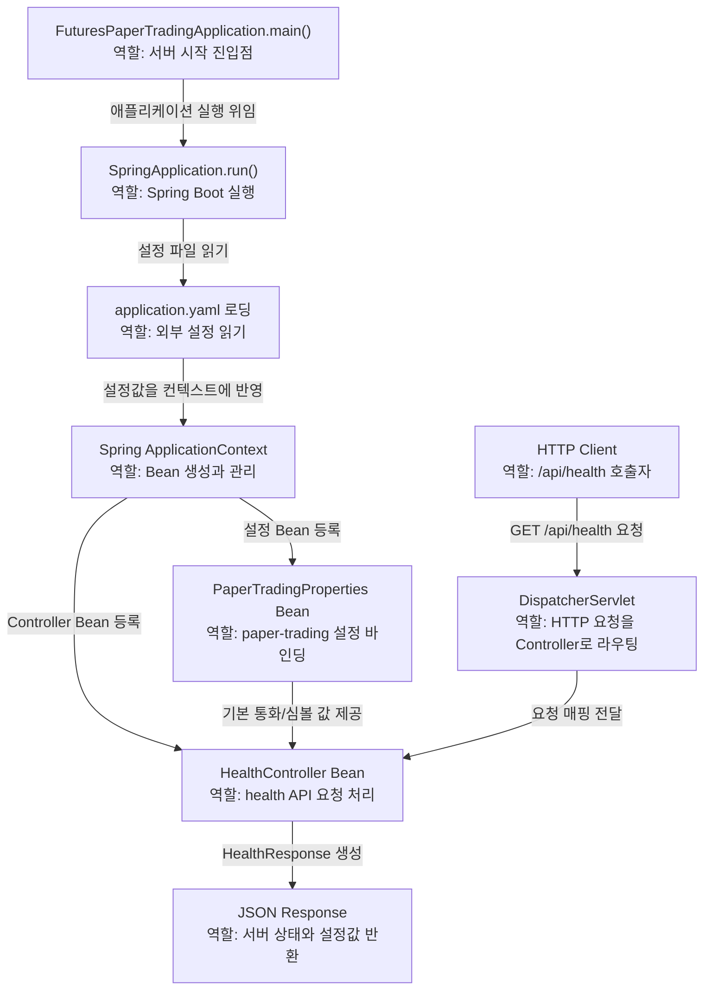

# 00단계. 프로젝트 뼈대 만들기

작성일: 2026-05-12  
현재 목표: `futures-paper-trading` Spring Boot 프로젝트가 정상 실행되고, 이후 단계가 들어갈 기본 구조를 준비한다.

이 문서는 전체 프로젝트 문서가 아니라 **0단계에서만 필요한 설계 문서**다.  
다음 단계인 Binance WebSocket 연결은 여기서 다루지 않는다.

---

## 1. 이 단계의 목표

0단계의 목표는 기능을 많이 만드는 것이 아니다.  
앞으로 시세 수신, 주문, 체결 엔진, 포지션 계산을 넣을 수 있게 기본 틀을 만든다.

완료되어야 하는 것:

```text
1. Spring Boot 애플리케이션이 실행된다.
2. 기본 health API가 동작한다.
3. application.yaml에 프로젝트 설정 구조가 생긴다.
4. 이후 단계에서 사용할 패키지 구조의 최소 골격이 생긴다.
5. 기본 테스트가 통과한다.
```

이 단계에서 만들지 않는 것:

```text
Binance WebSocket 연결
실시간 시세 저장
주문 API
계좌/잔고
체결 엔진
포지션/PnL
DB 저장
```

---

## 2. 이 단계에서 사용하는 기술과 스택

### Java 21

- 프로젝트의 기본 Java 버전이다.
- 이후 단계에서 virtual thread를 사용할 수 있게 해준다.
- 0단계에서는 virtual thread를 직접 쓰지 않는다.

### Spring Boot

- 애플리케이션 실행, Bean 등록, 설정 관리, 테스트 환경 구성을 담당한다.
- `FuturesPaperTradingApplication`이 진입점이다.

### Spring Web MVC / WebFlux

- 0단계의 HTTP API는 Spring Web MVC 기반으로 처리한다.
- `HealthController`는 `DispatcherServlet`을 통해 들어온 `GET /api/health` 요청을 처리한다.
- WebFlux 의존성은 이후 Binance 공개 시세 stream, `WebClient`, Reactor `Mono`/`Flux`를 쓰기 위해 준비만 해둔다.
- 0단계에서는 WebFlux API를 직접 사용하지 않는다.

### Spring Boot Actuator

- 애플리케이션 상태 확인을 위한 의존성이다.
- 0단계의 기준 API는 직접 만든 `GET /api/health`다.
- Actuator의 `/actuator/health`는 Spring Boot 운영용 health endpoint로 사용할 수 있지만, 0단계 테스트의 주 검증 대상은 아니다.
- 나중에 Binance 연결 상태 모니터링으로 확장할 수 있다.

### Validation

- 요청값 검증을 위한 의존성이다.
- 0단계에서는 직접 사용하지 않는다.
- 이후 주문 API에서 `@Valid`, `@NotNull`, `@Positive` 등을 사용할 예정이다.

### YAML 설정

- `application.yaml`에 프로젝트 설정을 계층적으로 관리한다.
- 0단계에서는 Binance 접속 URL이나 API key 같은 연결 설정을 두지 않는다.
- 기준 통화와 기본 심볼처럼 이후 단계에서 이어 쓸 애플리케이션 기본값만 준비한다.

### JUnit / Spring Boot Test

- 애플리케이션 컨텍스트가 정상적으로 뜨는지 확인한다.
- 0단계에서는 기본 테스트와 health API 테스트를 둔다.

---

## 3. concurrency 프로젝트에서 연결되는 단계

0단계에서 직접 연결되는 것은 `Step01`이다.

### Step01 - Spring Boot 기본 흐름

사용하는 이유:

```text
Spring Boot 애플리케이션이 시작되고, Controller와 설정 Bean이 등록되며,
DispatcherServlet을 통해 HTTP 요청이 Controller로 전달되는지 확인하는 단계이기 때문이다.
```

이 프로젝트에서 연결되는 부분:

```text
FuturesPaperTradingApplication
SpringApplication.run()
HealthController
application.yaml
PaperTradingProperties
Spring Bean 등록
REST 요청 처리 흐름
```

0단계에서 아직 사용하지 않는 단계:

```text
Step02 Thread / ExecutorService
Step03 공유 상태
Step04 CompletableFuture
Step05 @Async
Step06 WebClient
Step07 Flux / Mono
Step08 Virtual Threads
Step09 timeout / retry / circuit breaker
```

이 단계에서는 일부러 동시성 기술을 많이 쓰지 않는다.  
처음부터 WebSocket, Flux, 체결 엔진까지 넣으면 프로젝트의 기본 형태를 확인하기 어렵기 때문이다.

---

## 4. 0단계 한정 아키텍처

0단계의 아키텍처는 매우 작다.



요청 흐름:

```text
클라이언트
  -> GET /api/health
  -> DispatcherServlet
  -> HealthController
  -> JSON 응답
```

화살표 의미:

| 흐름 | 의미 |
|---|---|
| `main()` -> `SpringApplication.run()` | Java 프로그램의 시작점이 Spring Boot 실행을 시작한다. |
| `SpringApplication.run()` -> `application.yaml` | 서버가 뜨면서 설정 파일을 읽는다. |
| `application.yaml` -> `ApplicationContext` | 읽은 설정값이 Spring 환경과 Bean 생성 과정에 반영된다. |
| `ApplicationContext` -> `PaperTradingProperties` | `paper-trading.*` 설정을 Java 객체로 바인딩해 Bean으로 등록한다. |
| `ApplicationContext` -> `HealthController` | `/api/health`를 처리할 Controller를 Bean으로 등록한다. |
| `PaperTradingProperties` -> `HealthController` | health 응답에 넣을 기준 통화와 기본 심볼을 제공한다. |
| `HTTP Client` -> `DispatcherServlet` | 클라이언트가 `GET /api/health` 요청을 보낸다. |
| `DispatcherServlet` -> `HealthController` | Spring MVC가 URL에 맞는 Controller 메서드로 요청을 넘긴다. |
| `HealthController` -> `JSON Response` | Controller가 서버 상태와 설정값을 JSON 응답으로 만든다. |

0단계에서는 Service 계층을 무리하게 만들지 않는다.  
health API는 단순하므로 Controller만으로 충분하다.

---

## 5. 패키지 구조

0단계에서 만들 최소 패키지:

```text
com.example.futurespapertrading
  FuturesPaperTradingApplication
  system
    HealthController
  config
    PaperTradingProperties
```

패키지 의미:

- `system`
  - 서버 상태, 헬스체크, 운영성 API를 둔다.
  - 이후 `MarketDataStatusController` 같은 것이 이쪽에 들어갈 수 있다.

- `config`
  - `application.yaml` 값을 Java 객체로 바인딩하는 설정 클래스를 둔다.
  - `FuturesPaperTradingApplication`의 `@ConfigurationPropertiesScan`이 `PaperTradingProperties`를 Bean으로 등록한다.
  - 이후 `BinanceProperties`, `RiskProperties` 등이 추가될 수 있다.

0단계에서는 아래 패키지를 아직 만들지 않는다.

```text
market
account
order
matching
position
risk
```

필요한 단계가 올 때 하나씩 만든다.

---

## 6. 설정 구조

`application.yaml`에는 처음부터 너무 많은 설정을 넣지 않는다.

0단계에서 필요한 설정:

```yaml
spring:
  application:
    name: futures-paper-trading

paper-trading:
  app:
    base-currency: USDT
    default-symbol: BTCUSDT
```

의미:

- `spring.application.name`
  - Spring Boot 애플리케이션 이름이다.

- `paper-trading.app.base-currency`
  - 모의 거래소의 기준 통화다.
  - 처음에는 `USDT`를 사용한다.

- `paper-trading.app.default-symbol`
  - 처음 지원할 기본 심볼이다.
  - 1단계에서 Binance WebSocket을 연결할 때 `BTCUSDT`를 먼저 사용할 예정이다.

---

## 7. 만들 API

### GET /api/health

목적:

```text
서버가 정상적으로 떠 있고, 기본 설정이 읽히는지 확인한다.
```

예상 응답:

```json
{
  "status": "UP",
  "application": "futures-paper-trading",
  "baseCurrency": "USDT",
  "defaultSymbol": "BTCUSDT"
}
```

이 API는 기능 API가 아니라 개발 중 기준점 역할을 한다.  
앞으로 큰 기능을 붙인 뒤에도 서버가 기본적으로 살아 있는지 확인하는 데 사용한다.

---

## 8. 세부 구현 체크리스트

0단계에서 할 일:

```text
[x] 0-1. config 패키지 생성
[x] 0-2. system 패키지 생성
[x] 0-3. application.yaml에 paper-trading 설정 추가
[x] 0-4. PaperTradingProperties 생성
[x] 0-5. HealthController 생성
[x] 0-6. health API 테스트 추가
[x] 0-7. ./gradlew.bat test 실행
[x] 0-8. 주요 코드와 설정 파일에 목적/역할 주석 추가
```

완료 기준:

```text
테스트가 통과한다.
GET /api/health가 예상 JSON을 반환한다.
```

---

## 9. 테스트 또는 수동 확인 방법

자동 테스트:

```powershell
.\gradlew.bat test
```

수행 결과:

```text
2026-05-12 실행 완료
결과: BUILD SUCCESSFUL
확인: /api/health 응답값을 MockMvc 테스트로 검증
추가 확인: 코드 주석 정리 후 테스트 재실행
```

수동 실행:

```powershell
.\gradlew.bat bootRun
```

health API 확인:

```powershell
curl.exe -s "http://localhost:8080/api/health"
```

예상 결과:

```text
status가 UP이다.
application이 futures-paper-trading이다.
baseCurrency가 USDT이다.
defaultSymbol이 BTCUSDT이다.
```

---

## 10. 다음 단계로 넘어가는 기준

아래 조건을 만족하면 1단계로 넘어간다.

```text
1. 프로젝트가 정상 실행된다.
2. health API가 정상 응답한다.
3. 설정값을 application.yaml에서 읽을 수 있다.
4. 테스트가 통과한다.
```

1단계에서는 Binance Futures WebSocket을 연결한다.  
그때부터 `Step06 WebClient`, `Step07 Flux`, `Step09 reconnect/backoff`가 등장한다.

남은 일:

```text
0단계 구현과 테스트를 완료했다.
1단계 시작 전 docs/steps/01-binance-market-data.md를 만든다.
```
