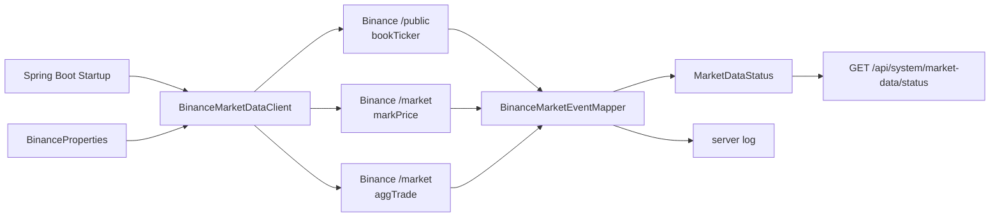

# 01단계. Binance 실시간 시세 수신

작성일: 2026-05-13

현재 목표: Binance USDⓈ-M Futures WebSocket에서 `BTCUSDT`의 `bookTicker`, `markPrice`, `aggTrade` 이벤트를 받아 서버 로그와 상태 API로 확인한다.

이 문서는 1단계에서만 필요한 설계 문서다. 최신 시세 저장소와 시세 조회 API는 2단계에서 다룬다.

---

## 1. 이 단계의 목표

1단계의 목표는 외부 실시간 스트림을 애플리케이션 안으로 안전하게 들여오는 것이다.

완료되어야 하는 것:

```text
1. 서버 시작 시 Binance WebSocket 연결을 시도한다.
2. BTCUSDT bookTicker 이벤트를 수신하고 파싱한다.
3. BTCUSDT markPrice 이벤트를 수신하고 파싱한다.
4. BTCUSDT aggTrade 이벤트를 수신하고 파싱한다.
5. 연결 상태와 마지막 이벤트 시간을 확인할 수 있다.
6. 외부 연결 실패가 테스트 실패로 이어지지 않는다.
```

이 단계에서 만들지 않는 것:

```text
최신 시세 저장소
GET /api/market/{symbol}
SSE 시세 스트리밍 API
주문, 계좌, 포지션, 체결 엔진
실제 Binance 주문 API 연동
```

---

## 2. 이 단계에서 사용하는 기술과 스택

### Spring WebFlux WebSocketClient

`ReactorNettyWebSocketClient`로 Binance WebSocket에 연결한다.

REST API는 아직 Spring MVC 컨트롤러를 쓰지만, 외부 WebSocket I/O는 Reactor 기반 클라이언트로 처리한다.

### Reactor Mono / Flux

WebSocket 세션은 메시지가 계속 들어오는 스트림이다. 수신 메시지는 `Flux`로 흘러오고, 각 메시지를 JSON 이벤트로 파싱한다.

### Jackson

Binance 이벤트 payload를 `JsonNode`로 읽고, 이벤트 타입별 record로 변환한다.

### AtomicReference / AtomicLong

연결 상태는 WebSocket 수신 스레드와 HTTP 요청 스레드가 함께 읽고 쓴다. 그래서 상태 snapshot은 `AtomicReference`, 이벤트 카운트는 `AtomicLong`으로 관리한다.

---

## 3. concurrency 프로젝트에서 연결되는 단계

1단계에서 사용하는 concurrency Step:

```text
Step03 - 공유 상태, AtomicReference, AtomicLong, ConcurrentHashMap
Step06 - 외부 I/O를 블로킹하지 않는 클라이언트 관점
Step07 - Flux 기반 실시간 스트림 처리
Step09 - 외부 연결 실패, 재연결, 상태 관찰
```

해당 Step을 쓰는 이유:

```text
Binance WebSocket은 서버 밖의 실시간 I/O다.
연결이 오래 유지되고 메시지가 계속 들어오므로 Flux 형태로 다루는 것이 자연스럽다.
외부 연결은 언제든 끊길 수 있으므로 실패 상태와 재연결 흐름을 처음부터 작게 둔다.
연결 상태와 이벤트 카운트는 WebSocket 수신 흐름과 HTTP 조회 흐름이 함께 접근하므로 공유 상태 보호가 필요하다.
```

이 프로젝트 코드에서 연결되는 부분:

```text
BinanceMarketDataClient
BinanceMarketEventMapper
MarketDataStatus
MarketDataStatusController
```

코드와 concurrency Step의 직접 연결:

```text
Step03 -> MarketDataStatus
  - AtomicReference로 현재 상태 snapshot을 원자적으로 교체한다.
  - AtomicLong으로 stream별 이벤트 카운트를 원자적으로 증가시킨다.
  - ConcurrentHashMap으로 streamName별 상태와 카운터를 안전하게 공유한다.

Step06 -> BinanceMarketDataClient
  - 외부 WebSocket I/O를 Tomcat 요청 처리 스레드가 직접 기다리지 않게 Reactor Netty 클라이언트로 분리한다.

Step07 -> BinanceMarketDataClient
  - Mono.defer, session.receive(), doOnNext, then으로 실시간 메시지 흐름을 Reactor 파이프라인으로 처리한다.
  - reactive 파이프 안에서 block()을 사용하지 않는다.

Step09 -> BinanceMarketDataClient, MarketDataStatus
  - retryWhen, repeatWhen으로 연결 실패와 정상 종료 후 재연결을 시도한다.
  - DOWN, RECONNECTING, CONNECTED 같은 상태를 남겨 외부 의존성 상태를 관찰한다.
```

이 단계에서는 아직 사용하지 않는 concurrency Step:

```text
Step02 Thread / ExecutorService
Step04 CompletableFuture
Step05 @Async
Step08 Virtual Threads
```

---

## 4. Binance 공식 WebSocket 기준

확인일: 2026-05-13

공식 문서 기준:

```text
Base URL: wss://fstream.binance.com
bookTicker URL path: /public
aggTrade URL path: /market
markPrice URL path: /market
stream 이름의 symbol은 소문자
```

이번 단계에서 연결할 stream:

| 목적 | Stream | URL |
|---|---|---|
| 최우수 bid/ask | `btcusdt@bookTicker` | `wss://fstream.binance.com/public/ws/btcusdt@bookTicker` |
| 마크가격/펀딩 | `btcusdt@markPrice@1s` | `wss://fstream.binance.com/market/ws/btcusdt@markPrice@1s` |
| 체결가 | `btcusdt@aggTrade` | `wss://fstream.binance.com/market/ws/btcusdt@aggTrade` |

참고 문서:

- Binance USDⓈ-M Futures WebSocket Connect: https://developers.binance.com/docs/derivatives/usds-margined-futures/websocket-market-streams
- Individual Symbol Book Ticker Streams: https://developers.binance.com/docs/derivatives/usds-margined-futures/websocket-market-streams/Individual-Symbol-Book-Ticker-Streams
- Mark Price Stream: https://developers.binance.com/docs/derivatives/usds-margined-futures/websocket-market-streams/Mark-Price-Stream
- Aggregate Trade Streams: https://developers.binance.com/docs/derivatives/usds-margined-futures/websocket-market-streams/Aggregate-Trade-Streams

---

## 5. 1단계 한정 아키텍처



요청/수신 흐름:

```text
서버 시작
  -> BinanceMarketDataClient.start()
  -> 3개 WebSocket stream 연결
  -> payload 수신
  -> BinanceMarketEventMapper 파싱
  -> MarketDataStatus 갱신
  -> 서버 로그 출력
```

---

## 6. 만들 패키지, 클래스, API

패키지 구조:

```text
com.example.futurespapertrading
  config
    BinanceProperties
  market
    client
      BinanceMarketDataClient
      BinanceMarketEventMapper
      BinanceStreamDescriptor
    event
      MarketEvent
      BookTickerEvent
      MarkPriceEvent
      AggTradeEvent
  system
    MarketDataStatus
    MarketDataStatusController
```

API:

```text
GET /api/system/market-data/status
```

응답 예시:

```json
{
  "enabled": true,
  "symbol": "BTCUSDT",
  "overallState": "CONNECTED",
  "streams": [
    {
      "streamName": "btcusdt@bookTicker",
      "endpoint": "PUBLIC",
      "state": "CONNECTED",
      "eventCount": 123,
      "lastEventAt": "2026-05-13T00:00:00Z"
    }
  ]
}
```

---

## 7. 세부 구현 체크리스트

1단계에서 할 일:

```text
[x] 1-1. docs/steps/01-binance-market-data.md 작성
[x] 1-2. application.yaml에 Binance WebSocket 설정 추가
[x] 1-3. BinanceProperties 생성
[x] 1-4. market event record 생성
[x] 1-5. Binance payload mapper 생성
[x] 1-6. MarketDataStatus 생성
[x] 1-7. BinanceMarketDataClient 생성
[x] 1-8. GET /api/system/market-data/status 생성
[x] 1-9. mapper와 status API 테스트 추가
[x] 1-10. ./gradlew.bat test 실행
```

---

## 8. 테스트 또는 수동 확인 방법

자동 테스트:

```powershell
.\gradlew.bat test
```

테스트 기준:

```text
1. Spring context가 뜬다.
2. 테스트에서는 Binance WebSocket 자동 연결을 끈다.
3. health API가 기존처럼 통과한다.
4. status API가 disabled 상태를 반환한다.
5. Binance JSON sample이 이벤트 record로 파싱된다.
```

수동 실행:

```powershell
.\gradlew.bat bootRun
```

상태 확인:

```powershell
curl.exe -s "http://localhost:8080/api/system/market-data/status"
```

서버 로그 확인:

```text
[market-data] btcusdt@bookTicker ...
[market-data] btcusdt@markPrice@1s ...
[market-data] btcusdt@aggTrade ...
```

테스트 수행 결과:

```text
2026-05-13 실행 완료
결과: BUILD SUCCESSFUL
확인: mapper, health API, market-data status API 테스트 통과
```

---

## 9. 다음 단계로 넘어가는 기준

아래 조건을 만족하면 2단계로 넘어간다.

```text
1. 서버 시작 시 BTCUSDT WebSocket 연결을 시도한다.
2. bookTicker, markPrice, aggTrade payload를 record로 파싱한다.
3. 수신 이벤트가 서버 로그에 남는다.
4. GET /api/system/market-data/status로 연결 상태와 이벤트 카운트를 확인할 수 있다.
5. 테스트에서는 외부 네트워크 연결 없이 통과한다.
```

2단계에서는 `MarketPriceSnapshot`, `MarketPriceStore`, `GET /api/market/{symbol}`을 만든다.
