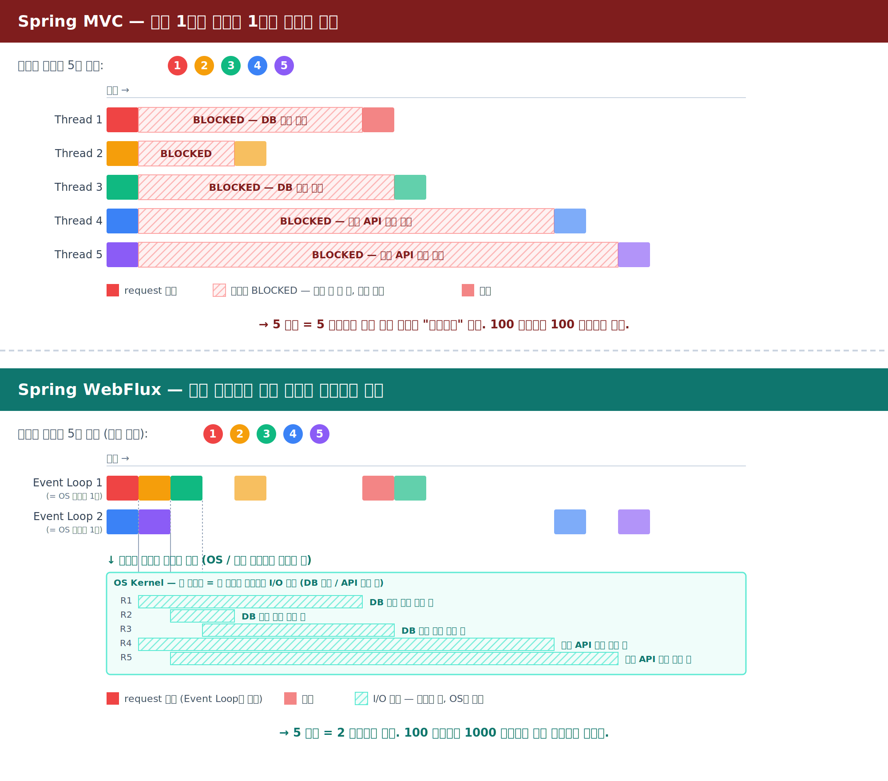

# 공부 노트: Spring MVC vs Spring WebFlux

작성일: 2026-05-15

Spring Boot로 웹 서버를 만들 때 고를 수 있는 길은 사실상 **딱 2개**다.
이 노트는 그 두 길의 차이를 머릿속에 그림으로 박아두기 위한 정리.

---

## 한 줄 요약

```text
Spring MVC    = 동기 / Blocking  / 요청 1개 = 스레드 1개      / 기본 서버 Tomcat
Spring WebFlux = 비동기 / Non-blocking / 적은 스레드로 많은 연결 / 기본 서버 Reactor Netty
```

두 줄을 보면 "이 프로젝트에 어느 쪽이 맞나"가 거의 결정된다.

---

## 용어 한 줄 정리

뒤에서 자주 등장할 단어들을 보면 머릿속에 그냥 이 이미지가 떠오르면 된다.

### 스레드와 이벤트 루프

- **스레드** — OS가 만들어주는 "한 줄로 일하는 작업자". 한 시점에 코드 한 줄씩 순서대로 실행한다. 받은 일이 도중에 멈추면(예: DB 응답 대기) 그 작업자는 거기 묶여서 같이 기다린다.
- **이벤트 루프** — 스레드 위에서 도는 무한 반복문. "처리할 이벤트 있나?" → 있으면 짧게 처리하고 즉시 다음 이벤트로 → 없으면 다시 묻기. 기다리는 일은 절대 떠안지 않고 OS에 맡긴다.

비유로는 스레드가 **책상 앞의 작업자 1명**(받은 일이 끝날 때까지 그 자리에서 처리),
이벤트 루프가 **그 작업자가 "다음 일감!" 외치며 큐(queue)를 끝없이 도는 행동 패턴**에 가깝다.

그래서 그림에 나오는 "Event Loop 1"은 자원의 단위가 아니라 행동의 이름이고,
실체는 **그걸 굴리는 OS 스레드 1개**다.

핵심 한 줄: **이벤트 루프 1개 = 스레드 1개 위에서 도는 무한 반복 패턴.**
Reactor Netty는 보통 CPU 코어 수만큼(8코어면 8개) 이벤트 루프 = 스레드를 띄운다.

### API와 인터페이스

- **API (Application Programming Interface)** — "이 라이브러리/시스템이 외부에서 부를 수 있게 노출한 메뉴판". 호출하는 쪽은 메뉴(메서드 이름·인자·URL 등)만 보고 부르면 되고, 안이 어떻게 돌아가는지는 몰라도 된다. 두 종류로 자주 등장한다:
  - **라이브러리 API** — 자바 코드 안에서 부르는 메서드. 예: `webSocketClient.execute(uri, handler)`.
  - **HTTP API / REST API** — 네트워크 너머로 부르는 URL. 예: `POST /api/binance-futures/btcusdt/depth/raw/start`.
- **인터페이스 (interface)** — 자바의 `interface` 키워드로 정의되는, **"이런 메서드를 가져야 한다"는 약속**. 메서드 이름·인자만 적혀있고 구현은 비어있다. 그 약속을 지키는 클래스(`implements`로 선언)가 따로 있어야 실제로 동작한다.

비유로는 API가 **식당의 메뉴판**(주방이 어떻게 돌아가는지 몰라도 "비빔밥 주세요" 가능),
인터페이스가 **"통역사 자격증 요건 명세"**(어떤 능력을 갖춰야 하는지만 적혀있고, 실제 그 능력자는 따로 와야 함)에 가깝다.

자바에서 둘은 자주 짝으로 쓰인다: **API의 모양은 인터페이스로 정의하고, 실제 동작은 구현 클래스가 채운다.** [BinanceFuturesRawDepthStreamer.java:24](../src/main/java/com/example/futurespapertrading/market/BinanceFuturesRawDepthStreamer.java:24)에서 `WebSocketClient`가 인터페이스, `ReactorNettyWebSocketClient`가 구현체인 것이 이 패턴. 변수 타입을 인터페이스로 잡으면 나중에 다른 구현체로 바꿔도 한 줄만 수정하면 된다. "Servlet API"라는 단어도 같은 패턴 — Servlet API는 인터페이스 모음, Tomcat이 그 구현체.

핵심 한 줄: **인터페이스 = 약속의 모양, 구현체 = 그 약속을 지키는 실체. API = 그 약속을 외부에 메뉴판으로 노출한 것.**

---

## 같은 요청을 두 프레임워크가 어떻게 처리하나

같은 5개 요청을 두 프레임워크가 어떻게 다루는지 한 그림에 펼쳐 본 것.



**눈으로 봐야 할 포인트:**

- **MVC 쪽 (위)**: 빨간 줄무늬(BLOCKED)가 **스레드 위에** 깔린다. 스레드는 "여기 앉아서 응답을 기다리는 것" 외에 아무 일도 못 한다. 5 요청 = 5 스레드가 통째로 묶여 있음.
- **WebFlux 쪽 (아래)**: 청록 줄무늬(I/O 대기)가 **스레드 밖, OS 영역에** 깔린다. Event Loop는 받자마자 OS에 던져두고 다음 요청으로 즉시 이동. 응답이 준비되면 그때 다시 잡아서 내려준다.
- **동일한 물리적 대기 시간**(R1의 DB 응답이 준비되는 데 걸리는 절대 시간)은 두 그림이 같다. 차이는 **그 대기를 누가 떠안는가** — MVC는 스레드가, WebFlux는 OS가.
- 그래서 100 요청, 1000 요청으로 늘어나면: MVC는 스레드 풀이 바닥나고, WebFlux는 같은 2 스레드가 그대로 처리한다.

---

## 비유로 먼저

식당 비유가 가장 직관적이다.

- **Spring MVC = 1인 1테이블 웨이터**
  손님이 오면 웨이터 한 명이 그 테이블에 붙는다. 음식이 나올 때까지 옆에 서서 기다린다. 손님이 100명이면 웨이터도 100명 필요.
  → **단순하고 직관적이지만, 대기 시간이 긴 손님이 많으면 인력이 빨리 동난다.**

- **Spring WebFlux = 회전초밥 / 주방 호출벨**
  웨이터 몇 명이 홀 전체를 돌면서 "지금 음식 나온 테이블"만 골라 서빙한다. 음식 기다리는 동안 다른 테이블을 본다.
  → **소수의 웨이터로 많은 손님을 본다. 대신 시스템(주방·호출벨·번호표)을 미리 갖춰야 한다.**

코드 복잡도와 처리량의 트레이드오프가 이 비유에 다 들어있다.

---

## 표로 비교

| 항목 | **Spring MVC** | **Spring WebFlux** |
|---|---|---|
| Spring Boot 스타터 | `spring-boot-starter-web` | `spring-boot-starter-webflux` |
| 처리 모델 | 동기 / Blocking | 비동기 / Non-blocking |
| 스레드 모델 | 요청 1개 = 스레드 1개 점유 | 이벤트 루프 + 적은 스레드 |
| 기본 내장 서버 | Tomcat (Jetty/Undertow 가능) | Reactor Netty (Tomcat/Jetty/Undertow 가능) |
| 메서드 반환 타입 | `User`, `List<User>` 등 일반 객체 | `Mono<User>`, `Flux<User>` |
| API 호출 | `RestTemplate` (deprecated 권고), `WebClient` 도 가능 | `WebClient` (전용) |
| DB 접근 | JPA, JDBC (대부분 blocking) | R2DBC, MongoDB Reactive 등 reactive 드라이버 |
| 컨트롤러 스타일 | `@RestController` + `@GetMapping` | 같은 어노테이션 + 함수형 라우팅도 가능 |
| 등장 시기 | Spring 1.0부터 (전통의 기본) | Spring 5 (2017)부터 |
| 학습 난이도 | 낮음 (자바답게 흘러간다) | 높음 (Reactor 사고방식 필요) |
| 디버깅 | 스택 트레이스가 직관적 | 스택 트레이스가 길고 끊긴 듯 보임 |

---

## Spring MVC와 Tomcat이 각각 뭔지

먼저 헷갈리기 쉬운 세 단어를 분리하자.

| 단어 | 정체 | 비유 |
|---|---|---|
| **MVC (패턴)** | 개념 / 디자인 원칙 | "분업해서 만들어라"라는 요리 철학 |
| **Spring MVC** | 자바 라이브러리 (JAR 파일 안의 클래스 모음) | 그 철학대로 적힌 요리책 |
| **Tomcat** | 실제로 실행되는 프로그램 (JVM 위에서 돌아가는 서버) | 책을 펴놓고 요리하는 주방 |

너의 `@RestController` 클래스는 **그 주방에서 요리책을 보며 만든 음식**이다. 음식은 주방 없이는 만들 수 없고, 요리책이 없으면 효율적으로 못 만들고, 철학(분업) 없으면 어수선해진다.

### Spring MVC란?

자바 라이브러리. JAR 파일을 열어보면 그 안에 클래스들이 들어있다. 대표 몇 개:

```text
spring-webmvc-6.x.jar
├── DispatcherServlet.class                ← Spring MVC의 핵심. Servlet 1개.
├── @Controller (annotation)
├── @GetMapping (annotation)
├── RequestMappingHandlerMapping.class     ← URL → 메서드 매핑 담당
├── HttpMessageConverter.class             ← JSON ↔ 자바 객체 변환
└── ...
```

→ **Spring MVC = 위 클래스들의 모음.** 그 자체로는 그냥 코드. 누가 실행해줘야 동작한다.

### Tomcat이란?

JVM 위에서 도는 **서버 프로그램**. 이 프로그램이:

- 8080 포트를 잡고 듣는다
- 들어오는 HTTP 바이트를 파싱한다
- 그 결과를 `HttpServletRequest` 자바 객체로 만든다
- 그 객체를 Spring MVC(정확히는 `DispatcherServlet`)에 넘겨준다

→ **Tomcat = 네트워크 입구를 맡는 실행 엔진.** 라이브러리가 아니라 실제로 동작하는 프로그램이다.

### 둘이 어떻게 함께 도나

앱이 실행되면 **JVM 프로세스 1개**가 뜨고, 그 안에 모든 게 같이 들어있다:

```text
┌─────────────────────────────────────────────────┐
│  JVM 프로세스 1개 (java -jar app.jar 로 시작)    │
│                                                  │
│  ┌─────────────────────────────────────────┐    │
│  │  Tomcat (서버 엔진)                       │    │
│  │  - 8080 포트 점유                         │    │
│  │  - HTTP 바이트 파싱                       │    │
│  │  - HttpServletRequest 객체 생성           │    │
│  │                                           │    │
│  │     ↓ 만든 객체를 넘김                    │    │
│  │                                           │    │
│  │  ┌──────────────────────────────────┐    │    │
│  │  │  Spring MVC (DispatcherServlet)  │    │    │
│  │  │  - URL 보고 라우팅                 │    │    │
│  │  │  - JSON 변환                      │    │    │
│  │  │                                   │    │    │
│  │  │     ↓ 메서드 호출                 │    │    │
│  │  │                                   │    │    │
│  │  │  ┌────────────────────────────┐  │    │    │
│  │  │  │  너의 @Controller 메서드    │  │    │    │
│  │  │  └────────────────────────────┘  │    │    │
│  │  └──────────────────────────────────┘    │    │
│  └─────────────────────────────────────────┘    │
└─────────────────────────────────────────────────┘
```

이 그림에서 봐야 할 4가지:

1. **Tomcat, Spring MVC, 너의 코드가 다 같은 JVM 안에 들어있다** (Spring Boot의 "임베디드 톰캣"이 이 뜻).
2. **8080 포트를 잡는 건 Tomcat.** Spring MVC는 포트도 안 잡는다.
3. **네트워크 → 자바 객체 변환은 Tomcat이 한다.** Spring MVC는 그 결과물(`HttpServletRequest`)을 받아서 일한다.
4. 즉 "Spring MVC는 Tomcat 위에서 돈다" = **"Tomcat이 입구(네트워크)를 맡고, Spring MVC가 그 안쪽 처리를 맡는 협업 구조"**.

---

## Spring WebFlux와 Reactor Netty도 같은 구조

같은 3층 구조가 그대로 적용된다. 단어만 바뀌었을 뿐.

| 단어 | 정체 | 비유 |
|---|---|---|
| **Reactive Streams (스펙)** | "비동기로 흐르는 데이터를 다루는 방법" 표준 (개념) | "흐름을 다루는 요리 철학" |
| **Spring WebFlux** | 자바 라이브러리 (JAR 파일 안의 클래스 모음) | 그 철학대로 적힌 요리책 |
| **Reactor Netty** | 실제로 실행되는 프로그램 (JVM 위에서 도는 서버) | 책을 펴놓고 요리하는 주방 |

### Spring WebFlux란?

자바 라이브러리. Spring MVC와 같은 자리지만, 동기 대신 **`Mono`/`Flux` 기반 비동기**로 다루도록 만들어진 클래스들의 모음.

```text
spring-webflux-6.x.jar
├── DispatcherHandler.class                ← WebFlux의 핵심. MVC의 DispatcherServlet에 해당.
├── @Controller (annotation)
├── @GetMapping (annotation)
├── RequestMappingHandlerMapping.class     ← URL → 메서드 매핑 담당
├── HttpHandler.class                      ← Reactor Netty가 호출하는 진입점 인터페이스
└── ...
```

→ **Spring WebFlux = 위 클래스들의 모음.** Spring MVC와 마찬가지로 그 자체는 코드일 뿐.

### Reactor Netty란?

JVM 위에서 도는 **서버 프로그램**. Tomcat과 같은 자리지만, 동기/blocking 모델이 아니라 **이벤트 루프 기반 비동기 모델**로 동작한다. 이 프로그램이:

- 8080 포트를 잡고 듣는다 (이벤트 루프로 다중 연결 처리)
- 들어오는 HTTP 바이트를 파싱한다
- 그 결과를 `ServerHttpRequest` 자바 객체로 만든다
- 그 객체를 Spring WebFlux(정확히는 `DispatcherHandler`)에 넘겨준다

→ **Reactor Netty = WebFlux 진영의 네트워크 입구 엔진.** Tomcat과 같은 역할, 다른 처리 방식.

### 둘이 어떻게 함께 도나

```text
┌─────────────────────────────────────────────────┐
│  JVM 프로세스 1개 (java -jar app.jar 로 시작)    │
│                                                  │
│  ┌─────────────────────────────────────────┐    │
│  │  Reactor Netty (서버 엔진)                │    │
│  │  - 8080 포트 점유                         │    │
│  │  - HTTP 바이트 파싱 (이벤트 루프)          │    │
│  │  - ServerHttpRequest 객체 생성            │    │
│  │                                           │    │
│  │     ↓ 만든 객체를 넘김                    │    │
│  │                                           │    │
│  │  ┌──────────────────────────────────┐    │    │
│  │  │  Spring WebFlux                  │    │    │
│  │  │  (DispatcherHandler)             │    │    │
│  │  │  - URL 보고 라우팅                 │    │    │
│  │  │  - JSON 변환                      │    │    │
│  │  │                                   │    │    │
│  │  │     ↓ 메서드 호출                 │    │    │
│  │  │                                   │    │    │
│  │  │  ┌────────────────────────────┐  │    │    │
│  │  │  │  너의 @Controller 메서드    │  │    │    │
│  │  │  │  (Mono/Flux 반환)          │  │    │    │
│  │  │  └────────────────────────────┘  │    │    │
│  │  └──────────────────────────────────┘    │    │
│  └─────────────────────────────────────────┘    │
└─────────────────────────────────────────────────┘
```

→ 구조가 **완전히 같다.** Tomcat 자리에 Reactor Netty가, Spring MVC 자리에 Spring WebFlux가 들어갔을 뿐.

### 두 진영 한눈에 정리

| 역할 | MVC 진영 | WebFlux 진영 |
|---|---|---|
| 서버 엔진 (네트워크) | **Tomcat** | **Reactor Netty** |
| 웹 프레임워크 (라이브러리) | **Spring MVC** | **Spring WebFlux** |
| 핵심 진입 클래스 | `DispatcherServlet` | `DispatcherHandler` |
| 표준 인터페이스 | Servlet API (`HttpServletRequest`) | 자체 추상화 (`ServerHttpRequest`) |
| 너의 코드 | `@Controller` (동기 반환) | `@Controller` (Mono/Flux 반환) |

마지막으로 한 번 더 못 박아두면: **MVC도 WebFlux도 그 자체는 객체가 아니다.** 라이브러리(JAR)이고, MVC/Reactive Streams는 그 라이브러리가 따르는 디자인 패턴·스펙이다. 실제로 메모리에 객체로 살아있는 건 그 라이브러리가 만든 클래스의 인스턴스(예: `DispatcherServlet` / `DispatcherHandler` 객체 1개)다.

---

## 이름이 왜 이렇게 붙었나

위 표에 등장한 네 단어가 왜 그 이름이 됐는지. 영어 단어를 알면 더 잘 박힌다.

### Spring MVC

전체 이름: `Spring` + `MVC`

- `Spring` — Java 진영의 대표 프레임워크. **"(겨울이 끝나고 오는) 봄"** — 무거웠던 EJB(예전 자바 엔터프라이즈 표준)의 겨울이 끝났다는 뉘앙스로 2003년 Rod Johnson이 붙였다. 가벼움·새 출발의 느낌이 의도된 작명.
- `MVC` — **M**odel + **V**iew + **C**ontroller. 1979년 Smalltalk에서 등장한 GUI 디자인 패턴 이름을 그대로 가져왔다.
  - **Model** — 데이터와 비즈니스 로직
  - **View** — 화면 또는 응답 (HTML, JSON 등)
  - **Controller** — HTTP 요청을 받아 Model을 호출하고 View로 응답을 만드는 중간 조정자

→ "MVC 패턴으로 웹을 다루는 Spring 모듈"이라는 의미가 이름에 그대로 박혀있다. `@Controller`, `@RestController` 어노테이션 이름도 여기서 나왔다.

### Tomcat

전체 이름: `Apache Tomcat`

- `Apache` — Apache Software Foundation이 운영하는 오픈소스 프로젝트라는 뜻. 그 외 기능적 의미는 없다.
- `Tomcat` — 영어로 **"수컷 고양이"**. 만든 사람 James Duncan Davidson이 *"혼자 살아남고 자기를 챙길 수 있는 동물"*의 이미지를 원해서 골랐다고 자기 책에서 밝혔다. 기능적 의미가 없는 코드네임이다.

### Spring WebFlux

전체 이름: `Spring` + `Web` + `Flux`

- `Spring` — 위와 동일.
- `Web` — HTTP/WebSocket 같은 웹 프로토콜을 다룬다는 평범한 표식.
- `Flux` — 라틴어 **fluxus = "흐름, 흐른다"**. Reactor의 핵심 타입 `Flux<T>`(0개 이상의 데이터가 비동기로 흘러나오는 스트림)에서 따왔다.

→ 즉 이름 자체에 **"흐르는(flux) 데이터를 다루는 웹(web) 모듈"**이라는 정체성이 박혀있다. `Mono<T>`(0~1개)와 `Flux<T>`(0~N개)가 모든 비동기 처리의 기본 단위라서, 모듈 이름까지 그 단어를 가져다 붙였다.

### Reactor Netty

전체 이름: `Reactor` + `Netty`

- `Reactor` — **Reactor Pattern**(1995년 Douglas Schmidt가 정리한 디자인 패턴)에서 따왔다. *"이벤트가 발생할 때마다 단일 핸들러가 즉시 반응(react)해서 분배하는"* 구조. 우리가 앞 [용어 정리](#용어-한-줄-정리)에서 본 이벤트 루프의 이론적 뿌리다. Pivotal(현 VMware)이 만든 Reactive Streams 구현 라이브러리 이름이 "Project Reactor"이고, 거기서 `Mono`/`Flux`가 나온다.
- `Netty` — **Net**(network) + 친근한 어미 `-ty`. 2004년 Trustin Lee가 만든 Java NIO 기반 비동기 네트워크 라이브러리. 자바에서 비동기 네트워크 = 거의 Netty라고 봐도 될 만큼 사실상의 표준.

→ "Reactor Netty" = **Reactor 스타일로 감싼 Netty**. Netty는 저수준이라 콜백 지옥이 되기 쉬운데, 그 위에 Reactor의 `Mono`/`Flux`를 얹어 깔끔한 스트림 API로 만들어둔 게 Reactor Netty.

---

## 코드 비교

### 같은 일을 두 스타일로

**Spring MVC** — 평범한 자바 메서드:

```java
@RestController
public class PriceController {

    @GetMapping("/price")
    public Price getPrice() {
        Price p = binanceApi.fetchPrice();   // 끝날 때까지 이 스레드는 여기서 대기
        return p;
    }
}
```

**Spring WebFlux** — `Mono` 반환:

```java
@RestController
public class PriceController {

    @GetMapping("/price")
    public Mono<Price> getPrice() {
        return binanceApi.fetchPrice();      // "끝나면 알려줘", 스레드는 다른 일 하러 감
    }
}
```

겉모양은 비슷한데, **반환 타입이 `Price`냐 `Mono<Price>`냐**가 핵심 차이.

### 스트리밍은 차이가 더 도드라진다

WebFlux는 "여러 개가 시간 차로 흘러나오는 데이터"에 강하다.

```java
@GetMapping(value = "/btcusdt/depth/stream", produces = MediaType.TEXT_EVENT_STREAM_VALUE)
public Flux<Depth> stream() {
    return depthStreamer.flux();   // 100ms마다 한 개씩, 끊지 않고 계속 흘려보냄
}
```

MVC로 같은 걸 하려면 SSE/스레드/큐 직접 다뤄야 해서 코드가 훨씬 무거워진다.

---

## 둘 중 어느 길을 가나

### MVC가 맞는 경우 — 사실 90%의 일반 웹앱

- CRUD 위주, JPA + 관계형 DB
- 요청-응답이 명확하게 끝나는 평범한 REST API
- 팀이 리액티브에 익숙하지 않다
- 외부 의존성도 대부분 blocking 드라이버 (대다수 RDBMS, 대다수 SDK)

→ **고민하지 말고 MVC 쓰자.** 대부분의 사이드 프로젝트와 사내 시스템은 여기에 해당.

### WebFlux가 맞는 경우

- **장시간 연결**이 많음 (WebSocket, SSE, 시세 스트리밍, 채팅)
- 외부 API를 **동시에 여러 개** 호출해서 합치는 게 핵심
- 트래픽은 많은데 각 요청이 짧고 가벼움 (실시간 알림, gateway, 시세 분배)
- 데이터가 "한 번에 다 오는 게 아니라 흘러오는" 도메인

→ **우리 프로젝트가 정확히 이쪽.**

---

## 우리는 왜 WebFlux를 골랐나

이 프로젝트의 본질은 "Binance에서 호가창이 100ms마다 흘러들어오는 걸 받아서, 가공해서, 또 흘려보내는" 일이다. 즉:

- WebSocket 연결은 **계속 열려있다**. MVC + Tomcat이면 연결당 스레드 1개가 메시지 기다리며 점유된다.
- 100개 심볼을 구독하면 → 스레드 100개가 그냥 대기 상태.
- WebFlux + Reactor Netty면 → 이벤트 루프 스레드 몇 개가 모든 연결을 다중 처리.

게다가 [stage-1.md](stage-1.md)의 [BinanceFuturesRawDepthStreamer.java](../src/main/java/com/example/futurespapertrading/market/BinanceFuturesRawDepthStreamer.java)에서 보듯이, 메시지가 자연스럽게 `Flux<WebSocketMessage>`로 들어와서 `.map().filter()` 같은 연산자로 변환·집계가 직관적이다.

호가창 → 체결 → 포지션 관리로 가면서도 **"흐르는 데이터"** 사고방식이 계속 살아있어야 해서 WebFlux가 적합하다.

---

## 자주 헷갈리는 점

### Q1. WebFlux 쓰면 MVC 못 쓰나?

**한 프로젝트에 둘 중 하나만** 쓰는 게 원칙.
`spring-boot-starter-web`과 `spring-boot-starter-webflux`를 동시에 의존성에 넣으면 Spring Boot가 **MVC를 우선 선택**해버려서 WebFlux 의도가 깨진다.

→ 우리 프로젝트는 `spring-boot-starter-webflux` 하나로 간다.

### Q2. WebFlux면 무조건 빠른가?

아니다. 요청당 처리 시간 자체는 비슷하거나 오히려 느릴 수 있다.
WebFlux의 강점은 **"동일한 자원으로 더 많은 동시 연결을 버틴다"**는 것. 1초에 처리하는 요청 수의 절대값이 아니라 **자원 효율**이 다르다.

### Q3. 그럼 작은 앱에 WebFlux 쓰면 손해인가?

손해까진 아니지만 **얻는 게 없을 수 있다.** 동시 연결이 적고 모든 호출이 짧은 blocking이라면, 코드 복잡도만 늘고 처리량 이득은 거의 없다.
"WebFlux를 쓸 이유"가 없으면 MVC가 무조건 정답.

### Q4. WebFlux에서 JPA 쓰면 안 되나?

쓸 수는 있는데 **권하지 않는다.** JPA는 본질적으로 blocking이라 WebFlux의 이벤트 루프 스레드를 막아버린다. 굳이 쓰려면 별도 스레드 풀(`Schedulers.boundedElastic()`)로 격리해야 하는데, 그러면 WebFlux를 쓰는 의미가 절반쯤 사라진다.

→ WebFlux를 쓸 거면 **R2DBC** 같은 reactive 드라이버를 같이 가는 게 정석.

### Q5. 디버깅이 어렵다는 게 무슨 뜻?

MVC는 메서드가 위에서 아래로 실행돼서 스택 트레이스가 그대로 콜 체인을 보여준다.
WebFlux는 `.map().filter().flatMap()`이 **나중에 다른 스레드에서 실행**되기 때문에, 에러가 나면 스택 트레이스에 정작 내가 짠 코드가 잘 안 보이고 Reactor 내부 클래스만 잔뜩 찍힌다.

→ 익숙해지기 전엔 `Hooks.onOperatorDebug()` 같은 도움 장치를 켜둬야 한다.

---

## 그 외 참고 (지금은 신경 안 써도 됨)

- **Spring Cloud Gateway** — WebFlux 기반의 API 게이트웨이. 마이크로서비스 입구로 쓰임.
- **Spring Boot CLI / Batch / 데이터 잡** — 웹 서버가 아예 없는 콘솔/배치 앱도 가능. "MVC vs WebFlux"는 웹 서버를 만들 때만 고민하는 주제.
- **Spring 6 / Boot 3의 Virtual Threads** — Java 21+에서 MVC 코드를 거의 그대로 두면서도 Tomcat이 가상 스레드로 돌아가게 할 수 있다. "MVC는 무조건 자원 비효율"이라는 통념이 흔들리는 중. 단, 본질적으로 stream을 다루는 도메인은 여전히 WebFlux의 사고방식이 더 잘 맞는다.

---

## 머릿속에 남길 그림 한 장

```text
            요청이 짧고 끝이 명확한가?
                    │
        ┌───────────┴───────────┐
       YES                      NO (스트림/장시간 연결/대량 동시성)
        │                       │
   Spring MVC              Spring WebFlux
   (대부분의 웹앱)          (이 프로젝트)
```

이 두 갈래만 기억해두면 충분하다.
