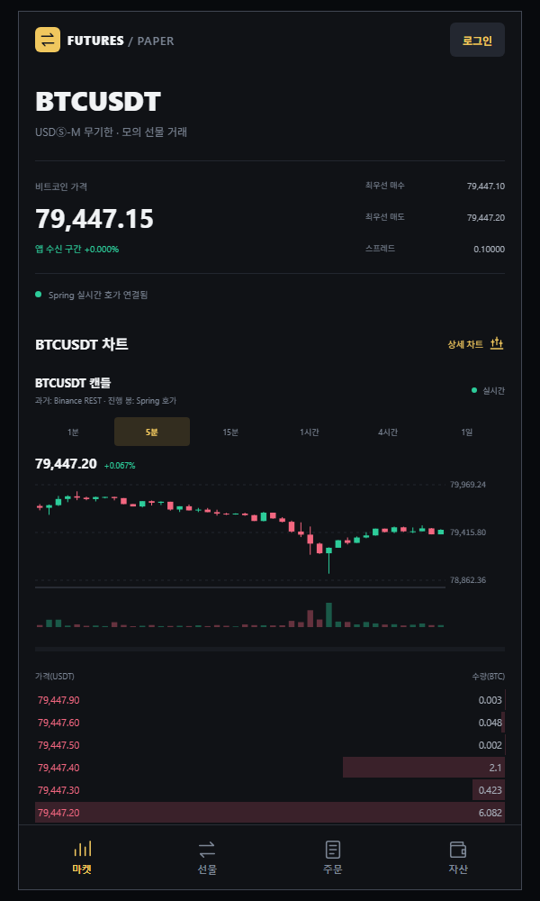
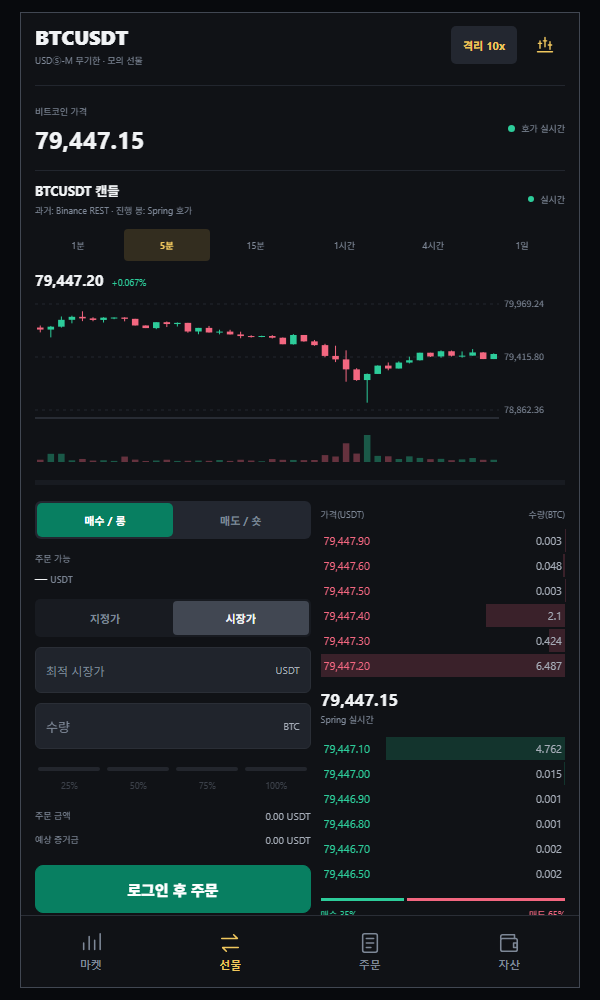
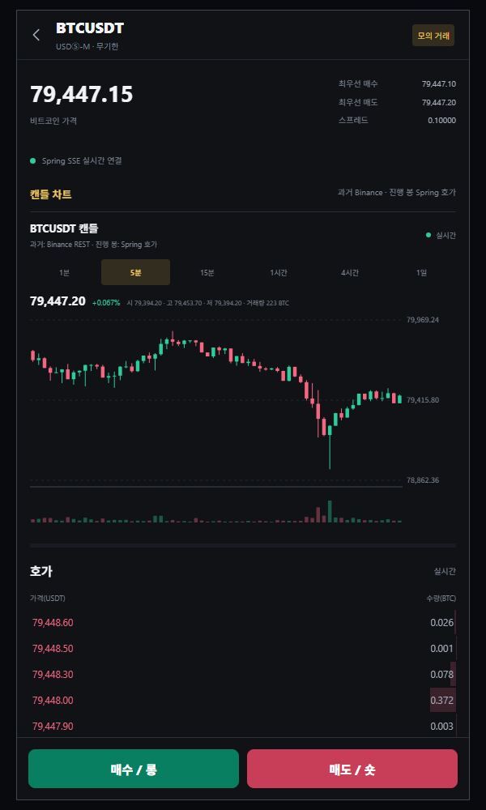
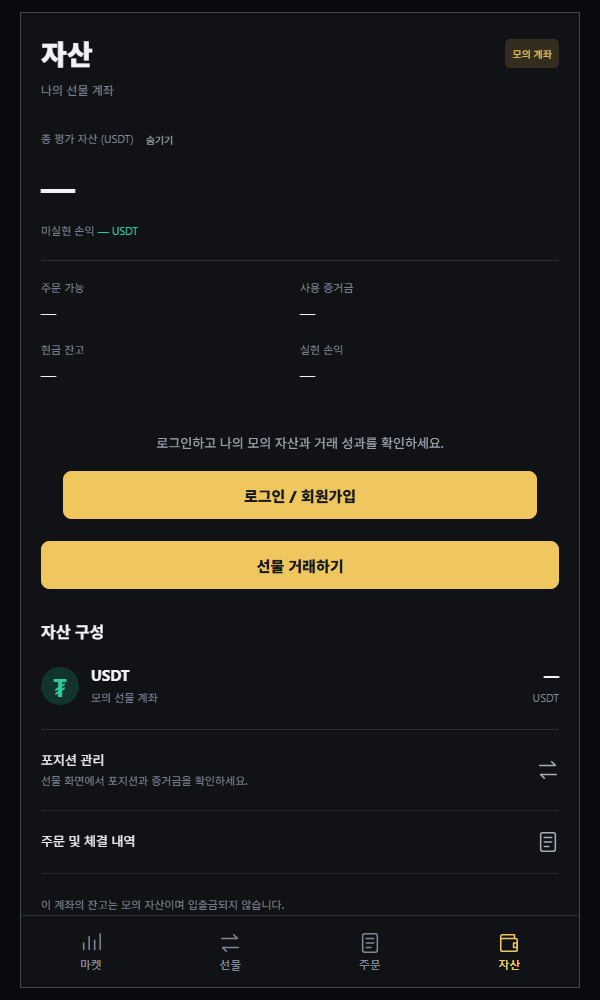

# Futures Paper Trading Mobile

> Binance USDⓈ-M 선물의 실시간 호가를 보면서 시장가·지정가 주문, 포지션, 손익을 확인할 수 있는 Expo/React Native 모바일 애플리케이션입니다.

웹 클라이언트와 동일한 Spring WebFlux 서버를 사용하며, 실제 자금이 오가지 않는 학습용 모의 선물거래 서비스입니다.

## 모바일 앱 확인하기

| 구분 | 주소 |
| --- | --- |
| 모바일 웹에서 체험 | [모바일 앱 실행하기](https://futures-paper-trading-production.up.railway.app/mobile/) |
| Android APK 다운로드 | [Android 앱 설치하기](https://github.com/lee-gimoon/futures-paper-trading/releases/latest/download/futures-paper-trading.apk) |
| 모바일 화면 미리보기 | [실서비스 스크린샷 4장 보기](#앱-화면) |

> APK는 Android 전용입니다. 설치 시 브라우저의 다운로드 허용과 Android의 `알 수 없는 앱 설치` 승인이 필요할 수 있습니다. Expo Go는 필요하지 않습니다.

## 앱 화면

Railway에 배포된 모바일 웹의 실제 비로그인 화면입니다. 실시간 BTCUSDT 가격·호가와 캔들 차트는 Spring WebFlux 서버에서 받은 데이터로 표시됩니다.

| 실시간 마켓·호가 | 선물 주문 |
| --- | --- |
|  |  |

| 캔들 차트 상세 | 자산·포지션 |
| --- | --- |
|  |  |

## 주요 기능

- 실시간 BTCUSDT 호가 및 현재 가격 조회
- 과거 캔들과 실시간 가격을 결합한 차트
- 시장가·지정가 BUY/SELL 주문
- 지정가 대기 주문 조회 및 취소
- 1·3·5·10·20·50배 레버리지 선택
- 포지션, 증거금, 실현·미실현 손익 조회
- 주문 및 체결 내역 조회
- 회원가입, 로그인, 로그아웃

## 모바일에서 구현한 부분

- Expo Router 기반 화면 및 탭 이동
- 웹과 동일한 Spring WebFlux REST API 사용
- Spring WebFlux `Sinks` 기반 SSE 실시간 호가 스트림을 `expo/fetch`로 구독
- `SESSION` 쿠키와 CSRF 토큰을 사용하는 세션 인증
- 공통 API 클라이언트에서 인증 만료와 네트워크 오류 처리
- 화면 포커스와 앱 활성 상태에 맞춘 데이터 재조회
- EAS 빌드 환경별 운영 API 주소 관리

## 기술 스택

| 분류 | 기술 |
| --- | --- |
| Mobile | Expo, React Native, Expo Router |
| Language | TypeScript |
| UI | React Native, React Native SVG |
| Network | Expo Fetch, REST, streaming response |
| Backend | Java 21, Spring Boot, Spring WebFlux, Reactor |
| Database | PostgreSQL, Spring Data R2DBC |
| Deployment | Railway, Expo Application Services |

## 연결 구조

```text
Binance WebSocket / REST
          ↓
Spring WebFlux 서버 ─── PostgreSQL
          ↓
Expo / React Native 모바일 앱
```

- 운영 API: `https://futures-paper-trading-production.up.railway.app`
- 모바일 앱은 Binance에 직접 주문하지 않습니다.
- 모든 주문은 Spring 서버 안에서만 처리되는 모의 주문입니다.

## 모바일 웹 배포

별도의 Railway 프로젝트나 서비스를 만들지 않습니다. 저장소의 `Dockerfile`이 Expo 웹 빌드 결과를 Spring Boot 정적 리소스에 포함하므로, Railway에 연결된 브랜치로 이 변경 사항을 push하면 기존 서비스가 함께 다시 배포됩니다.

배포가 끝난 뒤 아래 주소에서 확인합니다.

```text
https://futures-paper-trading-production.up.railway.app/mobile/
```

모바일 웹은 같은 출처의 Spring API를 사용하므로 별도의 API 서버 주소나 CORS 설정이 필요하지 않습니다.

## Android 포트폴리오 빌드

`preview` 프로필은 Railway 운영 API를 사용하는 설치 가능한 APK를 생성합니다.

```powershell
cd mobile
npx eas-cli@latest login
npx eas-cli@latest init
npx eas-cli@latest build --platform android --profile preview
```

첫 프로젝트 연결이 완료된 이후에는 `eas init`을 다시 실행하지 않아도 됩니다. EAS에서 생성한 APK는 GitHub Release에 `futures-paper-trading.apk`라는 이름으로 첨부하며, 문서 상단의 고정 주소는 최신 정식 Release의 APK를 내려받습니다.

## 로컬 실행

```powershell
cd mobile
npm install
npm run start
```

개발용 Spring 서버를 사용하려면 `mobile/.env.local`에 API 주소를 지정합니다.

```dotenv
EXPO_PUBLIC_API_BASE_URL=http://로컬-PC-IP:8080
```

실제 휴대폰에서 실행할 때 `localhost`는 휴대폰 자신을 의미하므로, 같은 네트워크에 연결된 개발 PC의 IP 주소를 사용해야 합니다.
